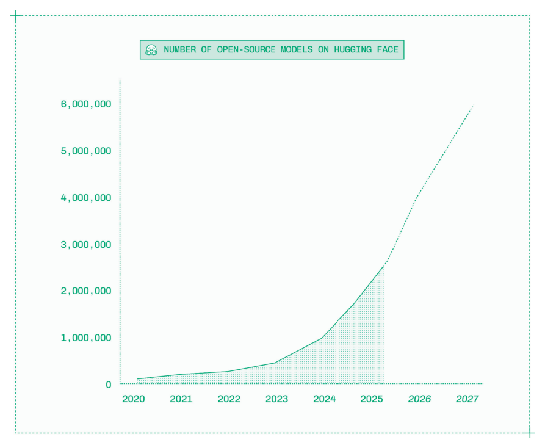
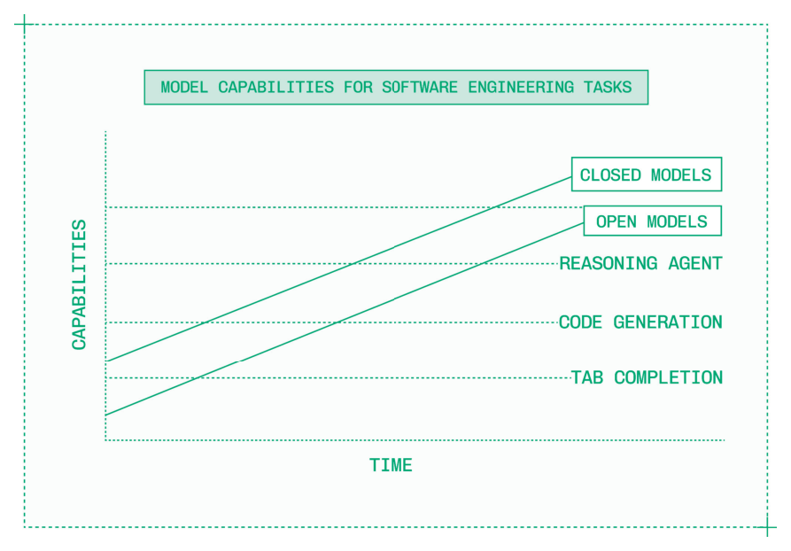
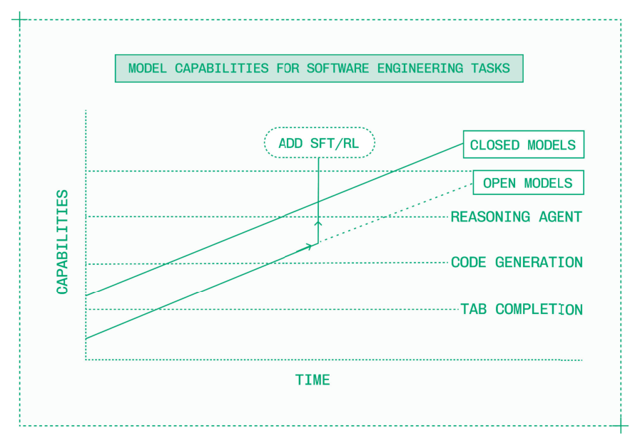

# Preface（前言）

Inference 是 AI 行业中最具价值的领域。

然而，inference engineering 仍处于起步阶段。inference engineer 的工作横跨从 CUDA 到 Kubernetes 的整个技术栈，致力于在生产环境中实现更快、更经济、更可靠的生成式 AI 模型服务。

2022 年 11 月 30 日——ChatGPT 发布的那一天——全世界也许只有几百位 inference engineer，尽管当时他们并不这么称呼自己。这些专家大多在 OpenAI、Midjourney 和 Anthropic 等前沿实验室，或 Google 和 NVIDIA 等大型科技公司工作。

那时，看起来这可能是 AI 行业的未来走向。也许训练生成式 AI 模型是如此困难、如此昂贵，以至于只有少数几家公司会开发闭源模型，从而需要 inference engineering 来支撑生产环境的服务。在那个假设的未来中，世界上的其他人只是通过 API 消费 AI，一次一个 token 地租用智能。

三年后，事实证明，训练生成式 AI 模型确实很困难，也确实很昂贵。但它既没有困难到、也没有昂贵到只有少数几个参与者才能涉足。

相反，开源模型经历了一次寒武纪大爆发——在 Hugging Face 上已有超过两百万个模型，而且数量仍在增长——这意味着现在每位工程师都可以部署自己的智能来驱动自己的 AI 产品。世界各地的研究实验室，从美国的 OpenAI 和 NVIDIA Nemotron，到欧洲的 Mistral AI 和 Black Forest Labs，再到中国的 Alibaba Qwen、DeepSeek AI、Z AI 和 Moonshot AI，都在定期发布各种模态的开放模型。

10 Preface

*Figure P.1: Hugging Face 上有远超两百万个开放模型，是五年前的 25 倍。*

尽管闭源模型变得越来越聪明、越来越便宜，向开放模型转移的趋势却在加速。开放模型在权重的可用性上有所不同：

- 闭源模型（Closed model）：权重不对公众开放的专有模型，如 GPT-5 或 Claude Sonnet。
- 开放模型（Open model）：权重对公众开放的模型，如 Llama 或 DeepSeek，通常在 MIT 许可证或类似宽松许可证下发布（不过某些模型会限制商业用途，务必仔细查看许可条款）。

直到 2024 年 12 月，闭源模型和开放模型之间在智能水平上还存在显著差距。当 DeepSeek V3 和 R1 发布时，这一差距消失了。

Preface 11

如今，新的闭源模型在几个月甚至几周内就会被开放模型追平，偶尔甚至会出现 Kimi K2 Thinking 这样的开放模型在短暂时间内超越闭源模型能力的情况。

即使开放模型在基准测试上始终在追赶闭源模型，它们依然改变了 AI 产品构建者的方程式。随着两种类型的模型都变得越来越强大，闭源和开放模型相继跨越能力阈值，驱动着全新类别的产品。

*Figure P.2: 开放模型和闭源模型都在快速提升，不断解锁和扩展新能力的访问。*

2022 年，要构建如今定义整个行业的那些 AI 原生产品是不可能的。

随着时间的推移，闭源模型变得越来越聪明，客服语音代理和 AI 驱动的 IDE 等新品类成为可能。这些早期模型速度慢、价格昂贵且不够可靠，但能力已经具备，AI 工程师们开始围绕这些能力创办公司。

当开放模型跨越了同样的能力阈值后，这些产品构建者开始使用开放模型来替代闭源模型。许多人还

12 Preface

开始对开放模型进行微调，以更快地跨越能力阈值，甚至在其特定产品和领域中超越闭源模型的质量。

*Figure P.3: 定制化开放模型在解锁新能力的同时，保持对延迟、可靠性和成本的控制。*

转向开放模型开启了利用 inference engineering 从全新维度提升驱动 AI 产品的模型表现的机会：

- 延迟（Latency）：闭源模型 API 是为吞吐量而构建的，但开放模型可以针对实时应用进行优化。
- 可用性（Availability）：虽然 GPT 和 Claude 的 API 的正常运行时间停留在两个九（99%），但通过开放模型的专用部署，可以实现四个九（99.99%）或更高的可用性。
- 成本（Cost）：在规模化部署时，开放模型通常至少便宜 80%。

因此，三年前看起来 inference engineering 可能只是一个利基领域，而如今每一家致力于构建真正差异化、有竞争力的 AI 产品的公司都需要一套 inference 策略。

Preface 13

Cursor、Clay、Gamma 和 Mercor 等 AI 原生创业公司正在重新定义超高速增长，它们构建的产品依赖于开放模型和自研模型。Notion 和 Superhuman 等领先的数字原生公司通过将 AI 能力深度整合到数亿用户已经喜爱的产品中而蓬勃发展。

而新一代融合研究和工程的团队——World Labs、Writer、Mirage 以及数十家其他公司——正在通过训练和产品化自己的基础模型来建立庞大的业务。

采用势头甚至在企业和受监管行业中也非常强劲，而这些行业历来对新技术的适应较慢。OpenEvidence、Abridge 和 Ambience 等公司正在让生成式 AI 在医疗保健领域无处不在，而在全球最大的企业中，AI 计划正在从试点阶段走向大规模用户采用。

在过去四年的 Baseten 工作中，我非常幸运地拥有一个前排座位，亲历了历史上发展最快的市场。在 Baseten，我们为最优秀的 AI 产品提供关键任务 inference 服务，包括前面段落中提到的每一家公司。

整个市场对 inference 的巨大需求意味着，从开发者到高管，每个人都有机会学习 inference engineering，并利用它来推进自己的职业和业务。

你现在入场并不晚。虽然 inference 的潜力和影响正在变得清晰，但这个领域还很年轻。从事 inference 工作的人相对较少，新人可以迅速成为专家。在技术栈的各个层面，都存在着解决新颖、有趣且技术深度极高的问题的巨大机会。

《Inference Engineering》是你成为 inference 专家的指南。它包含了我在 Baseten 工作四年间学到的一切。本书基于与工程团队数十位专家的访谈；我在 NVIDIA GTC、PyTorch Conference、AWS re:Invent 和 AI Engineer World's Fair 等会议上发表的技术演讲；以及与世界各地客户和构建者的无数次对话。

14 Preface

感谢你阅读《Inference Engineering》，欢迎来到 inference 的早期时代。

Philip Kiely

San Francisco, CA
