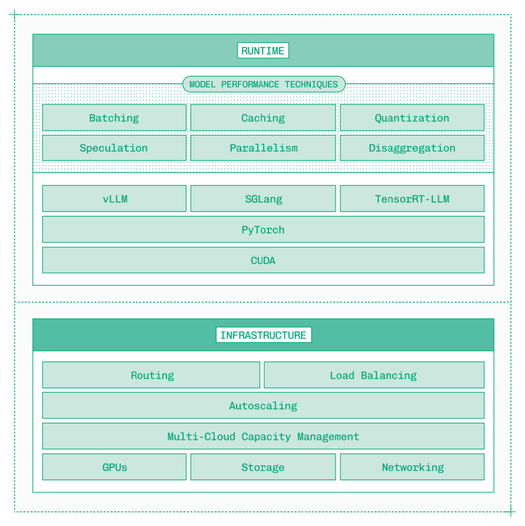
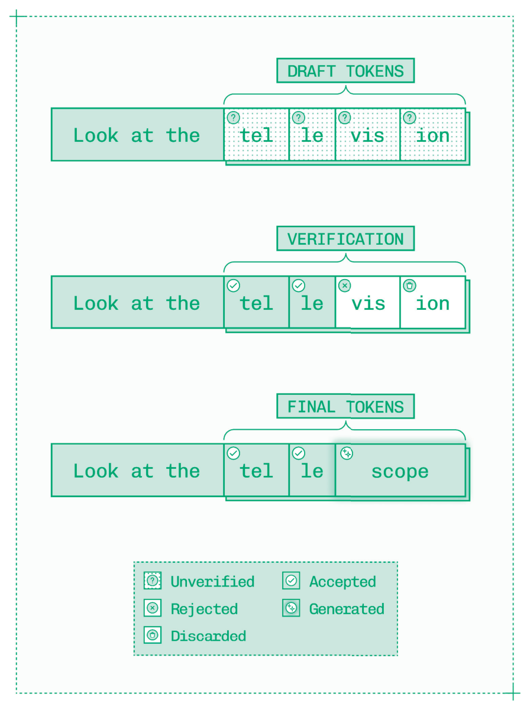
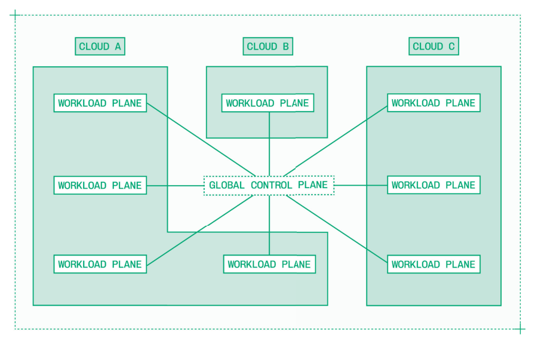

# Chapter 0: Inference（推理）

Inference（推理）是生成式 AI 模型生命周期中的第二个阶段：

- **Training（训练）**：从数据中学习模型权重的过程。
- **Inference（推理）**：在生产环境中服务生成式 AI 模型。

在过去十年的机器学习（Machine Learning, ML）热潮中，数十万数据科学家和 ML 工程师熟悉了 ML 模型的完整生命周期，包括训练和推理两个阶段。

经典 ML 模型的推理相对简单。在 Baseten 早期，我们曾在轻量级 CPU 上运行使用 XGBoost 等工具构建的模型推理，软件栈也非常简单。

相比之下，生成式 AI 模型的推理则复杂得多。你不能简单地拿一套模型权重，搞几块 GPU，就指望推理能够快速、可靠地支撑大规模生产使用。做好推理需要三个层面：

- **Runtime（运行时）**：在单个 GPU 实例上优化单个模型的性能。
- **Infrastructure（基础设施）**：跨集群、跨区域、跨云进行扩展，同时避免形成孤岛，并保持出色的可用性。
- **Tooling（工具链）**：为从事推理工作的工程师提供恰当的抽象层级，在控制力与生产力之间取得平衡。

这三个层面必须协同工作，才能构建出一个能够大规模处理关键任务推理的系统。

*Figure 0.1: *

Runtime 层负责确保运行在 GPU 上（或单个实例中多块 GPU 上）的单个模型尽可能高效地运行。

这一层依赖于复杂的软件栈，从 CUDA 到 PyTorch，再到 vLLM、SGLang 和 TensorRT-LLM 等 Inference Engine（推理引擎）。底层优化非常重要，例如 FlashAttention 等内核（kernel）可以带来显著的性能提升。

Runtime 层依赖多种模型性能优化技术，这些技术将最新研究应用于生成式 AI 模型推理所面临的独特挑战：

- **Batching（批处理）**：并行处理传入的请求，在 token 级别上将它们交织在一起以提高吞吐量。
- **Caching（缓存）**：在共享前缀的请求之间复用 KV cache——即 Attention（注意力）算法的缓存结果。
- **Quantization（量化）**：降低模型中特定部分的精度，以获取更多算力并减少内存负担。
- **Speculation（推测）**：在 Decode（解码）阶段生成并验证 Draft Token（草稿 token），使每次 Forward Pass（前向传播）产出多个 token。
- **Parallelism（并行）**：高效利用多块 GPU 来加速大模型，同时不引入新的瓶颈。
- **Disaggregation（解耦）**：将 LLM 推理的两个阶段——Prefill（预填充）和 Decode（解码）——分离到可独立伸缩的工作节点上。

这些模型性能优化技术适用于所有模态的模型，而不仅仅是 LLM。视觉语言模型、Embedding 模型、自动语音识别、语音合成、图像生成和视频生成等模态扩展了 AI 系统的能力，同时也需要各自特有的推理优化。

然而，仅有 Runtime 优化是不够的。无论单个模型服务实例的性能多么出色，它最终都会收到超出其处理能力的流量。

这不是 CUDA 问题，也不是 PyTorch 问题。这是一个需要在 Infrastructure 层解决的系统问题。

基础设施问题的性质随规模层级不同而变化。起初，问题集中在 Autoscaling（自动伸缩）：知道何时增减副本，以及如何快速完成伸缩。

超过一定规模（通常是几百块 GPU）后，基础设施问题由容量（capacity）主导。为了获得足够的 GPU，推理工程师开始将工作负载分散到多个区域和多个云服务商。

这很快会导致孤岛（silos）问题——一个集群中的模型可能资源匮乏，而其他集群却有闲置容量。基础设施的最终规模层级是一个将所有可用资源视为统一计算池的全球系统。

*Figure 0.2: *

精心设计的多云基础设施还能提升可靠性，防范任何单个区域或云服务商的宕机风险。对于全球化的应用，在靠近终端用户的位置运行推理可以降低端到端延迟。

*Figure 0.3: *

当 Runtime 和 Infrastructure 能力都搭建好之后，需要以恰当的抽象层级呈现出来。像 Baseten 这样的推理服务商以及内部构建推理能力的团队都需要考虑提供什么样的工具链和开发者体验，这是完整推理平台的关键第三层。

开发者体验是主观的。对于推理而言，一个极端是黑盒模式：将模型权重交给平台，拿回一个 API。另一个极端是仅提供计算、网络、磁盘等基本构建块。

恰当的开发者体验应该介于两者之间——推理工程师拥有足够的控制力来可靠地运行关键任务推理，同时又有足够的抽象来高效工作。

本书《Inference Engineering》呈现了跨越 Runtime、Infrastructure 和 Tooling 三个层面的推理技术和方法的完整图谱。

**Chapter 1, Prerequisites（前置条件）**，涵盖了推理工程介入之前需要完成的产品思维和 AI 工程工作：用例定义、延迟和成本预算，以及选择和评估要优化部署的生成式 AI 模型。

**Chapter 2, Models（模型）**，介绍了 AI 模型的技术架构——从大型语言模型到图像和视频生成模型——并分析了推理中的瓶颈所在，重点关注 Attention 优化。

**Chapter 3, Hardware（硬件）**，从现代 GPU 的规格参数入手，拆解计算和内存，然后梳理 NVIDIA 数据中心级产品线中的架构和 SKU，最后简要调研市场上的其他加速器。

**Chapter 4, Software（软件）**，从 CUDA 向上构建抽象层级，涵盖 PyTorch、Transformers 和 Diffusers 等框架，以及 vLLM、SGLang 和 TensorRT-LLM 等推理引擎。同时介绍了 NVIDIA 最新的大规模分布式模型服务系统 Dynamo。

**Chapter 5, Techniques（技术）**，讨论了从前沿研究转化而来的关键模型性能优化技术，并将其应用于生产环境：Quantization、Speculative Decoding、KV cache 复用、Model Parallelism 和 Disaggregation。

**Chapter 6, Modalities（模态）**，将推理工程从 LLM 扩展到语音和视觉领域。多种生成式 AI 模型——视觉语言模型、Embedding 模型、自动语音识别（ASR）模型、语音合成模型——都基于 LLM 架构改编而来，这意味着推理工程师可以使用与 LLM 相同的工具和技术来运行它们。图像和视频生成模型则有各自的架构和相应的性能优化技术。

**Chapter 7, Production（生产环境）**，总结全书，概述了在运营基础设施和基于优化模型推理服务构建高性能应用时需要解决的重要问题。

**Appendix A 和 B** 分别提供了推理工程术语表和推荐延伸阅读资源。

与 LLM 一样，书籍也有知识截止日期。本书于 2026 年 1 月完稿。虽然细节会随时间变化，但本书中的原则、概念和基础技术为推理工程提供了扎实的背景知识，将在未来多年对你有所裨益。
