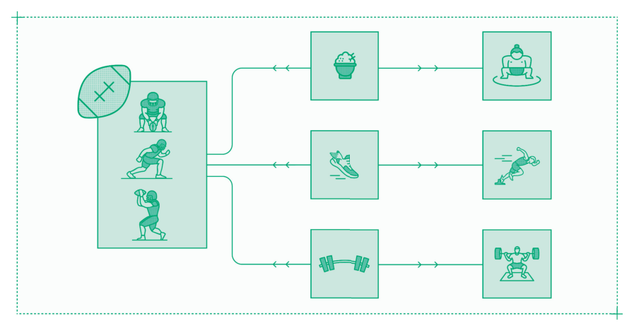
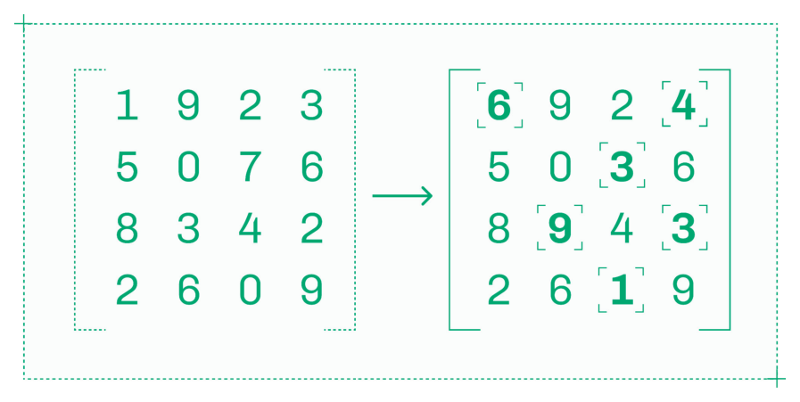
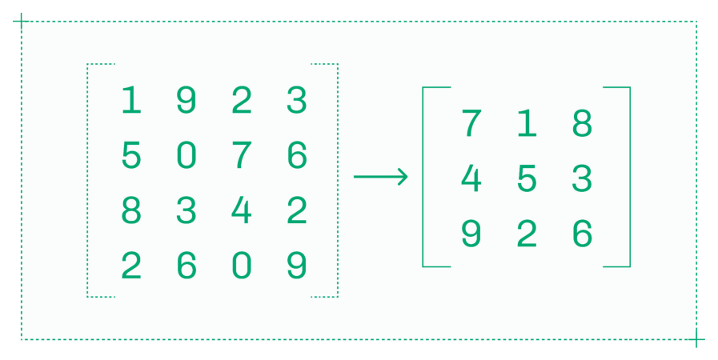
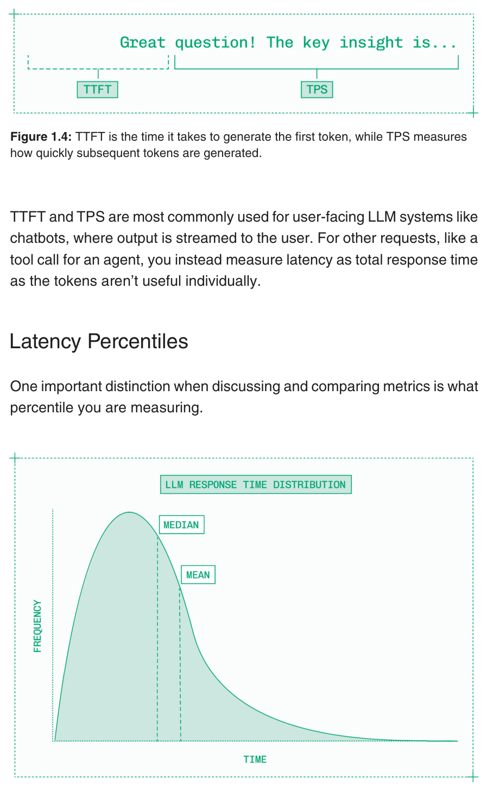

# Chapter 1: Prerequisites（前提条件）

Inference engineering（推理工程）通过优化生成式模型的生产部署，为 AI 产品提升速度和规模。

优化意味着从一系列选项中找出最佳方案。在优化模型性能和构建健壮的基础设施之前，你需要明确什么对你的产品来说是"最佳"——许多性能提升都来自在延迟（latency）、吞吐量（throughput）和质量（quality）之间做出权衡。

在实践中，优化往往是为了找到合适的平衡，而非将某个单一指标最大化。

NFL 球员体型大、速度快、力量强。但他们没有相扑选手那么大，没有奥运短跑运动员那么快，也没有冠军力量举重运动员那么强壮。他们的身体和技能经过了优化，以在整个赛季中满足其位置的具体需求。

*Figure 1.1: *

同样，你的推理系统必须经过优化，以满足你的模型、产品和流量的具体需求。你能引入的约束条件越多，就能获得越好的结果。

你应该了解以下方面：

- **模型需求：** 你需要在哪些模型上运行推理？
- **应用接口：** 输入将如何传递给模型，输出期望以什么格式返回？
- **延迟预算：** 端到端来看，你的产品需要对用户操作多快做出响应？
- **单位经济：** 在每次请求、每位用户或每月的基础上，合理的支出是多少？
- **使用模式：** 你正在服务多少并发用户，他们的使用是否有某种规律（例如，工作时间内的活跃度更高）？

在构建 AI 产品的早期阶段，这些问题的答案可能尚不清晰。在这个早期阶段，通常最好尽可能使用现成的 API，而不是投入专用推理。随着产品规模的扩大，需求会逐渐明确，推理工程也会成为一项值得投入的工作。

## 1.1 规模与专门化

将 AI 模型集成到产品中有两种方式：

- **共享推理（Shared inference）：** 将流量发送到某个模型的公共 API 端点（endpoint），按每百万 token 或其他基于消费量的指标付费。
- **专用部署（Dedicated deployments）：** 租用 GPU 并为你的应用搭建专属推理服务，按 GPU 使用时长付费（或购买并在本地安装 GPU）。

共享推理与专用部署的讨论，并不完全等同于闭源模型与开源模型的讨论——开源模型有大量共享端点，而许多模型实验室也为大型客户提供某种形式的闭源模型专用部署方案。然而，采用开源模型的关键动机之一，正是它解锁了不受限制的专用推理。

大多数 AI 产品最初使用按 token 付费的 API，因为在寻找产品市场契合点（product-market fit）或早期增长阶段，这种权衡是合理的。

| 共享推理的优势 | 共享推理的劣势 |
|---|---|
| 零运维开销，仅为实际消费付费 | 成本随使用量线性增长 |
| 无冷启动时间，模型始终可用 | 服务商的运行时间上限制约产品运行时间，存在嘈杂邻居（noisy neighbors）问题 |
| 工程投入极小，只需一个 API key | 无法控制延迟、模型质量或速率限制 |

随着时间的推移，将 AI 产品迁移到专用部署是必要的，原因有三：

- **规模（Scale）：** 你处理的流量已经足够大，按 GPU 计费比按每百万 token 计费更经济。
- **专门化（Specialization）：** 你在运行自定义或微调（fine-tuned）的模型，或者你有特定的延迟或可用性要求。
- **编排（Orchestration）：** 你的产品依赖多个模型和多步骤管线（pipeline），需要最小化网络延迟和部署复杂度。

切换到专用部署意味着你需要自行负责推理工程。这赋予了你灵活性和控制力，但也增加了工程覆盖面，并提高了每月推理支出的下限。只有在有明确且迫切的业务需求时才进行切换。

## 1.2 了解你的应用

你所做的每一个推理工程决策都将取决于你的用例（use case）。

想象一位体育教练在学校招募运动员。他们会想找哪些学生？这完全取决于他们在执教什么运动——篮球教练会想要班上最高的孩子，而体操教练则会从最矮的孩子中挑选。

同样，你的推理系统的使用方式决定了你应该如何构建它。

在两种情况下，推理工程师需要以最高通用性来构建：

- **基础模型（Foundation models）：** 你训练了自己的模型，将通过公共共享推理 API 直接销售消费，需要支持多种使用模式。
- **推理平台（Inference platforms）：** 你正在构建一个推理平台（内部使用或作为产品），需要支持任意模型和任意用例。

但大多数 AI 原生（AI-native）应用是垂直应用，如代码编辑器或客服代理，其中 AI 被用来创造某种新颖的用户体验。在为垂直 AI 原生应用构建推理时，你需要通过明确用例来引入尽可能多的约束条件。

### 1.2.1 AI 原生应用

生成式 AI 模型解锁了跨行业和跨领域的一类全新应用。每个应用类别依赖不同的模型和模态（modality），需要量身定制的推理方案。

| 类别 | 示例 | 考量因素 |
|---|---|---|
| 代理（Agents） | 面向销售团队的潜在客户挖掘代理 | 一次用户操作触发多次推理调用 |
| 聊天（Chat） | 带有 RAG 的前线客户支持聊天 | 首 token 时间（Time to first token）让聊天感觉快速 |
| 语音（Voice） | 语言间的实时翻译 | 端到端延迟决定自然对话体验 |
| 媒体（Media） | 服装、鞋履和珠宝的虚拟试穿 | 平衡输出质量与速度 |
| 搜索（Search） | 法律文档发现 | 离线语料填充与在线用户请求 |
| 推荐系统（RecSys） | 电商产品推荐 | 高请求量下保持一致的延迟 |
| 补全（Completion） | IDE 中的代码 Tab 补全 | 以用户打字速度提供完整补全块 |
| 审核（Moderation） | 扫描用户生成内容以确保安全 | 高吞吐量实现经济高效的内容检查 |

这只是当今正在构建的 AI 原生应用的一小部分样本，但它展示了推理工程师所面临的考量范围之广。随着模型变得更快、更便宜、更智能，今天尚未想象到的新用例将会涌现。

### 1.2.2 在线与离线

推理工程中的主要权衡之一是延迟与吞吐量之间的取舍。更低的延迟使应用更快，但更高的吞吐量在大规模下更经济，因为你可以用更少的 GPU 服务同样数量的用户。

大多数 AI 应用——代码补全、聊天、语音代理——都是实时运行的在线应用。由于每次 API 调用的另一端都有一个急躁的用户在等待，这些在线应用应该针对延迟进行优化。

然而，有些应用有离线批量推理（offline batch inference）的需求。离线作业更适合高吞吐量的模型部署，其中每个单独的请求可能太慢而无法提供良好的用户体验，但系统整体上可以并行处理远更多的请求。

一些离线工作负载的示例包括：

- **目录转录：** 转录播客、访谈或其他音频的库存档案，使其可被搜索。
- **文档处理：** 定期对一组文档进行嵌入（embedding）、转换或分析。
- **语料准备：** 清洗、嵌入或以其他方式准备大规模语料数据用于模型训练。

一个模型完全可以同时用于在线和离线作业。例如 Whisper，一个语音转文本模型（speech-to-text model），可以同时用于实时听写应用和批量转录作业。假设两个用例都有足够的量级，为同一模型创建两个独立的部署——一个针对延迟优化，另一个针对吞吐量优化——将更具成本效益。

### 1.2.3 消费者与企业级

面向消费者和面向企业构建的应用有不同的推理需求。

消费者应用通常对成本更为敏感，且使用模式更难预测。许多消费者 AI 应用专为病毒式传播而设计，一次产品发布或营销活动就可能在一夜之间引发使用量的激增。

从事消费者应用的推理工程师应优先考虑边际成本（marginal cost）和灵活性，同时将延迟和可用性保持在合理的标准。

企业间（B2B, Business-to-Business）产品通常有更好的利润率和更稳定的使用模式，但要求高可用性和持续的低延迟。处于收入链路上的关键任务软件被要求达到很高的性能和可靠性标准。

为企业构建的推理工程师必须优先保障延迟和运行时间，尽管成本和规模也是重要的次要考量。

在消费者和企业应用中，合规性（compliance）都可能限制基础设施选项，特别是在受监管的行业中。一些关键考量包括：

- **数据主权（Data sovereignty）：** 你的 GPU 是否位于允许你发送用户数据的地理区域？
- **用户隐私（User privacy）：** 模型的输入和输出是否被保密和安全保护？
- **监管合规（Regulatory compliance）：** 你和你的底层供应商是否遵守所有相关法规？

推理工程师必须与安全专家和法律专家紧密合作，确保其运营的基础设施符合合规要求。

## 1.3 模型选择

在其他条件相同的情况下——硬件、运行时（runtime）、优化方案、架构——在参数较少的较小模型上进行推理，将比在参数较多的较大模型上更快、更便宜。

这就是为什么模型性能优化中最重要的决策不是运行时引擎或推测算法（speculation algorithm），而是你一开始选择了哪个模型。

迭代早期产品的 AI 工程师应该直接使用功能强大的前沿模型（frontier models）的预构建按 token 付费 API，如 Kimi 和 DeepSeek（甚至是 GPT 和 Gemini 等闭源模型）。在找到产品市场契合点之前，不值得在自行推理上花费时间或金钱。

但当需要扩展时，建议恰好相反。找到——或者创建——能够胜任当前任务的最小、最易运行的模型。在许多情况下，这可能仍然需要一个万亿参数的前沿模型。但检查一下更小、更便宜、更快的模型是否能完成任务，总是值得的。

你选择的模型也会影响你可用的推理优化方案。不同推理引擎对不同模型架构的支持深度各不相同。坚持使用流行的模型架构，可以确保你在性能工具生态中获得强大的支持。

### 1.3.1 模型评估

模型评估（Model evaluation），或称 evals，是系统化衡量模型智能水平的实践。

高置信度的模型评估是推理工程的前提条件。Evals 帮助推理工程师：

- **明智地投入时间：** 在投入精力让模型变快之前，evals 确保模型是有用的。
- **建立基线：** 一些性能优化技术可能会降低模型质量，需要一个基线来进行对比。

与衡量模型在 MMLU 或 SWE-bench 等通用任务上能力的标准智能基准测试不同，evals 是针对特定产品、领域和任务量身定制的。

智能基准测试对于筛选候选模型很有用，但它们已经趋于饱和甚至被人为操纵。Goodhart 定律指出"当一个衡量指标成为目标时，它就不再是一个好的衡量指标"，这同样适用于前沿实验室在每次发布新模型时大力展示新的创纪录智能基准测试的强烈动机。

虽然存在更好的方法来评估模型整体智能水平，例如基于与其他模型对战胜率的 Elo 评级（Elo rating），但没有什么可以替代直接衡量模型在你的应用中的表现。

进行有效的模型评估工作的一些技巧：

- **审视你的数据：** 将 eval 结果与你对产品和问题领域的直觉进行对照。
- **保持精确：** 明确模型需要解决的最难问题，并将评估聚焦于此。
- **善用工具：** 不要在 AI 工程的基本问题上重新发明轮子。

附录 B 包含了关于 evals 的工具推荐和延伸阅读。

### 1.3.2 通过微调提升领域特定质量

微调（Fine-tuning）是指在一个预训练的基础模型上，通过引入新数据使其适应特定用例的实践。

*Figure 1.2: *

如果你能通过微调一个小模型使其通过你的 evals，你就能为达到推理的延迟和成本目标奠定更轻松的基础。

微调特别有效的一个典型领域是将英语翻译为 SQL，一种用于查询数据库的语言。

通用编程模型擅长编写 SQL，但这些模型有数千亿参数。SQL 是一种相对受限的语言，因此对于只需要从自然语言提示生成 SQL 查询的应用，一个仅有几十亿参数的微小微调模型就能在此特定任务上达到同等性能。

Text-to-SQL 是一个极端的例子——许多领域不会支持如此大幅度的模型缩减——但它说明了在一个范围清晰的领域、一套强有力的评估标准和高质量标注数据的条件下，微调能够实现什么。

### 1.3.3 蒸馏

如果你能以一小部分的规模保留大模型的大部分智能呢？这就是蒸馏（distillation）的核心理念。

*Figure 1.3: *

蒸馏是使用一个大型"教师"模型来训练一个更小的"学生"模型，使其模拟大模型行为的过程。与在合成数据上进行微调——模型基于输入-输出对进行训练——不同，蒸馏向学生模型展示教师模型的实际概率分布（probability distributions），而不仅仅是其最终答案。

微调教一个模型在特定领域表现得更好，而蒸馏教模型如何模拟一个更大模型的行为——包括好的和坏的方面。

蒸馏在实际应用中的使用远少于微调。

当前沿实验室发布一系列不同尺寸的模型家族时，较小的模型通常并不是从较大模型蒸馏而来的。相反，这些模型是独立训练的，以防止大模型的偏见人为地限制小模型。但如果实验室只训练了一个大模型，蒸馏可以让该模型更易于使用。

2025 年 1 月，开源模型研究实验室 DeepSeek 发布了其当时的旗舰推理模型 DeepSeek-R1。由于该模型非常大（671B 参数），他们还基于当时最流行的开源模型架构发布了该模型的蒸馏版本：Llama 3 和 Qwen 2.5。

这些蒸馏模型展现了与主 DeepSeek-R1 模型类似的推理行为，尽管智能基准测试分数较差，但蒸馏模型相对较小，并且可以利用 Llama 和 Qwen 架构已有的性能优化工作。

截至出版时，这些 DeepSeek-R1 蒸馏模型仍然是 Hugging Face 上最受欢迎的蒸馏模型之一，此外还有用于音频转录的 Whisper 蒸馏版本和一些图像生成模型的蒸馏版本。

## 1.4 衡量延迟和吞吐量

LLM 最常用的两个性能指标是 TTFT（time to first token，首 token 时间）和 TPS（tokens per second，每秒 token 数）。关于 LLM 之外的模态特定指标，请参阅第 6 章。

| 首 token 时间（TTFT） | 每秒 token 数（TPS） |
|---|---|
| 使用流式输出时，用户需要多长时间才能看到第一个输出 token？ | 在生成第一个 token 之后，用户每秒接收多少个 token？ |
| 基于计算密集型的 prefill 阶段 | 基于带宽密集型的 decode 阶段 |
| 更低的 TTFT == 更好的延迟 | 更高的 TPS == 更好的延迟 |

虽然 TTFT 是一个清晰的术语，但 TPS 的含义不够精确。TPS 可以是一个延迟指标（每个用户每秒的 token 数），也可以是一个吞吐量指标（整个推理服务每秒的 token 数）。

大多数人用 TPS 来表示每用户的延迟指标。在需要更精确时，请使用更具体的术语：

- **感知 TPS（Perceived TPS）：** 第一个 token 之后每个用户观察到的每秒 token 数（延迟）。
- **总 TPS（Total TPS）：** 推理服务每秒生成的总 token 数（吞吐量）。
- **token 间延迟（Inter-token latency, ITL）：** 相邻 token 之间的时间间隔。10 毫秒的 ITL 等于每用户每秒 100 个 token。

*Figure 1.4: *

TTFT 和 TPS 最常用于面向用户的 LLM 系统，如聊天机器人，其输出以流式方式呈现给用户。对于其他类型的请求，如代理的工具调用（tool call），你应该以总响应时间（total response time）来衡量延迟，因为这些 token 单独来看并没有用处。

### 1.4.1 延迟百分位数

在讨论和比较指标时，一个重要的区别是你衡量的是什么百分位数（percentile）。

*Figure 1.5: *

最简单的做法是直接看平均（mean）TTFT 或 TPS。然而，这并不能反映全貌。LLM 的总响应时间通常呈右偏分布（right-skewed distribution），大部分时间集中在一个众数（mode）附近，但异常值可能会显著更长。

这些异常值会严重影响用户体验和对产品的信任。如果每十次交互中就有一次需要数秒钟，那么大多数交互感觉再灵敏也是不够的。

因此，推理工程师以百分位数来衡量延迟。

| 指标 | 含义 | 说明 |
|---|---|---|
| P50 | 中位数延迟 | 每 2 个请求中有 1 个更慢 |
| P90 | 第 90 百分位延迟 | 每 10 个请求中有 1 个更慢 |
| P95 | 第 95 百分位延迟 | 每 20 个请求中有 1 个更慢 |
| P99 | 第 99 百分位延迟 | 每 100 个请求中有 1 个更慢 |

虽然降低平均延迟很重要，但优秀的性能优化工作还应关注降低 P90/P99 延迟，以提供更可靠的用户体验。

### 1.4.2 端到端指标

指标中的另一个重要区别是，你衡量的是纯推理时间——在 GPU 上生成 token 所需的时间——还是一个包含了网络延迟和排队时间的端到端测量。

纯推理指标和端到端指标都很有价值。推理时间告诉你模型性能优化的效果如何，而端到端指标则揭示了用户对应用速度的感知。当推理时间很快但端到端时间很慢时，应将注意力转向基础设施而非模型性能优化。
