# Chapter 2: Models（模型）

Models

推理工程（Inference Engineering）是让生成式 AI 模型变得更快、更便宜、更可靠的实践——同时不牺牲使其如此有价值的质量。无论是提升性能还是保持质量，都需要对模型底层的工作原理有深刻的直觉理解。

生成式 AI 模型是由大型、复杂的神经网络组合而成的。神经网络的历史可以追溯到 1950 年代，当时第一批用于简单二元分类的感知机（perceptron）以硬件形式实现。在接下来的几十年里，感知机曾被抛弃，但随后又以从单层到多层感知机的形式重新发明，引入了反向传播（back-propagation）这一新概念，它在层与层之间引入了隐藏状态，并提供了一种反复调整网络中权重的学习过程。

这些神经网络只有几层。2000 年代，研究者开始探索具有数十层的深度神经网络。2012 年，AlexNet 成为第一个展示出良好现实世界能力的深度神经网络，并证明了 GPU 在深度学习中的有效性，催生了用于文本的词嵌入（word embedding）模型和用于图像的生成对抗网络（Generative Adversarial Networks, GANs）等新架构。

但故事真正始于 2017 年，当时 Vaswani 及其同事发表了开创性论文《Attention Is All You Need》，引入了 transformer。transformer 是一种具有注意力机制（attention mechanism）的神经网络，能够学习序列中各部分之间的关系。

Transformer 是生成式 AI 的基石。Transformer 不仅用于 LLM，它驱动着从嵌入到语音、再到图像和视频生成的每一种模型模态。

跨模态而言，基于 transformer 的模型有两种重要风格：

- 自回归 token 生成（Autoregressive token generation）：从已 token 化的序列开始，预测最可能的下一个 token。
- 迭代去噪（Iterative denoising）：从随机噪声开始，通过扩散（diffusion）逐步精炼出最可能的输出。

本章将探讨 LLM（自回归 token 生成）和图像生成模型（迭代去噪）的架构细节。

## 2.1 神经网络（Neural Networks）

几代神经网络的研究构成了生成式 AI 的理论基础。

要成为一名高效的推理工程师，你需要对神经网络的核心概念有基本的直觉。本节提供高层次介绍；附录 B 提供了进一步阅读的建议。

神经网络的基本单元是节点（node，也称神经元/neuron）。节点是一段短程序：接收输入，将其与一些权重相乘，加上一些偏置（bias），然后返回结果。

一组节点构成一个层（layer）。同一层内的节点彼此独立——它们各自完成计算。节点之间的连接，也就是神经网络中的"网络"，存在于层与层之间，即某一层的节点接收上一层的输出。

LLM 背后的神经网络包含数十到数百层。层分为三种类型：

- 输入层（Input layer）：第一层，接收并处理输入到神经网络的数据。
- 隐藏层（Hidden layers）：第一层和最后一层之间的每一层，迭代地将输入转化为输出。
- 输出层（Output layer）：最后一层，返回网络的预测结果。

每一层产生一个输出，供下一层作为输入读取。对于隐藏层，这些输出被称为隐藏状态（hidden states）。

隐藏状态是神经网络中数据内部表示（internal representation）的一种形式。内部表示的一个关键方面是其维度（dimensionality），即所用向量的实际大小。

> 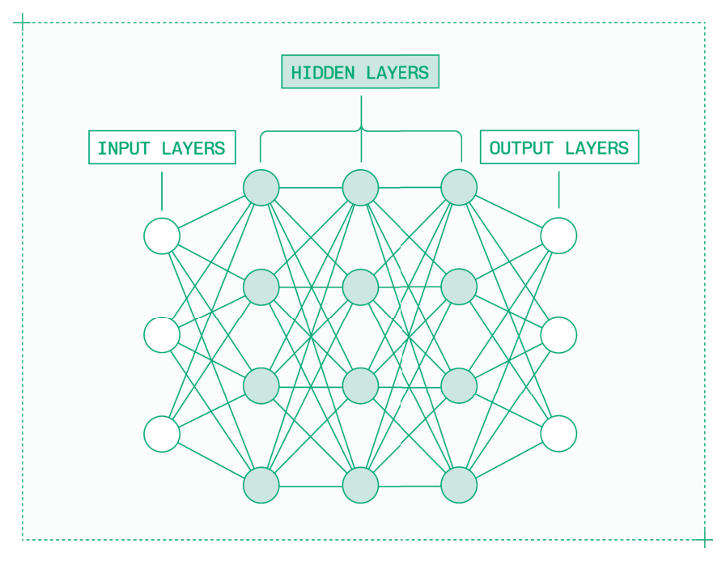
> *Figure 2.1: 多层神经网络有一个输入层、多个隐藏层和一个输出层。*

文本输入的内部表示会增加维度，将文本块编码为数百或数千个数字的向量以捕获语义信息。但图像模型的内部表示则将维度从数百万像素降低到可管理的大小。

创建内部表示的神经网络和使用内部表示的神经网络各不相同：

- 编码器（Encoder）：接收文本或图像等输入，创建包含额外信息和语义的内部表示。
- 解码器（Decoder）：使用内部表示生成文本或图像等输出。

神经网络是可组合的（composable）。你可以将多个神经网络组合成一个单一模型，或者按顺序使用它们构建流水线（pipeline）。

现代 LLM 是纯解码器（decoder-only）模型，而纯编码器（encoder-only）模型如今已较为少见，BERT 家族的老牌文本嵌入模型是其典型代表。

其他模态中的许多模型使用编码器-解码器（encoder-decoder）架构。Whisper 是一个流行的开源音频转录模型，它使用编码器处理音频输入，使用解码器生成文本 token。

### 2.1.1 线性层与矩阵乘法（Linear Layers and Matmul）

神经网络中最基本的操作是矩阵乘法（matrix multiplication），即 matmul。matmul 接收一个输入向量（一组数字）和一个矩阵（数字网格），将向量通过矩阵相乘以产生输出向量。

在神经网络中，线性层（linear layer）是最简单的 matmul 形式。给定输入向量，线性层应用权重矩阵并加上偏置向量：

> 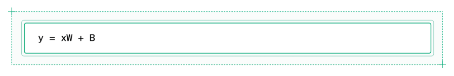
> *Figure 2.2: 在 matmul 中，输出向量 y 是输入向量 x 与权重矩阵 W 的乘积再加上偏置向量 b。*

任何给定线性层的权重只是生成式 AI 模型总权重的一小部分，权重矩阵中的各个值在训练过程中被设定。

### 2.1.2 激活函数（Activation Functions）

矩阵乘法是可组合的，这意味着将一个向量乘以两个矩阵等价于将该向量乘以这两个矩阵的乘积。

> 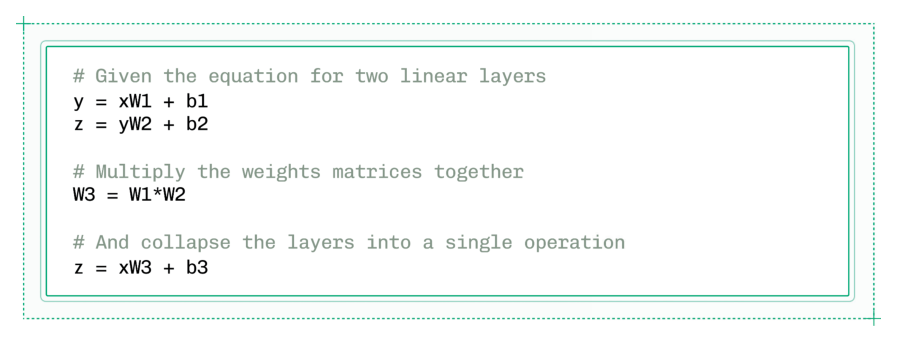
> *Figure 2.3: 代表独立层的两个 matmul 方程由于线性的可组合性而坍缩。*

这对于多层神经网络来说是个问题，因为一系列线性层（每个都是 matmul）会坍缩成一个单一层，所有矩阵相乘在一起。

深层多层神经网络之所以有用，是因为更多的层能更有效地使用更多参数，并在隐藏状态中编码更多含义。

神经网络通过激活函数打破线性来分离各层。激活函数是非线性的，以防止可组合的 matmul 导致层坍缩；它们是可微的或大部分可微的，以支持反向传播。

推理中最基本的激活函数之一是 ReLU（Rectified Linear Unit）。ReLU 是一个简单的函数：如果 X 大于零，返回 X；否则返回零。激活函数有数十种——包括一种因其形状类似 Nike 标志而得名的"Swish"——但大多数遵循相同的通用模式：将负值映射为零或接近零，同时保持正值不变。

ReLU、SiLU、Swish 和 SwiGLU 等激活函数运行速度快、易于训练（因为它们大部分可微，至少对大多数值有梯度），并且能打破线性以支持多层神经网络。

> 
> *Figure 2.4: 像 ReLU 这样的激活函数用于打破多层神经网络中的线性。*

## 2.2 LLM 推理机制（LLM Inference Mechanics）

LLM 是自回归 token 生成模型。LLM 基于之前的所有 token，每次生成一个新的 token。

这些 token 是语言模型的原子单位，是表示文本块的数字。现代 LLM 使用子词 token 化（subword tokenization），即每个 token 是一个词或词的一部分。

> 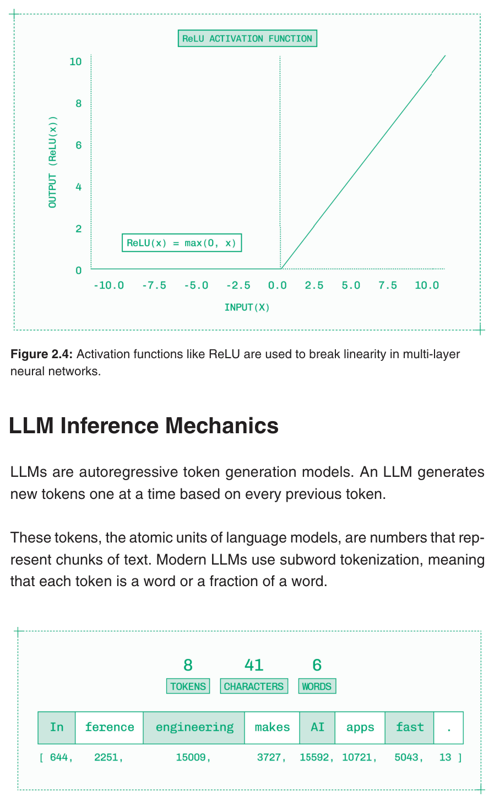
> *Figure 2.5: 子词 token 化对常见词和标点符号使用一个 token，但将不太常见的词拆分为多个 token。*

将文本转换为 token 以及将 token 转换回文本不需要任何神经网络。相反，tokenizer 是字符串与其数字 token 表示之间的简单映射。

语言模型的词汇表（vocabulary）是 token 与字符串之间的完整映射。词汇表和 tokenizer 因模型而异，较新的模型采用更高效的 token 化方案；生成输出所需的 token 越少，端到端推理就越快。

大多数模型的词汇表中有超过 100,000 个 token。在其他模态中，如语音合成，模型词汇表被扩展以让 token 表示其他信息，如音频波形。

推理涉及两个或三个 token 序列：

- 输入序列（Input sequence）：传入 LLM 的 prompt、对话、上下文、函数和其他输入。
- 推理序列（Reasoning sequence）：可选地，对于推理模型，用于思考的中间输出序列。
- 输出序列（Output sequence）：LLM 生成的响应。

这些序列的总和受限于模型的上下文窗口（context window，即模型每次请求能处理和生成的 token 总数）。请求还可以通过 max_tokens 参数进一步限制输出序列长度。

虽然输入序列是单个字符串，但 LLM 被训练为接受多种输入，如带角色的多轮对话序列、用于工具调用的函数签名，以及在某些情况下的多模态输入。这些输入需要合并为单个序列。这由聊天模板（chat template）处理，聊天模板在不同模型之间有细微差异，必须在推理引擎中正确实现。

应用聊天模板后对输入序列进行 token 化是推理的第零步。然后，推理有两个主要阶段：

- Prefill（预填充）：处理输入序列，为每个输入 token 计算注意力并将其存储到 KV cache 中。
- Decode（解码）：通过模型执行前向传播（forward pass）以自回归方式生成 token。

Decode 阶段的每次前向传播必须生成一个 token。这需要几个额外步骤，因为神经网络输出的是向量而非 token。

LLM decode 中使用的神经网络输出层生成一个 logits 向量。该向量的长度等于模型的词汇表大小。归一化后，这些 logits 表示词汇表中每个潜在 token 成为正确输出的概率。

> 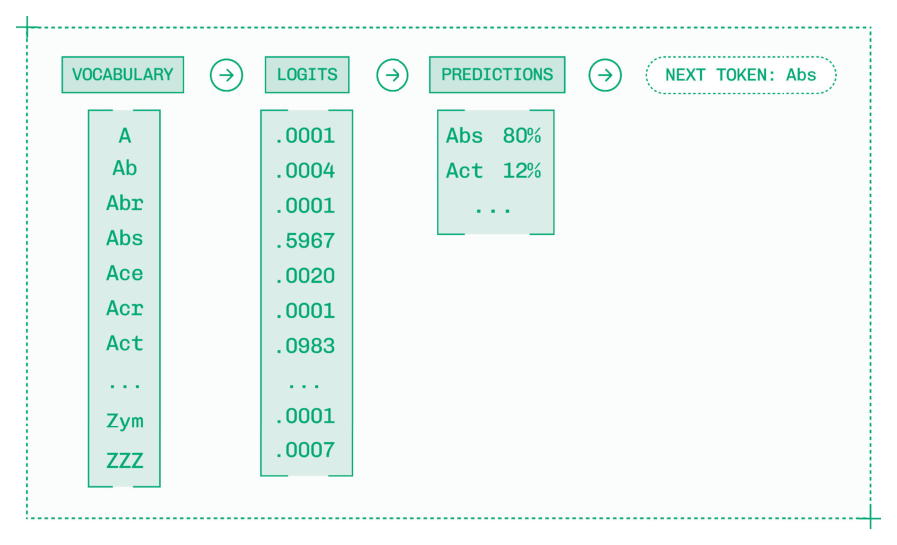
> *Figure 2.6: 一个 decode pass 为模型词汇表中的每个 token 生成一个 logit，然后将 logits 归一化为百分比。*

输出 token 通过基于归一化概率向量的加权随机数生成来选择。你可以通过推理参数来影响该过程：

- Temperature（温度）：在归一化之前调整 logits 本身。
- Top-k：在归一化之后选择最可能的 k 个 token，然后在它们之间重新归一化。
- Top-p：在归一化之后选择概率之和达到 p 的最小 token 集合。

较低的温度、top-k 或 top-p 使 LLM 输出更可预测，因为模型被限制在只选择高概率 token。将温度设为 0 或 top-k 设为 1 使 token 选择变为确定性的（始终选择最高概率的 token）。

当生成结构化输出（输出符合如 JSON 等 schema）时，还有 logit biasing 等额外工具来进一步引导 LLM 的输出。这些方法在每次前向传播之后应用，支持工具调用等重要 LLM 能力；它们的正确实现对高质量推理至关重要。

这个 logit 生成和 token 选择过程持续进行，直到模型生成停止 token（stop token，表示输出序列结束的特殊值），除非先达到上下文窗口或 max tokens 限制。

这个推理循环的两个关键部分是：在 prefill 期间生成 KV cache，以及在 decode 期间生成输出 token（或更具体地说，是变为 token 的 logit 向量）。这些步骤占用了推理过程中绝大部分的时间和资源，因为它们依赖大型神经网络。

### 2.2.1 LLM 架构（LLM Architecture）

Hugging Face（最大的开源模型仓库）上的每个 LLM 都包含一个 config.json 文件：几十行描述模型架构的详细信息。

模型架构是训练过程中关于模型各组件性质和形状所做的一系列决策。在单一架构内，可能有：

- 多种尺寸：不同参数量的模型，如 Llama 8B 和 70B。
- 多种变体：给定模型的"base"和"instruct"变体共享相同架构。
- 无限微调：LoRA（Low-Rank Adaptation）等方法改变行为，而非架构。

这些架构之所以重要，是因为它们决定了运行时和引擎支持。如果你对某个架构有高度优化的部署，你可以部署同一架构的另一个变体，并享受相同的性能提升。

模型架构是大多数配置文件中的第一行。要解析像 Qwen3MoeForCausalLM 这样的架构名称：

- Qwen：模型家族，或模型品牌名称。
- 3：该家族内架构的主版本号。
- MoE：表示 Mixture of Experts 模型（第 2.2.4 节）。
- CausalLM：表示因果语言模型（causal language model）。

因果语言模型基于之前的 token 预测序列中的下一个 token，与之相对的是掩码语言模型（masked language model），后者根据左右上下文来填空。当今所有生成式 LLM 都是因果语言模型。

除了架构名称，config.json 文件还包含关于构成模型底层神经网络的各种层的性质和维度，以及推理时穿过它们的向量的信息。

### 2.2.2 Transformer 块（Transformer Blocks）

LLM 的主体是一系列数十到数百个 transformer 块。这些块构成了一个大型神经网络的核心，包含三种类型的层：

- 嵌入层（Embedding layer）：神经网络的输入层，接收 token 并返回嵌入（embeddings）。
- Transformer 块：网络中的隐藏层，是生成预测的 transformer 块。
- 输出层：也称为语言建模头（language modeling head）或 LMHead，将 transformer 块的隐藏状态转换为 logits 向量，词汇表中每个 token 对应一个 logit。

在 transformer 块内部，有用于注意力（attention）、前馈神经网络（feed-forward neural network）和归一化（normalization）的子层。

> 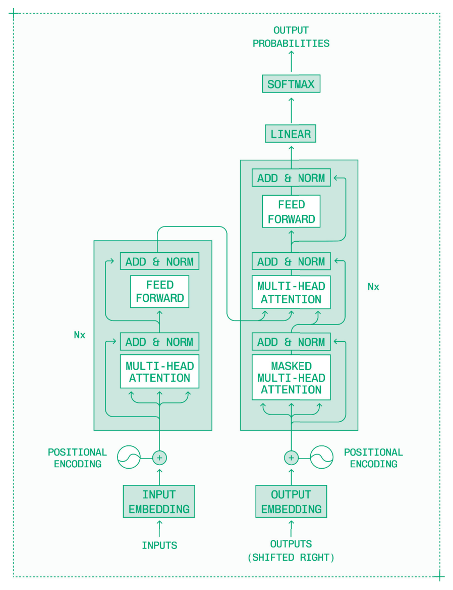
> *Figure 2.7: Transformer 块图，改编自《Attention Is All You Need》（Vaswani et al., 2017）。*

前馈神经网络是一个多层感知机。这些线性子层构成了 LLM 中大部分可训练权重，而注意力子层是第二大组件。归一化和激活函数等其他组件在模型大小中几乎可以忽略不计。

虽然线性子层是权重的最大部分，但推理中更复杂的操作是注意力。

### 2.2.3 注意力（Attention）

注意力是 transformer 用来将给定 token 与序列中其他 token 建立关联的机制。人类擅长理解词与词之间的关系。注意力将同样的能力带给了 LLM。

考虑这个句子："I decided to write a book because I thought it would be easy, but it was actually hard." 注意力表明句子中的"it"指的是写书这件事。

注意力的标准形式是缩放点积注意力（scaled dot-product attention），如下列方程所示。

> 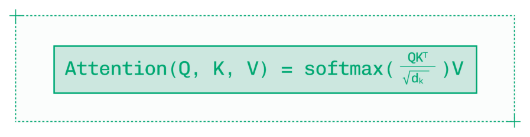
> *Figure 2.8: 注意力方程，改编自《FlashAttention: Fast and Memory-Efficient Exact Attention with IO-Awareness》（Dao et al., 2022）。*

注意力接收三个输入：

- Q（queries，查询）：正在生成或更新的 token 的嵌入表示。
- K（keys，键）：所有先前 token 的表示。
- V（values，值）：所有先前 token 的已计算注意力值。

模型中的注意力子层是多头的（multi-head），每个头是一次注意力操作。如果你可视化神经网络的架构，这些头在同一子层中彼此并行。每个头可能负责关注 token 之间不同类型的关系，如主谓一致（subject-verb agreement）和共指消解（co-reference resolution）。

注意力有两种主要类型：

- 自注意力（Self-attention）：Q、K 和 V 都来自同一序列。
- 交叉注意力（Cross-attention）：Q 来自不同于 K 和 V 的序列，将 Q 条件化于外部信息。

LLM 使用自注意力（带有因果掩码/causal mask 以防止在序列中向前看），而图像生成和多模态模型也使用交叉注意力（例如，在生成的图像和关联的文本 prompt 之间）。

因为注意力要寻找当前 token 与序列中每个先前 token 之间的关系，它是一个关于序列长度的二次时间方程。随着上下文扩大，注意力变慢。

在实践中，注意力是线性的而非二次的，这归功于 KV cache。KV cache 是注意力实现中的标准组件，为每个先前 token 存储键值对。通过在 KV cache 中查找这些信息而非每次重新计算，注意力以线性时间运行。

KV cache 在 LLM prefill 期间构建，在 decode 期间使用和更新，默认驻留在 GPU 内存中。存储、访问和重用 KV cache 是推理工程中的重要主题，在第 5.3 节中详细讨论。

### 2.2.4 混合专家模型（Mixture of Experts Models）

神经网络的密度由层之间连接的数量决定。更密集的网络保留更多信息，而更稀疏的网络运行所需的计算和内存更少。

混合专家（Mixture of Experts, MoE）是一种架构优化，为线性层添加稀疏性。MoE 模型不是使用一个巨大的矩阵，而是有数百个较小的矩阵（专家/experts），并将每个输入路由到少量选定的专家。这被称为激活专家（activating the experts）。

对于像 Qwen3-235B-A22B 这样的 MoE 模型，每次请求会激活模型 2350 亿总参数中的 220 亿参数。得益于其低活跃参数量，MoE 模型在单请求本地推理中非常高效。然而，在生产服务器的批量推理中，不同请求激活不同专家，你应该预期几乎所有模型参数在任何给定时刻都是活跃的，除非通过大规模的 Expert Parallelism（专家并行，第 5.4.2 节）实现稀疏性。

专家路由是细粒度的。每次通过模型的前向传播通过处理模型的每一层来生成一个 token。路由器（router），LLM 内部的一个微型模型，在模型的每一层选择要激活的专家。在 Qwen 的例子中，有 128 个专家，路由器在 94 层中的每一层为每个生成的 token 选择 8 个专家。

MoE 架构在拥有 100B+ 参数的大型模型中尤为流行，但也有小到 200 至 300 亿参数的 MoE 模型。Mixture of Experts 解锁了一种称为 Expert Parallelism 的新型推理并行方式，使大型模型能够在多 GPU 上实现高吞吐推理。

> 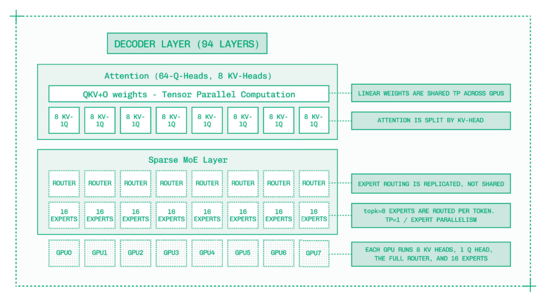
> *Figure 2.9: Mixture of Experts 架构同时包含分片（sharding）和复制（replicating），以利用多 GPU 推理的优势。*

32B 参数以下的模型，特别是 8B 参数以下的模型，往往能高效地使用传统的密集架构。用于代码补全等任务的领域特定模型也不能从 MoE 中获得太多好处，因为整个模型实际上就是一个专家。

## 2.3 图像生成推理机制（Image Generation Inference Mechanics）

图像生成模型接收文本 prompt 并根据 prompt 创建图像。这些模型略早于 LLM 的公开兴起，Midjourney 的闭源模型和开源的 Stable Diffusion 模型均在 2022 年夏天首次发布。

图像生成模型不像 LLM 那样是单一模型。相反，它们是由多个模型协同工作以生成图像的流水线。在图像生成的基础模型中，有三个核心组件：

- 文本编码器（Text encoder）：将文本 prompt 转换为图像生成模型能理解的指令。
- 去噪模型（Denoising model）：模型的核心，基于 prompt 从噪声迭代至图像。
- 变分自编码器（Variational Autoencoder, VAE）：将模型输出从潜空间（latent space）转换到像素空间（pixel space）。

这种流水线思维贯穿整个图像模型生态。除了基础模型，图像推理通常还包括：

- LoRAs：轻量级微调，用于改变风格和提升质量。
- ControlNets：轮廓和边缘，用于引导输出图像匹配大致的形状和颜色。

围绕图像生成模型的庞大且丰富的开源生态系统包括 ComfyUI 等工具，用于构建基础模型和适配器的复杂流水线，通过交换组件来产生独特的输出。

整个图像生成流水线在潜空间中运行。一张普通 HD 图像可能有 1024x1024 像素；这超过了一百万个像素。由于去噪模型需要在整个图像上并行计算注意力，在像素空间中工作是不可行的。

潜空间是图像的低维表示。图像的潜空间矩阵可能是 128x128，大约是其所表示的像素空间总值的百分之一。

潜空间被初始化为随机值，即噪声。去噪模型基于文本 prompt，通过一系列步骤将噪声精炼为图像。每个步骤更新整个潜空间，不像 LLM 那样一次处理一个 token。大多数图像生成模型需要 30 到 50 个步骤来创建高质量图像。

> 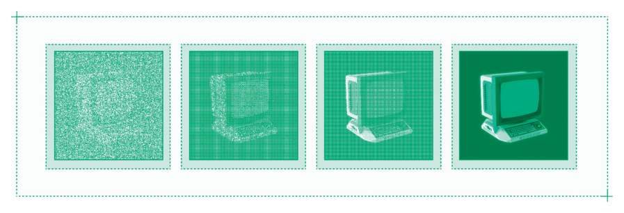
> *Figure 2.10: 基于扩散的模型从噪声迭代生成图像，通常经过 30 到 50 个步骤。*

在每个步骤中，模型运行两次前向传播：一次有条件引导（文本 prompt），一次无条件引导。然后根据引导比例（guidance scale）将这些生成结果合并。由于这种双部分步骤，50 步图像生成实际上需要 100 次前向传播。

这一过程以及图像生成的其他核心部分，通过推理参数在每次请求的基础上进行控制。最重要的参数有：

- Prompt：描述图像应该是什么样子。
- Negative prompt：单独描述不应出现在图像中的风格或对象。
- Number of steps：通过去噪步骤数量权衡速度和质量，大多数模型为 30 到 50。
- Guidance scale：控制创造性与 prompt 遵循度之间的平衡，整数值通常在 4 左右。
- Image size：从固定菜单中选择输出图像的分辨率和宽高比。

虽然这些核心机制在图像生成模型中是通用的，但其架构在过去几年中已经有了显著演进。

### 2.3.1 图像生成模型架构（Image Generation Model Architecture）

图像生成模型基于 transformer 构建，具体来说是扩散 transformer（diffusion transformer）。扩散 transformer 与 LLM 使用的 transformer 非常相似，但它处理的是图像数据，而非离散 token 的嵌入表示。

扩散 transformer 以块（patches）的方式查看图像。在训练文本到图像模型时，训练数据中的图像通过 2x2 或 4x4 像素的重叠块输入，然后嵌入到潜空间中。推理则以相反方向工作，在图像生成完成后将潜空间转换回像素。

图像生成模型是多个模型的流水线，包括文本编码器、去噪模型和变分自编码器。这种流水线的一个清晰示例是 Stable Diffusion XL（SDXL）。SDXL 是一个较老的模型，但其架构仍然具有参考意义。

> 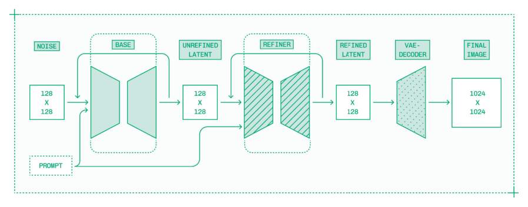
> *Figure 2.11: SDXL 架构流水线，改编自《SDXL: Improving Latent Diffusion Models for High-Resolution Image Synthesis》（Podell et al., 2023）。*

SDXL 的流水线包含两个用于去噪的扩散模型，即基础模型（base）和精炼模型（refiner）。这些模型分别训练用于不同任务：基础模型从纯噪声生成连贯的图像，而精炼模型添加细节并确保 prompt 遵循度。

现代模型在更好的 prompt 遵循度、准确的面部和手部及细节、清晰的文字渲染，以及支持图像到图像推理等方面，显著超越了 SDXL。这些模型（如 Qwen Image 系列）在整体上与 SDXL 流水线相似，但每个步骤都使用了更大、更强的模型。

| 组件 | SDXL (2023) | Qwen Image (2025) |
|------|-------------|-------------------|
| 文本编码器 | 基于 CLIP 的模型 | Qwen 2.5 VL (7B) |
| 去噪器 | <4B 参数 | 20B 参数 |
| VAE | 单次编码 | 双重编码 |

现代图像生成模型（如 Qwen Image）能力的显著增长来自更大的组件模型和更复杂的流水线。清晰文字渲染和逼真人脸等新能力，来自从微型 NLP 模型切换到完整 LLM 进行文本编码，以及将去噪器参数量增加五倍。

这些更大的模型需要更多资源来运行。幸运的是，随着模型变大，GPU 也变得更强大，尽管推理工程师不能仅仅依赖硬件进步来高效运行这些模型。

图像生成模型的最新研究方向是将扩散 transformer 架构与 LLM 架构相融合。

任何可以被 token 化的东西都可以作为 LLM 来建模。LLM 具有内置文本理解能力的优势，它们已经成为图像生成流水线中的重要组件。

LLM 解决了扩散模型固有的许多问题。扩散模型只能产生固定大小的输出，而 LLM 是自回归的，可以产生可变长度的输出。图像模型需要多达 100 次前向传播来生成一张图像，而 LLM 在一次前向传播中就生成 token。像 HunyuanImage-3.0 这样的模型使用了这种 LLM 风格的架构。

虽然这是图像生成的新前沿，但还有其他现有架构用于加速图像创建以及将图像模型扩展到视频生成。

### 2.3.2 少步图像生成模型（Few-Step Image Generation Models）

图像生成中最耗时的部分是 30 到 50 个去噪步骤。与其让每一步更快，如果有一种方法可以简单地使用更少的步骤来优化图像模型呢？

少步图像生成模型正是为此训练的：使用八个或更少的去噪步骤创建高分辨率图像。这些模型开箱即用比传统图像生成模型快 80% 到 90%，尽管其输出质量明显较低。

创建这些模型有两种主要方法：

- 潜空间一致性（Latent consistency）：训练模型直接预测目标潜空间图像向量，并重复预测两到四次以增强质量。
- 蒸馏（Distillation）：使用对抗蒸馏（adversarial distillation）和/或渐进蒸馏（progressive distillation）来训练一个小模型，以更少的推理步骤模拟更大的模型。

如今蒸馏比潜空间一致性更常见。当 FLUX 和 Qwen Image 等新图像模型发布时，开源图像模型社区的成员除了创建面向质量和风格的 LoRA 之外，还会创建蒸馏版本。

如果你有一个延迟敏感且质量不那么重要的用例（如实时生成滤镜），请考虑少步图像生成模型。

### 2.3.3 视频生成（Video Generation）

视频生成模型在架构上与图像生成模型相似，只是更大。它们的参数量是图像模型的 3 到 5 倍，在潜空间中编码的信息量是图像模型的 10 到 100 倍。

视频生成的朴素方法是逐帧工作。早期的视频生成使用这种逐帧方法：先生成一个起始帧，然后使用该帧生成下一帧，依此类推。

逐帧方法的问题在于误差累积（error accumulation）。早期的小问题会在每一帧中不断累积，视频很快就会偏离轨道。

相反，现代视频模型将整个视频保持在潜空间中，并在每个去噪步骤中对其进行修改。每一帧都关注其他每一帧，并在每次前向传播中更新。

如果图像模型的潜空间表示两个物理维度 X 和 Y，那么视频模型的潜空间表示三个维度：X、Y 和 T（时间）。

这种方法的主要限制是视频具有固定的帧数，就像图像生成模型有固定的宽高比一样。现代视频生成模型创建几秒钟的视频序列。

视频长度的限制在于计算资源。即使使用最新的 GPU，在巨大潜空间上的注意力操作也极其昂贵，每秒视频需要数秒的推理时间。视频生成模型计算量如此之大，以至于它们通常以 batch size 为 1 运行，这意味着一个完整的八 GPU 节点在处理单个请求。

虽然每个去噪步骤的注意力操作很昂贵，但视频生成模型的总步骤数与图像模型相同，通常约 50 步。

与 LLM 和图像生成相比，视频生成是一个较新的模态。其限制与两年前 LLM 的限制相对应。

| LLM（2023 年末） | 视频生成模型（2025 年末） |
|------------------|--------------------------|
| 高 TTFT，低 TPS | 慢速生成时间 |
| 频繁幻觉 | 不真实的物理效果 |
| 占满 Ampere GPU | 占满 Blackwell GPU |
| 有限的上下文窗口 | 短视频输出 |

如今，这些限制在 LLM 中已基本消除。从电影级视频生成以及相关领域（如世界模型、3D 对象生成（XYZ 维度而非 XYT）和其他生成式 AI 渲染模型）中消除这些限制，是一个高度活跃的研究领域。

一个重要的研究方向是回归自回归生成的理念，就像将 LLM 架构融入图像生成模型一样。与其使用具有不可接受的误差累积的纯逐帧视频生成，像 Self Forcing 这样的新技术结合了对质量的全局视图和迭代的生成方式。

将自回归组件添加到视频模型中可以部分缓解注意力的瓶颈，尽管注意力仍然是推理中最重要和最昂贵的组件。

## 2.4 计算推理瓶颈（Calculating Inference Bottlenecks）

在一个完美优化的系统中，每种资源在任何时候都得到充分利用。在 GPU 中，有两种主要资源：

- 计算（Compute）：GPU 每秒能执行的浮点运算次数。
- 内存带宽（Memory bandwidth）：GPU 每秒能移动的字节数。

理想情况下，计算永远不会因等待内存中的信息而闲置，内存带宽也永远不会因等待计算完成而闲置。

在现实世界中，系统存在瓶颈（bottlenecks）：即一种资源闲置而另一种资源饱和的不平衡。发现这些瓶颈是提升性能的第一步。如果某个操作受内存带宽瓶颈限制，再多的计算优化也不会让系统更快，反之亦然。

在大多数情况下，推理系统具有以下瓶颈：

- LLM prefill（KV cache 构建）受计算瓶颈限制。
- LLM decode（token 生成）受内存瓶颈限制。
- 图像和视频生成受计算瓶颈限制。

在优化这些阶段中每一个的性能时，目标是让瓶颈对系统整体性能的限制更小。例如，将多个请求批量处理在一起使 LLM decode 的内存瓶颈程度降低，因为处理一批请求在相同内存流量下使用了更多计算。

### 2.4.1 Ops:Byte 比率与算术强度（Ops:Byte Ratio and Arithmetic Intensity）

每块 GPU 有特定的计算速度（以每秒运算次数衡量）和内存带宽（以每秒 GB 或 TB 衡量）。比较这两者可以确定给定 GPU 的 ops:byte 比率。

例如，H100 GPU 在 FP16 下可以执行 989 teraFLOPS 的密集计算，对应 3.35 TB/s 的内存带宽。这产生约 295 的 ops:byte 比率。

要使 FP16 推理在 H100 GPU 上完美平衡（正如万物应有的那样），推理系统需要每访问一个字节的内存执行 295 次浮点运算。

要算出这个比率，需要计算算法的算术强度（arithmetic intensity）。算术强度，也称运算强度（operational intensity），是当前计算的工作量与内存流量之间的比率。

> 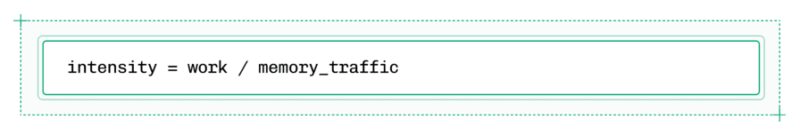
> *Figure 2.12: 算术强度的方程。*

ops:byte 是按每秒尺度衡量的，而算术强度是按单个函数或算法的执行过程衡量的。

算术强度通过屋顶线模型（roofline model）进行可视化，该模型将性能相对于带宽上限（一条对角线）和性能上限（一条水平线）进行图表化。

> 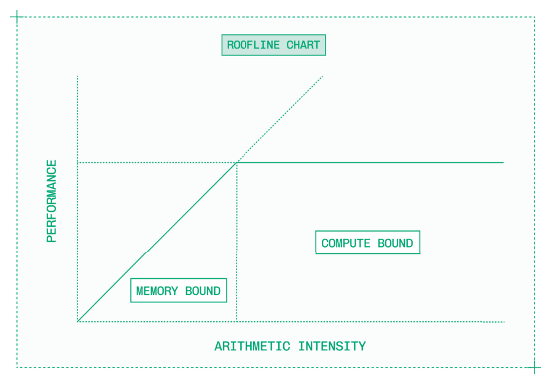
> *Figure 2.13: 屋顶线图显示了基于算术强度从内存瓶颈到计算瓶颈的转变。*

对照屋顶线模型绘图可以揭示算法是：

- 计算瓶颈（Compute bound）：当算术强度高于硬件的 ops:byte 比率并触及水平性能上限时，即为计算瓶颈。
- 内存瓶颈（Memory bound）：当算术强度低于硬件的 ops:byte 比率并触及对角带宽上限时，即为内存瓶颈。

要找到瓶颈，请查看系统中最昂贵计算的算术强度。对于推理，其中一个计算是注意力。

### 2.4.2 LLM 推理瓶颈（LLM Inference Bottlenecks）

LLM 推理有两个阶段：

- Prefill：决定首 token 时间（TTFT），受计算瓶颈限制。
- Decode：决定每秒 token 数（TPS），受内存瓶颈限制。

对于每个阶段，你可以通过将最重要操作的算术强度与可用硬件的 ops:byte 比率进行比较，来证明瓶颈的存在。

在 prefill 和 decode 中，最昂贵的操作都是注意力。注意力的确切算术强度取决于模型架构（维度、头数等）、输入序列长度和注意力算法的实现。

本质区别在于，prefill 并行处理整个输入序列，而 decode 一次生成一个 token。

对于 prefill，模型权重只加载一次，然后进行输入矩阵与注意力矩阵之间的一系列大型矩阵乘法。这是大量计算相对于单次内存读取，产生了高算术强度。

在 decode 时，模型权重为每个 token 加载一次，通过代价低得多的向量-矩阵乘法生成 token。在这种情况下，相对于加载整个模型权重所需的浮点运算较少，因此算术强度低。

作为计算确切算术强度的示例，考虑一个具有 128 维注意力头（d=128）的模型在 4096 个 token 的序列（N=4096）上的 decode 步骤。在此分析中，使用标准的注意力算法，不进行任何优化。

> 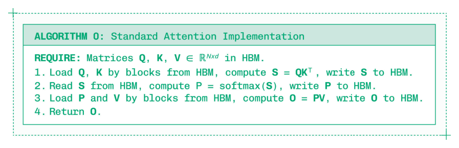
> *Figure 2.14: 标准注意力实现，改编自《FlashAttention: Fast and Memory-Efficient Exact Attention with IO-Awareness》（Dao et al., 2022）。*

基于此练习的参数，确定这些矩阵的大小：

- N：序列长度，确定为 4096。
- d：注意力头的维度，设为 128。
- Q, K, V：给定为 Nxd，即 4096x128。
- S, P：计算为 NxN，即 4096x4096。
- O：计算为 Nxd，即 4096x128。

假设 FP16 推理，矩阵中每个值为两个字节。作为参考，一个 4096x4096 的矩阵约为 32 MiB，大约与一张高分辨率 RAW DSLR 照片的数据量相同。

注意力算法的三行都遵循相同的模式：从内存加载数据、执行计算、将结果存储到内存。

> 
> *Figure 2.15: Figure 2.14 中注意力实现的内存移动（读取和写入）以及计算工作。*

要计算总内存移动量，将第一列和第三列求和，它们跟踪从 GPU 内存的读取和写入：

> 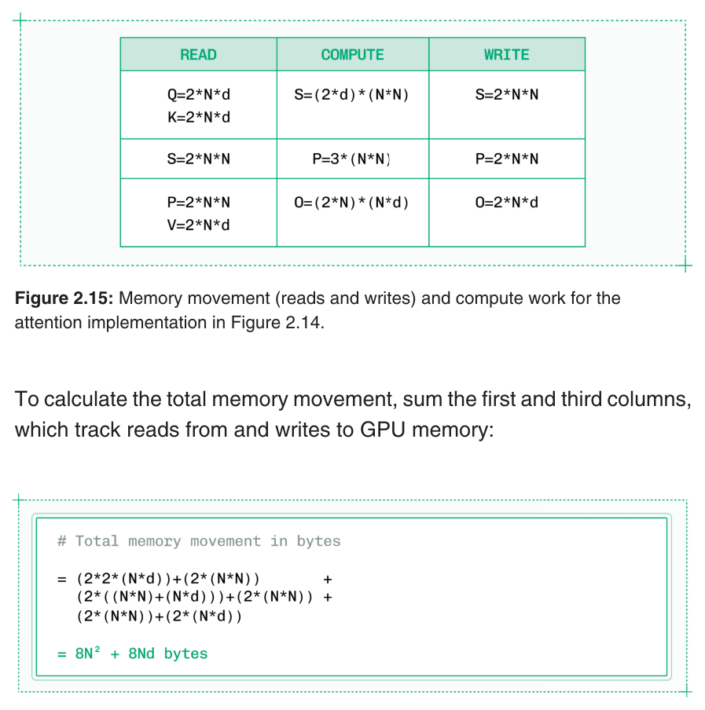
> *Figure 2.16: kernel 的总内存移动量是三个步骤中所有读取和写入的总和。*

要计算总计算量，将第二列求和：

> 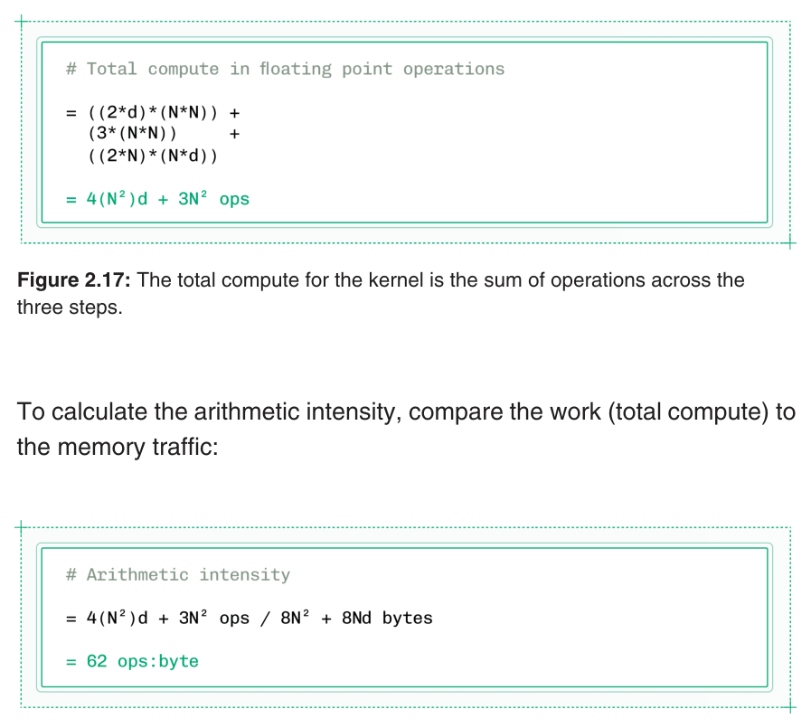
> *Figure 2.17: kernel 的总计算量是三个步骤中所有操作的总和。*

要计算算术强度，将工作量（总计算量）与内存流量进行比较：

> 
> *Figure 2.18: kernel 的算术强度是总工作量（计算操作数）除以内存移动量。*

在此示例中，62 的算术强度远低于 H100 GPU 的 295 的 ops:byte 比率。确切数值因模型、序列长度和硬件而异，但此示例说明了 decode 受内存瓶颈限制的一般原则。

像这样计算算术强度是一项学术练习，而非推理工程师的常规任务。但看一次有助于建立直觉。

### 2.4.3 图像生成推理瓶颈（Image Generation Inference Bottlenecks）

图像和视频模型相对较小——它们的参数量是前沿语言模型的十分之一——但其注意力机制在计算上同样要求很高。

图像和视频生成模型使用迭代去噪，而非自回归 token 生成。

正如 LLM prefill 的注意力一次性处理整个输入序列一样，生成媒体的注意力必须考虑以潜空间表示的整个图像或视频对象。

同样与 LLM prefill 类似，图像和视频生成模型推理受计算瓶颈限制。针对这些模态优化推理的具体技术在第 6.5 和 6.6 节中介绍。

## 2.5 优化注意力（Optimizing Attention）

对于 LLM，注意力随输入序列长度呈二次方增长。每次注意力计算都依赖于每个先前 token 的 K 和 V 值。在实践中，注意力在 decode 期间是线性时间操作，因为 KV cache 存储了先前 token 的键值计算结果。

即使是线性增长的算法也会变得非常昂贵。注意力是跨模型和架构的推理中最昂贵的部分之一。自然而然，优化注意力是一个重要且高度活跃的研究领域。

注意力是一个敏感的过程，因为每个 token 都依赖于每个先前 token。注意力中的小错误可能快速累积，使得注意力优化成为一个精细的过程。

Figure 2.14 展示了注意力算法本身很直接。然而，这种基本实现效率低下。中间矩阵 S 和 P 在一个步骤结束时存储，然后在下一个步骤中立即加载。

优化注意力有两种策略：

- 实现改进（Implementation improvements）：编写更高性能的 kernel，更高效地使用内存和计算。
- 新算法（New algorithms）：创建以优于二次时间复杂度扩展且质量损失最小的注意力算法。

实现改进仍然受限于注意力的二次时间复杂度，但它们是无损的（不影响质量），并使长序列推理在当前硬件上变得可行。其他算法方法则用质量换取时间和空间复杂度，尽管训练技术可以将影响降至最低。

最著名的注意力实现是 FlashAttention 系列论文和 kernel。基本算法可以用几行代码实现，而 FlashAttention 使用数万行代码在手工融合的 kernel 中实现注意力，这些 kernel 为特定 GPU 构建——用于 H100 的 FlashAttention 与用于 B200 的 FlashAttention 使用不同的代码。

FlashAttention 通过消除从内存中的过多读写，并以精确适配 GPU 能力的方式布局注意力算法来工作。FlashAttention 对于 LLM prefill 和视频生成等计算瓶颈操作特别有用。

另一个重要的实现是 PagedAttention。KV cache 很快就会变得很大，占满 GPU 内存且需要时间来读取。PagedAttention 将 KV cache 分区为块（pages），可以通过查找表访问。这意味着 KV cache 可以在 GPU 上以碎片化内存存储，而不需要单一的连续内存块。

虽然 FlashAttention 和 PagedAttention 是有价值的优化，但它们并没有改变注意力是二次算法这一事实。注意力的新变体改善了底层时间和空间复杂度：

- 滑动窗口注意力（Sliding window attention）：为前面 w 个 token 的滑动窗口计算注意力，将注意力从 O(N^2) 变为 O(Nw)，其中 w 通常在 8K 到 32K 的范围内。
- 门控注意力（Gated attention）：训练中引入的各种类型的层，允许在关于块长度的线性时间内近似计算某些上下文块的注意力。
- 线性注意力（Linear attention）：用线性时间算法替换二次 softmax 方程来近似注意力。
- 压缩注意力（Compressed attention）：周期性地压缩序列中较早的上下文，注意力同时考虑压缩的上下文和未压缩的近期 token。
- 多潜变量注意力（Multi-latent attention）：在低维潜空间中近似注意力。

直觉上，序列中彼此靠近的 token 比更早的 token 相互影响更大。我正在写的这句话与前一句话紧密相关，但与本章节开头的那句话关系就不那么紧密了。

这种直觉可以通过训练来扩展。像滑动窗口注意力这样的算法在训练期间应用时，会创建在推理中使用相同技术时仍能保持高质量的模型。

另一个研究方向是完全避免注意力，使用不同于 transformer 的架构。Mamba 是一种选择性状态空间模型（selective state-space model），用循环状态更新替代自注意力，在序列长度上实现线性扩展。混合模型有时将 Mamba 风格的状态空间模型块与 transformer 块混合使用。状态空间模型的应用仍然有限，尽管混合模型正变得越来越流行，如 NVIDIA Nemotron 3 Nano 等开源模型采用了混合架构。
