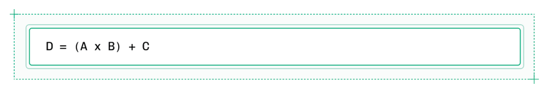
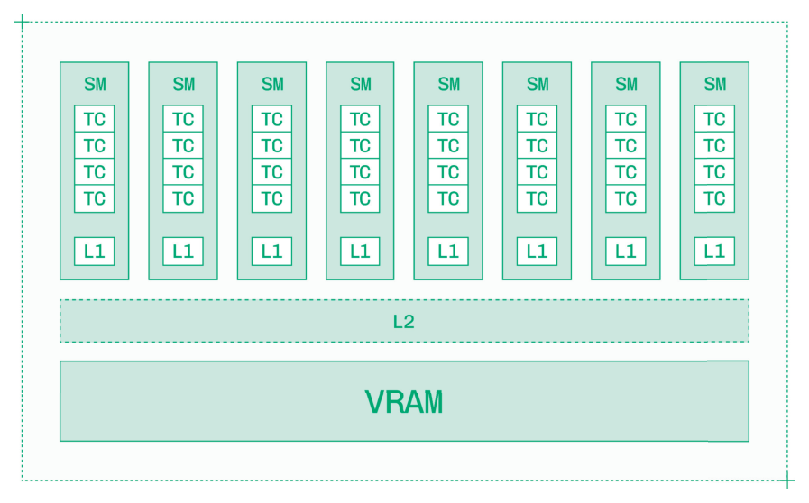
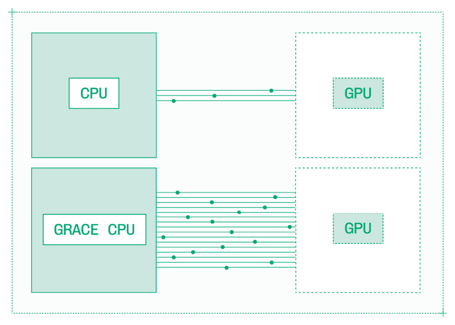
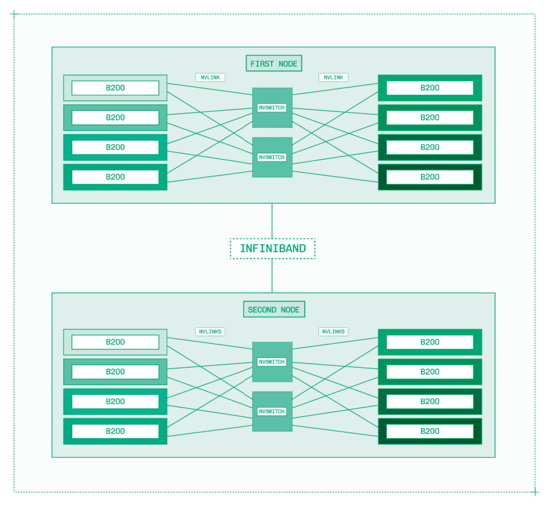
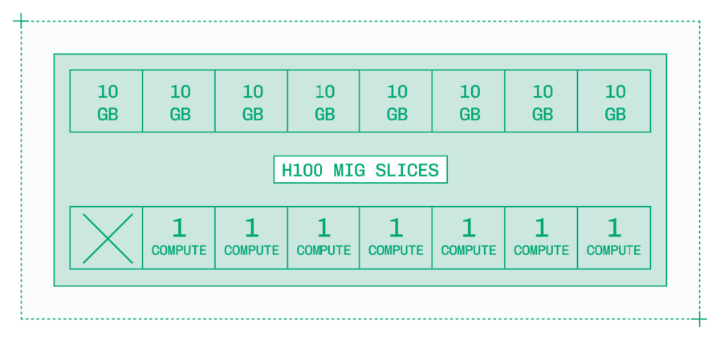

# Chapter 3: Hardware（硬件）

硬件  73

## Hardware

推理工程依赖加速器（accelerator）：专为加载 TB 级数据并每秒执行万亿次运算而设计的强大硬件。

推理中最常见的加速器类型是 GPU，而推理 GPU 市场的领导者是 NVIDIA。本书聚焦于数据中心 NVIDIA GPU 的推理工程，但本章 3.4 节会介绍数据中心加速器的其他供应商，3.5 节会介绍本地推理。

纵观各供应商，市场上的 GPU 分为三类：

- **数据中心 GPU（Datacenter GPU）**：搭载互连高性能 GPU 的机架式服务器。例如：NVIDIA B200。
- **工作站 GPU（Workstation GPU）**：用于专业工作流的独立桌面 GPU。例如：NVIDIA RTX Pro 6000。
- **个人计算 GPU（Personal computing GPU）**：用于日常使用的独立桌面 GPU。例如：NVIDIA GeForce RTX 5090。

大规模推理使用安装在机架上的数据中心 GPU：这些冰箱大小的机箱具备标准化的供电、网络和散热。像 NVIDIA B200 这样的数据中心 GPU 提供了最高的单卡性能，但更重要的是，它们包含高带宽的 GPU 间互连，安装在高度标准化的配置中，并且在全球数据中心中数以百万计地部署。

我怀疑你的桌子下面并没有一台 B200 GPU。如果有的话，给我发张照片！实际上，数据中心 GPU 上的推理以三种模式之一运行：

- **云端（Cloud）**：在别人的数据中心租用 GPU，通常是 AWS 和 GCP 这样的超大规模云厂商（hyperscaler），或者 Coreweave 和 Nebius 这样的新兴云厂商（neocloud）。
- **本地部署（On-premise）**：购买并安装在你直接控制的数据中心中的 GPU。
- **隔离部署（Air-gapped）**：在本地安装 GPU，需要物理访问 GPU 才能运行推理。

74  Chapter 3: Hardware

大多数推理工程师使用云端 GPU。大型企业和政府机构运行本地部署和隔离部署，但基于云端的 GPU 为快速增长的 AI 产品提供了扩展所需的灵活性和访问能力。

即使在这些约束条件下，驾驭硬件格局仍然十分复杂。从云厂商之间的差异到 NVIDIA 自身的命名约定，选择合适的加速器有诸多细微之处。

## 3.1 GPU 架构（GPU Architecture）

GPU 是吞吐量机器。CPU 擅长复杂的顺序执行，而 GPU 则专为简单的大规模并行工作负载而设计。

具体来说，GPU 非常擅长对数千个独立数据块执行同一操作。鉴于 AI 模型推理是一系列向量（vector）和矩阵（matrix）乘法，GPU 是天然的理想选择。

虽然高度并行计算的原理很简单，但 GPU 本身是极其复杂的技术产品。硬件工程是一个迷人的多学科领域，从芯片的供电和冷却物理到制造每个组件所涉及的极其严格的公差。

推理工程师在 GPU 硬件之上的一个舒适的抽象层次上工作，但对机箱内部发生的事情有一个强大的心智模型对于构建高性能系统至关重要。

### 3.1.1 计算（Compute）

如果你熟悉 CPU，你可能听说过核心（core），比如高端游戏电脑中的 8 核 Intel i9 CPU。

在 GPU 中，核心有不同的含义。GPU 有 Streaming Multiprocessor（SM），每个 SM 包含多个核心。GPU 中有三种计算类型：

- **CUDA Core**：对单个数字（标量）进行操作。

3.1.1 Compute 75

- **Tensor Core**：对向量和矩阵进行操作。
- **Special Function Unit（SFU）**：加速某些数学运算，如 sin、cos 和 log。

衡量推理的 GPU 计算能力时，应以 Tensor Core 的计算能力为标准。SFU 对于 softmax 至关重要，但 Tensor Core 负责执行 Matrix Multiply and Accumulate（MMA）指令，这是推理的基础。

MMA 中的"累加"步骤意味着将两个矩阵的乘积加到一个基础矩阵上以产生输出，如图 3.1 所示。

*Figure 3.1: *

与核心不同，线程（thread）的概念在 CPU 和 GPU 之间是相似的。CPU 有几十到几百个线程，而 GPU 有数万到数十万个可以并发工作的线程，它们可以在单个时钟周期内切换任务，并并行执行简单指令。

计算能力以 FLOPS（每秒浮点运算次数，floating point operations per second）衡量，数据中心 GPU 能够达到万亿或千万亿次 FLOPS（分别为 teraFLOPS 和 petaFLOPS）。然而，当你阅读规格表时，你会看到 Tensor Core 计算的两个测量值：

- **Dense（稠密）**：如果张量的每个元素都被使用时的原始浮点运算次数/秒。
- **Sparse（稀疏）**：在具有 2:4 结构化稀疏性（structured sparsity）的张量中，50% 的值为 0，Tensor Core 可以跳过乘以 0 的运算。

GPU 在给定精度下使用稀疏性的 FLOPS 通常（但不总是）是同一精度下稠密运算的两倍。默认情况下，推理是稠密的，因此请确保你查看的是不含稀疏性的 FLOPS。

76  Chapter 3: Hardware

FLOPS 通常随着精度每减半一次而翻倍。一个在 16 位数字上能达到 1 petaFLOPS 的 GPU，在 8 位数字上将能达到 2 petaFLOPS。这对推理很重要——务必在相同精度下比较不同 GPU 的 FLOPS。

计算是 LLM prefill 以及图像和视频生成的瓶颈。如果你在选择硬件时考虑这些用例之一，请选择 FLOPS 更高的加速器。

### 3.1.2 内存与缓存（Memory and Caches）

GPU 包含高速板载内存，称为 VRAM。就像 GPU 中的"G"代表图形（graphics）一样，VRAM 中的"V"代表视频（video）——这是这些加速器最初用途的印记。

如今，VRAM 以 HBM3、HBM3e 或 HBM4 的形式添加到 GPU 中，这些都是高带宽内存（High Bandwidth Memory）的不同代际。GPU 有几十或几百 GB 的 VRAM。

任何芯片（CPU 或 GPU）上都有两种类型的内存：

- **DRAM（Dynamic RAM）**：通用片外内存，以 GB 为单位。
- **SRAM（Static RAM）**：更快的、更昂贵的片上内存，以 KB 或 MB 为单位。

VRAM 是一种 DRAM。GPU 还以缓存（cache）的形式在片上配备 SRAM。GPU 有三级缓存：

- **L0**：单个 Tensor Core 的指令缓存。
- **L1**：每个 Streaming Multiprocessor 的共享内存。
- **L2**：跨 Streaming Multiprocessor 的全局缓存。

一块 H100 GPU 每个 Streaming Multiprocessor 有 256 KB 的 L1 缓存，以及片上共 50 MB 的 L2 缓存。

VRAM 带宽衡量通过内存总线在 GPU 核心和 VRAM 之间的峰值传输速率。在实践中，这决定了 VRAM 向 GPU 缓存层次结构供应数据的速度。

3.2 GPU Architecture Generations 77

*Figure 3.2: *

GPU 上的 VRAM 总量限制了你能在其上加载的模型大小。VRAM 应能容纳模型权重，外加至少 50% 的余量用于 KV cache（长上下文、大批量或视频生成模型需要更多）。

如果没有足够的 VRAM 可用于权重，加载模型将失败并报 OOM（out of memory，内存不足）错误。如果没有足够的余量，推理会很慢或因 OOM 而崩溃。

内存带宽是中低批量 LLM decode 的瓶颈。高端 GPU 有每秒数 TB 的内存带宽。如果你在选择 GPU 并希望每秒生成更多 token，请选择内存带宽更高的加速器，例如选择 H200 而不是 H100。

## 3.2 GPU 架构世代（GPU Architecture Generations）

硬件迭代周期很慢。从最终确定架构设计到 GPU 出货之间有数年的前置时间。

鉴于 AI 行业的发展速度，这个流片（tapeout）和测试过程意味着即使是下一代 GPU 也是在 AI 模型能力与今天完全不同的时候设计的。设计一个在市场上具有持久力的 GPU 架构，需要对用例在 GPU 预期生命周期内如何演进有前瞻性的洞察。

多年来，训练 AI 模型是 GPU 的主要用途。现在，随着推理成为主导用例，最新的架构正在引入面向推理的功能。

GPU 名称，如 B200，由两部分组成：

- **字母**：表示芯片中使用的架构世代。
- **数字**：标识该世代中的具体型号。

例如，H100 直接替代上一代 A100，而 H200 是同一世代中更大的 GPU（随后又被 B200 取代）。

编号看似有些随意，不同世代使用不同的数字组合，但一般规则是更大的数字意味着更大、更强大、更昂贵的 GPU。另一方面，架构字母则非常有意义。

每隔一到两年，NVIDIA 会发布新的 GPU 架构，该架构为从数据中心到个人电脑的所有产品提供动力。每个架构世代都会带来计算和内存的基础速度改进，以及更高效推理的新功能。

自 1998 年以来，NVIDIA 一直以杰出科学家的名字命名其 GPU 架构。

*Figure 3.1: *

3.2.1  Hopper GPUs  79

虽然 GPU 架构可以追溯到数十年前，但推理工程师通常在最近三到五个 GPU 世代内工作。即使是对成本敏感的工作负载，现代架构的效率也往往使它们在大规模流量中更具成本效益，当然更新的架构也提供更好的性能。

你偶尔仍可能在低流量或遗留系统中看到 Turing（T4）和 Ampere（A10、A100）GPU，但目前大多数部署使用 Lovelace（L4、L40）、Hopper（H100、H200）或 Blackwell（B200、B300）GPU。

Hopper 和 Blackwell 架构提供低精度 Tensor Core、高带宽内存和面向推理的功能，而 Lovelace GPU 用于小模型的低成本推理。即将推出的 Rubin 和 Feynman 架构分别在 2026 年和 2028 年发布时将带来更高的性能。

### 3.2.1 Hopper GPU

| GPU | FP8 计算（dense） | 内存 | 带宽 |
|-----|------------------|------|------|
| H100 | 1,979 teraFLOPS | 80 GB | 3.35 TB/s |
| H200 | 1,979 teraFLOPS | 141 GB | 4.8 TB/s |

Hopper 架构以海军少将 Grace Hopper 命名，最初于 2022 年 3 月随 H100 GPU 发布。

Hopper 引入了对 FP8 的支持，这是一种 8 位精度的浮点数格式。FP8 Tensor Core 的速度是 FP16 Tensor Core 的两倍，且传输 FP8 值只需要一半的内存带宽。正如第 5.1 节所讨论的，这并不能线性转化为双倍性能，但对于可以在 FP8 下运行的工作负载来说，这是一个显著的提升。

Hopper 架构在比前代更多更快的 Streaming Multiprocessor 中增加了第四代 Tensor Core。除了动态编程指令、线程块集群（thread block cluster）和分布式共享内存之外，Hopper GPU 为 CUDA 工程师提供了更多编写高性能 kernel 的工具。

80  Chapter 3: Hardware

其中一个这样的 kernel 是 FlashAttention 3，它提高了 Hopper GPU 上注意力机制的性能和内存效率。FlashAttention 3 利用了 Hopper 引入的新的异步数据传输和执行功能。

H100 和 H200 GPU 是使用最广泛的推理加速器之一，这是有充分理由的。Hopper 架构足够新以保证高性能，但又足够成熟以获得全行业的支持和高度优化的 kernel，H100 和 H200 GPU 的规模恰到好处，适合各种模态的常见工作负载。

### 3.2.2 Ada Lovelace GPU

| GPU | FP8 计算（dense） | 内存 | 带宽 |
|-----|------------------|------|------|
| L4 | 242 teraFLOPS | 24 GB | 300 GB/s |
| L40 | 362 teraFLOPS | 48 GB | 864 GB/s |

Ada Lovelace 架构以第一位计算机程序员的名字命名，首次发布于 Hopper 之后仅六个月。

这两个架构相似，Lovelace 更多是作为对应产品而非继任者。Lovelace 也支持 FP8 推理。

Hopper 专注于 AI 应用，而 Lovelace GPU 更偏向图形方向。Lovelace GPU 不支持 NVLink 互连。这是一个重大限制。配备八个 Hopper 或 Blackwell GPU 的节点使用这些高带宽互连实现高效并行。Lovelace GPU 必须单独使用或通过 Pipeline Parallelism 等低效的并行方法使用。

L4 GPU 可以是一种运行文本嵌入（text embedding）和计算机视觉等小模态模型的廉价便捷方式。

但 L40 GPU 通常不是推理的好选择。在相同的内存占用量下，多实例 GPU（第 3.3.2 节）在部分 H100 上提供了高得多的计算能力和内存带宽。

3.2.3  Blackwell GPUs  81

### 3.2.3 Blackwell GPU

| GPU | FP8 计算（dense） | 内存 | 带宽 |
|-----|------------------|------|------|
| B200 | ~5 petaFLOPS | 192 GB | 最高 8 TB/s |
| B300 | ~5 petaFLOPS | 288 GB | 最高 8 TB/s |

Blackwell 架构以数学家 David Blackwell 命名，最初于 2024 年 11 月随 B200 GPU 发布，随后是 B300。虽然 B100 确实存在，但在推理中并不常见。

Hopper 引入了 FP8，Blackwell 在低精度计算方面更进一步，引入了 FP4（一种 4 位浮点格式），以及一组微缩放格式（microscaling format，MXFP8、MXFP4、NVFP4），用于在推理过程中更好地保持质量。第 5.1 节详细解释了这些格式。

Blackwell 在 Hopper 的异步编程范式之上，增加了更多用于在 tensor 内存和全局内存之间加载和存储的功能。更新的 FlashAttention 4 kernel 在很大程度上依赖于异步流水线中的分块加载（tiling load）、计算和写入。

B200 和 B300 是推理的新的黄金标准，为大型语言模型和视频生成等高要求工作负载提供最高性能。Blackwell GPU 的软件支持、优化 kernel 和通用可用性近几个月都已上线，标志着推理行业的一个重要转折点。

### 3.2.4 Rubin GPU

Rubin 架构以天文学家 Vera Rubin 命名，将于 2026 年作为 NVIDIA 下一代 GPU 架构发布。

在评估新架构时，在你能够运行真实世界性能基准测试之前保留判断很重要。新架构的推出，以及随后的全行业软件支持，大约需要一年时间才能完全就绪。

在出版时，关于 Rubin 已有一些具体细节。Rubin 架构使用 HBM4，这是对驱动了前几代 GPU 的 HBM3 和 HBM3e 的升级。像 LLM decode 这样受内存带宽限制的推理任务将受益于这种更高吞吐量的 VRAM。

82 Chapter 3: Hardware

Rubin 还引入了新的 CPX，这是一种为 LLM prefill 等计算密集型任务而构建的独立芯片。CPX 将成为 NVIDIA 面向大批量推理的机架级系统的一部分。

在 Rubin 之后，NVIDIA 将于 2028 年发布 Feynman。关于 Feynman 的细节很少，但它可能支持更大型、更强大的芯片以及更快的内存架构。

### 3.2.5 Grace 和 Vera CPU

NVIDIA 还提供自己的基于 ARM 的 CPU，这些 CPU 与 GPU 集成在 GH200 和 GB200 等超级芯片（superchip）上。"G"代表"Grace"，即 Grace Hopper（与 Hopper GPU 相匹配）。

NVIDIA Grace CPU 总体上具有很强的计算性能，但对推理来说重要的是，它们在 CPU 和 GPU 之间有高得多的带宽连接。Grace CPU 使用 NVIDIA NVLink Chip to Chip 技术，实现 CPU 和 GPU 内存之间高达 900 GB/s 的双向带宽。

*Figure 3.3: *

3.3  Instances  83

这种 CPU 到 GPU 的互连速度比 PCIe 或其他标准的 CPU 与 GPU 之间的连接快数倍。

某些推理设置需要将重要信息（如 LoRA 微调权重和先前推理调用的 KV cache）卸载到 CPU 内存中，CPU 内存远大于 GPU 内存。使用 Grace CPU，这些信息可以被更快地检索。

对于 Rubin 架构，Vera CPU（以 Vera Rubin 命名）取代了在 Hopper 和 Blackwell 系统上使用的 Grace CPU。

## 3.3 实例（Instances）

云上 GPU 分配的原子单位是实例（instance）。一个实例是一个虚拟机，包括：

- **GPU（设备）**：一个或多个用于推理任务的 GPU。
- **CPU（主机）**：用于不在 GPU 上运行的任何任务的通用计算。
- **内存（主机内存）**：用于 CPU 操作的通用内存（传统 RAM）。
- **存储**：用于加载和存储大文件的磁盘内存。
- **网络**：到数据中心以及最终到公共互联网的物理网络连接。
- **互连（Interconnect）**：用于同时在多个 GPU 上运行的物理 GPU 间和节点间连接。

并非所有 GPU，也并非所有实例都是等同的。根据你的云厂商不同，实例在计算、内存、存储和互连方面各不相同。虽然 NVIDIA 提供自己的参考架构，但每个云厂商最终根据自己的偏好构建系统。

甚至 GPU 本身也可能因实例而异。例如，NVIDIA A100 GPU 有两种外形规格（form factor）：PCIe 和 SXM。但 A100 上的大多数推理运行在 SXM GPU 上，因为它们的内存带宽比 PCIe 变体高 5%。

84  Chapter 3: Hardware

在配置实例时，准确了解你获得的是什么至关重要。实例的任何组件——不仅仅是 GPU——都可能在推理过程中成为瓶颈或故障点。

### 3.3.1 多 GPU 实例（Multi-GPU Instances）

通常，模型太大无法在单个 GPU 上运行，或者推理工程师希望使用多个 GPU 来提高性能。通常需要两个、四个、八个甚至更多 GPU 来运行 DeepSeek 等大型模型或视频生成等高要求模态。

GPU 的标准单位是节点（node），包含八个独立的 GPU。例如，一个 B200 节点包含八个 B200 GPU。

这些 GPU 通过两个系统连接在一起：

- **NVLink**：GPU 之间的一对一通信层，Blackwell 上高达 1800 GB/s，Hopper 上为 900 GB/s。
- **NVSwitch**：NVLink 之上的全对全（all-to-all）通信层，用于协调节点中所有 GPU。

这些高带宽互连使得将单个模型的推理分布在多个 GPU 上成为可能，最多可达完整的 8-GPU 节点。

但有时一个节点不够。在超过八个 GPU 上运行极其高要求的推理工作负载需要节点之间的高带宽互连。

NVIDIA GPU 节点间互连的标准是 InfiniBand。InfiniBand 与 Ethernet 等网络技术竞争，2019 年 NVIDIA 收购了制造 InfiniBand 的 Mellanox。

InfiniBand 比 NVLink 慢得多，规格为每个 Network Interface Controller（NIC）高达 400 Gb/s。但它是市场上最快的节点间互连——Ethernet 每个 NIC 最高为 100 Gb/s。

3.3.1 Multi-GPU Instances 85

*Figure 3.4: *

并非每个云厂商都使用 InfiniBand。一些提供自己的互连，而另一些在某些 GPU 上有 InfiniBand，但不是全部。在配置 GPU 时，请仔细核对提供了什么互连以及该互连提供什么带宽。

除了 InfiniBand，NVIDIA 还提供了一种用于超过八个 GPU 之间 NVLink 连接的高端解决方案。其 NVL72 GB200 系统在一个全机架系统中结合了 72 个 Blackwell GPU 和 36 个 Grace CPU。这些系统为服务全球最大模型的高强度流量提供巨大的吞吐量。

NVIDIA Vera Rubin NVL 144 CPX 是这种大规模系统的下一代，配备了更新的 Vera CPU 和 Rubin GPU 以及新的 Rubin CPX。

86 Chapter 3: Hardware

在使用多 GPU 和多节点系统时，请记住相对带宽。当像 NVLink 这样的互连比 InfiniBand 快一个数量级时，它可以在成为瓶颈之前处理多得多的数据。第 5.4 和 5.5 节中讨论的并行和拆分技术利用这种拓扑结构在多个 GPU 上交付高性能推理。

### 3.3.2 多实例 GPU（Multi-Instance GPUs）

有时，推理工程师会遇到相反的问题：GPU 对模型来说太大了。

使用 Hopper 和 Blackwell 等更新的高性能架构需要像 H100 或 B200 这样的 GPU，它们具有相对较大的计算和内存分配。对于只有几十亿参数或更少的模型，很难有效利用这些 GPU。即使有大批量，宝贵的 GPU 资源也会被浪费。

与其在较旧、性能较低的 GPU 上运行小模型，有一种方法可以在更新的高性能 GPU 的一部分上运行这些轻量级工作负载。

Multi-Instance GPU（MIG）是 A100、H100、H200 和 B200 等较大 GPU 中的硬件级功能。这些 GPU 最多可以被分成七份。这些分片 GPU 还会获得一部分 CPU、RAM、存储和组成实例所需的其他资源。

*Figure 3.5: *

3.4  Other Datacenter Accelerator Options  87

例如，一个三切片的 H100 MIG 拥有约 3/7 的可用计算能力，可以访问多达总 VRAM 的一半，即 40 GB。它还包括分配给底层 H100 的 CPU 核心、CPU 内存、存储和网络带宽的大约一半，以组成一个实例。

软件工程通常以 2 的倍数工作，所以看到七个计算切片可能显得奇怪。计算切片由 GPU 中的 Streaming Multiprocessor 组成。GPU 通常没有整齐的 2 的倍数的 SM 数量，例如，SXM H100 GPU 有 132 个 SM。因此，创建了七个等大小的计算切片，剩余的 SM 保持空闲。

对于像 Orpheus TTS 这样的 3B 参数小模型，使用两个 MIG 实例有时比将整个 GPU 分配给单个实例更高效地利用资源。

## 3.4 其他数据中心加速器选项（Other Datacenter Accelerator Options）

NVIDIA 在 AI 硬件市场的领导地位使其成为世界上最有价值的公司。但它远不是唯一一家制造能够运行 AI 推理的硬件的公司。

从 Amazon 和 Google 等行业巨头到大批初创公司，竞争对手正在投入数十亿美元开发和制造 NVIDIA GPU 的替代品。

虽然本书侧重于优化 NVIDIA GPU 上的推理，以下是运行模型推理的其他值得注意的硬件选项简表。

| 公司 | 阶段 | 旗舰产品 |
|------|------|----------|
| AMD | 上市公司 | MI350 GPU：一款具有竞争力的数据中心 GPU，运行在 AMD 自己的软件栈上。|
| AWS | 上市公司 | Inferentia 和 Trainium：一对分别专为 AWS 上的推理和训练而构建的芯片。|
| Cerebras | 初创公司 | WSE-3：一款晶圆级芯片，具有极高的内存带宽以消除 decode 瓶颈。|

88  Chapter 3: Hardware

| 公司 | 阶段 | 旗舰产品 |
|------|------|----------|
| Etched | 初创公司 | Sohu：一款专为 transformer 架构设计的 Application-Specific Integrated Circuit（ASIC）。|
| Furiosa | 初创公司 | RNGD：一款专为张量收缩运算（tensor contraction operation）设计的节能加速器。|
| Google | 上市公司 | TPU：Tensor Processing Unit 是一种专为推理和训练构建的 AI 专用 ASIC。|
| Groq | 初创公司 | LPU：一种可组合的语言处理单元，依赖 SRAM 实现高内存带宽。|
| Qualcomm | 上市公司 | Cloud AI 100 Ultra：一款由多个节能移动 GPU 组成的全尺寸 GPU。|
| Sambanova | 初创公司 | RDU：一种具有大内存分配的 Reconfigurable Dataflow Unit，适用于万亿参数模型。|

GPU 是相当通用的加速器。每家试图从 NVIDIA 手中赢得推理工作负载的硬件公司都在押注其产品能够获胜的特定优势：

- **内存带宽**：像 Cerebras 和 Groq 这样的初创公司通过在超高带宽内存上加速 decode，为 LLM 实现了高每秒 token 数。
- **功耗效率**：像 Furiosa 和 Qualcomm 这样的公司设计低功耗芯片，从而降低运营成本。
- **平台集成**：像 Amazon 和 Google 这样的企业与它们的云服务平台和专有闭源模型建立深度集成。

虽然这些加速器选项各有其制胜的用例，但它们面临共同的挑战：

- **软件**：没有 CUDA，硬件供应商必须为其加速器重建整个推理栈。
- **制造**：公司需要组装人类有史以来制造的最复杂的物体。
- **分发**：在制造芯片之后，供应商需要将其安装并上线以向市场投放产能。

3.5  Local Inference  89

竞争加速创新。拥有更多数据中心硬件选项的市场对每位推理工程师都是好事。随着推理工作负载变得更有价值，这个领域的竞争只会越来越激烈，数据中心之外的选项（如本地推理）的探索也是如此。

## 3.5 本地推理（Local Inference）

本地推理（local inference），也称为边缘推理（edge inference）、客户端推理（client-side inference）或设备端推理（on-device inference），是指直接在终端用户设备上而非中央服务器上运行 AI 模型推理。

客户端推理相对于服务器端推理有四大巨大优势：

- **零网络延迟**：没有通信开销，节省数十甚至数百毫秒。
- **独立性**：不依赖互联网连接，不受高服务器流量或宕机的影响。
- **改善隐私**：终端用户的数据不会离开其设备。
- **成本**：数据中心 GPU 昂贵，而边缘推理对开发者免费，解锁了新的商业模式。

本地推理在理论上听起来很完美。在实践中，大多数推理在云端进行是有原因的。本地推理有四个限制其应用的弱点：

- **硬件能力**：即使是高端消费级桌面也只能提供数据中心 GPU 速度和性能的一小部分。
- **散热限制**：本地设备的散热不如数据中心，进一步限制了其速度和性能。
- **碎片化的支持矩阵**：无尽的硬件和软件组合使标准化变得困难。
- **电池寿命**：推理是一种高要求的工作负载，会快速消耗笔记本电脑和智能手机的电池。

在使用本地推理进行构建时，重要的是记住你的受众。AI 爱好者可能拥有最新最好的手机和一台

90  Chapter 3: Hardware

强大的电脑，但中位数用户更可能拥有组件性能较弱的旧设备。

本地推理正在从实验阶段转向生产阶段，拥有跨硬件和软件的强大生态系统，以及与世界开放模型紧密相关的活跃社区。

### 3.5.1 桌面推理（Desktop Inference）

经典的本地设备是配备一两个来自 NVIDIA 或 AMD 的高端消费级 GPU 的工作站或游戏 PC。虽然研究人员和爱好者确实使用这些配置，但它们只是桌面推理市场的一小部分。

越来越多地，Apple 成为桌面推理市场的领导者。Apple 定制的 M 系列 CPU 和 GPU 从统一的内存（unified memory）中提取数据，使 GPU 上的推理可以访问多得多的内存，尽管速度较慢。

Apple 和 NVIDIA 目前市场上可用的最高端选项说明了内存容量与速度之间的权衡。

| 硬件 | NVIDIA RTX 5090 | Apple M3 Ultra |
|------|-----------------|----------------|
| 内存 | 32 GB | 512 GB |
| 带宽 | 1,792 GB/s | 819 GB/s |
| 成本（完整电脑）| $5,000 | $10,000 |

这一趋势延续到更合理价格点的中端硬件。像 Chromebook 这样的低端电脑不具备运行任何有意义的本地推理的能力。

以爱好者为主导的开源生态系统专注于在桌面和笔记本电脑上运行前沿开放模型。如今，使用 Ollama 和 llama.cpp 等工具，在高端个人硬件上运行经过激进量化（aggressively quantized）的 100B+ 参数模型是可能的。

Mixture of Experts 日益增长的流行也是桌面推理的助力。这些模型具有更少的活跃参数，意味着

3.5.2  Mobile Inference  91

单个用户的单次请求只涉及模型总权重的一小部分。

图像生成在个人电脑上也非常流行，特别是通过 ComfyUI，这是一种将多个图像模型组件组装成单个流水线的工具。

较小的语言模型和语音等其他模态在中端电脑上也可以运行，行业正在快速开发 WebLLM 等浏览器推理库和其他跨平台标准，以将这些能力从早期采用者推向主流。

### 3.5.2 移动推理（Mobile Inference）

移动设备上的本地推理代表了当今大多数设备端工作负载。两大操作系统都为开发者提供了将边缘推理添加到应用中的工具：

- **Android**：Google 的 AI Edge SDK 和 ML Kit GenAI API 与 Gemini Nano 和 OSS Gemma 模型交互。
- **iOS**：Apple 的 Foundation Models 和 Core ML 框架提供跨模态模型的 API。

移动设备的硬件能力和电池容量极其有限，使推理更具挑战性。即使是高端手机也难以运行超过一二十亿参数的模型。

尽管如此，某些模态非常适合在手机上进行边缘推理。例如，转录和语音合成模型对延迟敏感，一些模型足够小，可以在现代手机上实时运行。其他离散任务，如翻译，可以由小型微调模型在边缘设备上处理。

与任何其他软件一样，推理的未来不是本地或云端，而是两者协同工作，为用户提供快速无缝的体验。

小型模型和快速查询将在终端用户设备上运行，而更高要求的工作负载将留在云端的数据中心 GPU 上。
