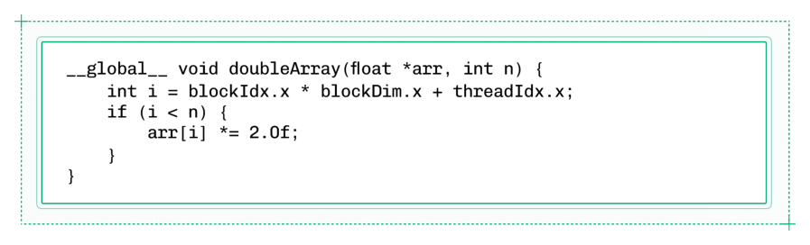
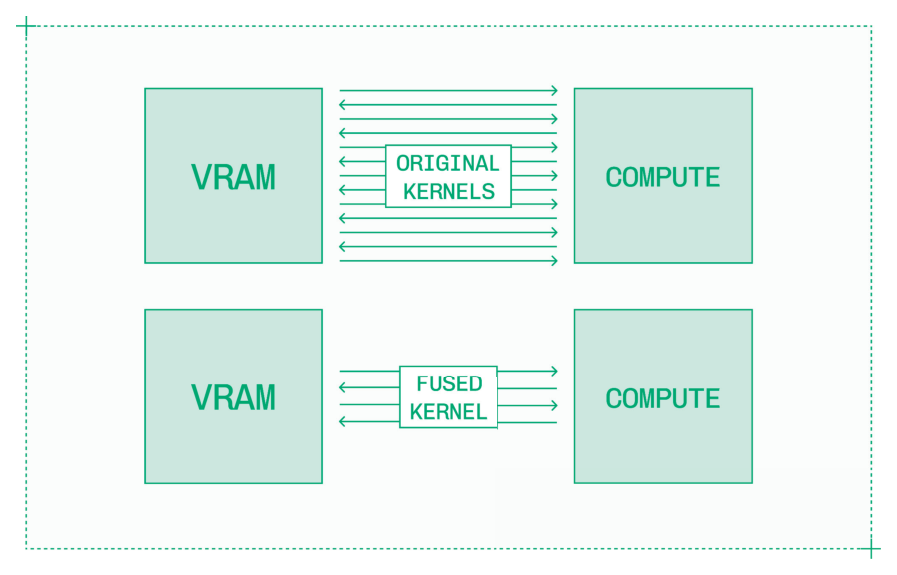
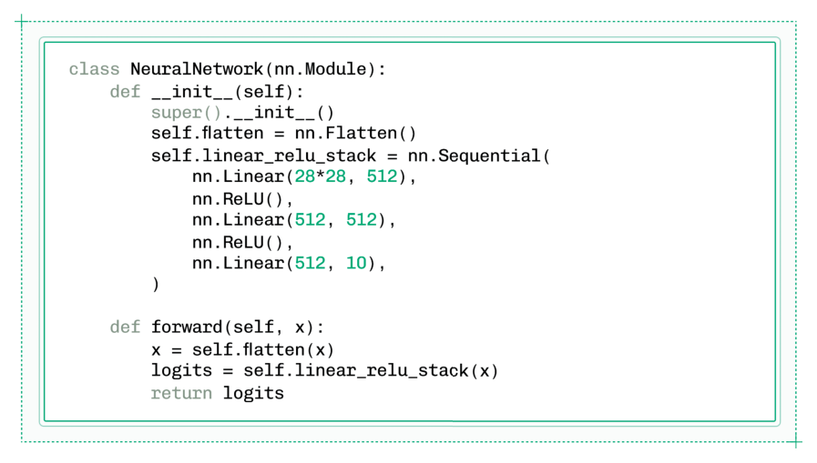
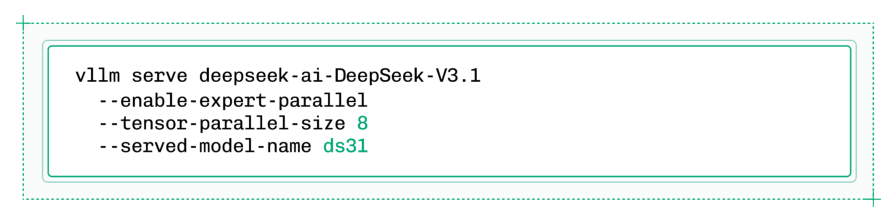
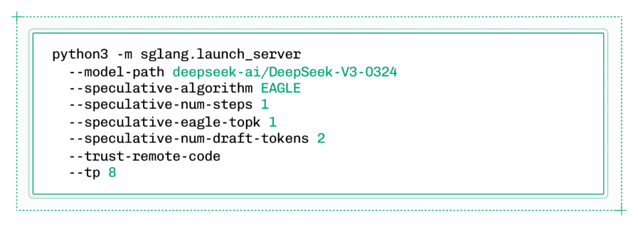
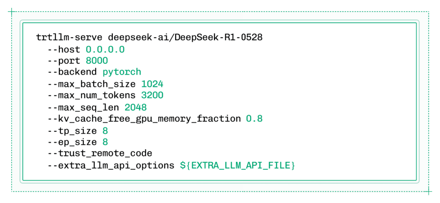
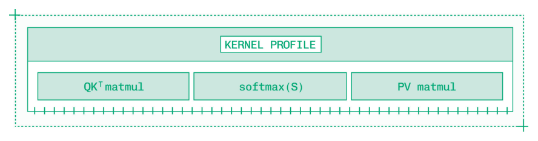

# Chapter 4: Software（软件）

## 软件

NVIDIA 在推理领域的市场主导地位，在很大程度上归功于围绕其硬件构建的成熟而强大的软件生态系统。

硬件迭代周期缓慢。像 Apple 和 NVIDIA 这样一流的硬件公司最多每年发布一次新架构和新一代产品，而两年一次的发布周期更为常见。

但软件迭代非常快。通常，要在零日（day zero）运行一个新发布的开放模型，你需要安装每个软件依赖的 nightly build 或其他预发布版本，才能获得对新模型的支持。

软件的快速迭代周期和较低的进入门槛极大地拓展了推理工程的版图。虽然硬件领域以 NVIDIA 和少数几家竞争对手为中心，但有无数公司在推理栈的各个层级构建软件。

对于推理工程师来说，以下是一些关键参与者：

- **NVIDIA**：大力投资构建自己的（有时是专有的）软件生态系统，从 CUDA 一直到 Dynamo。
- **Hugging Face**：维护所有开放模型的模型注册表，以及 transformers 和 diffusers 库。
- **Linux Foundation**：维护硬件无关的项目，如 PyTorch 和 vLLM。
- **LMSYS Org**：开发推理和评估的基本工具，最著名的是 SGLang。

还有成千上万的公司、大学和研究机构在推理领域做出重要的开源贡献。

软件领域太庞大、变化太快，无法在任何一本书中进行详尽的记录，更不用说在一个章节中。因此，本章介绍的是具有长期重要性的基础技术。

在整个章节中，技术按照抽象层级从低到高依次呈现：

- **CUDA**：与 GPU 直接通信，实现对计算和内存的显式控制（第 4.1 节）。
- **深度学习框架**：对 CUDA 的抽象，用于在 Python 中训练、导出和运行神经网络（第 4.2 节）。
- **推理引擎**：基于 PyTorch 的高度可配置推理，适用于常见架构（第 4.3 节）。
- **NVIDIA Dynamo**：位于推理引擎之上，为大规模部署提供支持（第 4.4 节）。

当今大多数推理工程工作都在较高的抽象层级进行，即配置和部署推理引擎，以及跨多个 GPU 编排推理。无论你在栈的哪个层级工作，拥有对相邻抽象层级的清晰思维模型来指导你的工作都是至关重要的。

## 4.1 CUDA

CUDA 是你编写在 NVIDIA GPU 上运行的代码的方式。

更正式地说，CUDA 是 NVIDIA 的专有计算平台和编程模型，用于在 GPU 上执行并行任务。"平台"和"编程模型"都是宽泛的定义；从其组成部分来看 CUDA 会更容易理解：

- **CUDA kernel**：在 GPU 上执行并行化代码的用户定义函数。
- **CUDA graph**：由 kernel 和其他 GPU 操作组成的有向无环图（DAG），用于优化重复工作流。
- **CUDA driver**：应用程序与 GPU 硬件之间的低层接口，用于管理内存和执行。
- **CUDA runtime**：面向开发者的 API，用于启动 kernel 和管理内存。

CUDA——代表 Compute Unified Device Architecture（统一计算设备架构），尽管如今这个缩写很少被展开——是 NVIDIA GPU 上整个生成式 AI 生态系统的基石。

CUDA 不是一种编程语言。相反，CUDA 程序是用编程语言（最常见的是 C++）编写的，然后由 nvcc 等编译器编译为独立的 CPU 和 GPU 代码。

一个 kernel 就是一个执行某种并行计算的函数。每当你看到"CUDA kernel"这个词，你可以将其替换为"一段为 NVIDIA GPU 编写的代码"。

作为一个"Hello, World!"的 kernel 示例，考虑以下六行 C++ 代码，它接收一个长度为 n 的数组，并将数组中的每个元素翻倍。

*Figure 4.1: 示例 CUDA kernel 将数组中的每个值翻倍。*

通常，在 CPU 上，这个函数会以线性时间运行，数组中的每个元素被顺序翻倍。但在 GPU 上，数千个元素可以被同时处理，使这个函数高效得多。

编写 CUDA kernel 将推理工程从思考算法转向思考实现。例如，生成式 AI 中核心的传统 attention 算法可以用几十行代码来表达。然而，FlashAttention——执行的是相同的数学运算——却需要数万行代码来以一种更适合特定 GPU 的内存高效方式实现该算法。

### 4.1.1 用于推理的 CUDA Kernel

编写 CUDA kernel 并不意味着要从零开始构建。

可供借鉴的现有技术比 CUDA 还要早数十年。BLAS（Basic Linear Algebra Subprograms，基础线性代数子程序）于 1970 年代首次在 Fortran 中实现，是从点积到矩阵乘法等常见线性代数运算的规范。

cuBLAS 是 BLAS 的 CUDA 实现，以预构建 kernel 的形式将这一规范引入 CUDA，用于基本的线性代数运算。类似地，cuDNN（CUDA Deep Neural Network）为神经网络提供了原语。

在 BLAS 中，推理中最常用的操作是 GEMM（General Matrix-Matrix Multiplication，通用矩阵-矩阵乘法）。模型中的每个线性层都使用矩阵乘法，而 cuBLAS 提供了一个强有力的起点。

但你并不局限于 cuBLAS 的实现。由于 GEMM 等操作对推理如此关键，你可能需要更细粒度的控制。你可能会为不同形状的矩阵编写不同的 GEMM kernel，或者为了在特定 GPU 架构上更好地运行而编写不同的 kernel。

CUTLASS 是一个模板库，为编写高性能 kernel 提供构建块。例如，FlashAttention 3 使用了 CUTLASS。CuTe 是另一个模板库，引入了针对新架构的 tiled tensor 操作的抽象。借助 CUTLASS 和 CuTe 等工具，可以在更高层次的抽象上编写 kernel，同时保持出色的性能。

另一个 kernel 来源是 FlashInfer，这是一个为 LLM 推理提供高性能 kernel 实现的库，包括许多优化的 attention kernel 和 fused sampling 函数。

### 4.1.2 CUDA Kernel 选择

大多数推理工程师永远不需要编写自己的 kernel。然而，kernel 选择——从一系列选项中选择最佳 kernel——是推理优化的重要组成部分。

Kernel 实现是高度专业化的。CUDA 暴露了用于内存管理和并行计算的底层 API，kernel 工程师根据他们所针对的硬件的精确规格做出实现决策。

理解 kernel 实现与特定硬件细节之间的紧密关联非常重要。Kernel 通常包含基于给定 GPU 的内存带宽或 Tensor Core 数量或布局的硬编码值。

为 H100 编写的 kernel 可能无法充分利用 B200 的架构和额外内存，而为 B200 编写的 kernel 可能与上一代 Hopper 架构不向后兼容。每一代 GPU，将手写 kernel 移植到新架构上以最优方式运行都需要大量的工程工作。

大多数 kernel 选择是自动的。深度学习框架和推理引擎为各种架构预配置了 kernel，而 PyTorch 和 TensorRT-LLM 在其编译步骤中包含自动 kernel 选择。

但是，你可能会为关键算法手动选择一些 kernel 来加速推理。

例如，大多数生产就绪的 GEMM kernel 来自 cuBLAS。但当 DeepSeek 实验室发布更新版本的 DeepSeek-V3 时，他们也发布了 DeepGEMM，它提供了更高效的 GEMM kernel，用于在 Hopper GPU 架构上以 FP8 运行矩阵乘法。

手动 kernel 选择让你可以将 DeepGEMM kernel 作为插件插入，以加速推理中的特定步骤，如乘以两个精确维度的矩阵。只需注意确保兼容性。例如，如果你要升级到 B200 GPU，你必须将 kernel 替换回去、等待 DeepGEMM 支持 Blackwell（在出版时已支持），或者自己移植 kernel。

### 4.1.3 通过 Kernel Fusion 减少内存访问

对相同数据连续运行两个不同的 kernel 会导致对内存的冗余读写。

举一个简单的例子，假设有两个 kernel：multiply_by_2 和 multiply_by_3。如果这两个 kernel 连续运行，流程将是：

1. 从内存中读取输入向量 [1, 2, 3]。
2. 对该向量运行 multiply_by_2。
3. 将输出向量 [2, 4, 6] 保存到内存。
4. 从内存中读取新的输入向量 [2, 4, 6]。
5. 对该向量运行 multiply_by_3。
6. 将最终输出向量 [6, 12, 18] 保存到内存。

低效之处显而易见：步骤三和四构成了一次不必要的内存往返。在 decode 阶段（LLM 推理中受带宽限制的阶段），推理引擎无法承受对内存的不必要读写。

Kernel fusion 是将两个或多个 kernel 重新实现为一个处理所有操作的单个 kernel 的过程。在这个例子中，融合后的 kernel 将是 multiply_by_6，新的操作顺序将是：

1. 从内存中读取输入向量 [1, 2, 3]。
2. 对该向量运行 multiply_by_6。
3. 将最终输出向量 [6, 12, 18] 保存到内存。

在实践中，kernel fusion 要复杂得多——函数更复杂，数据重叠也不那么干净。但在推理的 kernel fusion 中有常见的模式，比如将矩阵乘法、偏置加法和激活函数组合在一起。

*Figure 4.2: Kernel fusion 减少了 GPU 内部内存和计算之间的读写操作。*

Kernel fusion 可以是自动的，也可以是手动的。编译器可以识别简单的融合机会并自动创建融合 kernel。但更复杂的算法，如 FlashAttention，需要手写的融合 kernel，在推理期间通过插件使用。

## 4.2 深度学习框架和库

深度学习框架和库是直接使用 CUDA 与使用现成推理引擎（如 vLLM）之间的桥梁。这些库同时用于训练和推理。

在过去几年中，PyTorch 已成为这一栈层级中明显的领导者。还有另外两个框架，为简洁起见，我只简要提及：

- **TensorFlow**：由 Google 官方支持的端到端机器学习平台，TensorFlow 在 2010 年代的机器学习时代很突出，但如今已不再流行。
- **JAX**：非正式地与 Google 关联的研究项目，JAX 提供了更简单的接口，没有那么多遗留特性和操作。然而，正如文档所警告的，expect sharp edges（预期会遇到一些问题）。

本节的其余部分聚焦于 PyTorch 及其在栈中周围和之上的技术。

### 4.2.1 PyTorch

PyTorch 是一个用于描述 tensor 操作的 Python 包。PyTorch 最初由 Meta 创建，现在是 Linux Foundation 的一部分，是生成式 AI 模型训练和推理的业界标准技术。

就我个人而言，我整个职业生涯都是一名 Python 程序员，我发现在底层编写 C++ 很困难。借助 PyTorch，我可以用 Python 为 CPU 和 GPU 编写高性能推理代码，而且在需要时，我随时可以通过插入特定的 kernel 深入到 CUDA。

PyTorch 可以训练任何类型的神经网络。PyTorch 文档展示了一个基本的神经网络示例：

*Figure 4.3: PyTorch 中的基本神经网络，改编自 PyTorch 文档。*

虽然这是一个非常简单的示例，但你可能已经认出第 2 章中讨论过的线性层和 ReLU 激活函数是神经网络的关键组成部分。

PyTorch 通过其 autograd 模块自动计算任何可微函数的梯度。这正是 PyTorch 在训练方面如此强大的原因——你定义一个计算图，就能获得用于训练的梯度。

但 PyTorch 的特殊之处在于它不仅非常适合训练，在推理方面也很强大。PyTorch 在内置函数和自动性能优化与你需要的手动控制之间取得了平衡。

将模型从训练转变为推理的步骤是编译。PyTorch 编译（torch.compile）针对特定的 GPU，执行自动 kernel 选择和 kernel fusion 以确保最佳性能。

torch.compile 无法融合像 DeepGEMM、FlashAttention 或自定义 kernel 这样的插件 kernel。这限制了它在 LLM 推理中的实用性，因为大多数 kernel 都是自定义的。然而，PyTorch 编译对于优化不太常见的模型架构以及编译轻量级 kernel 的长序列非常有用。当你优化具有自定义或罕见架构的模型时，可能需要重写函数使其更抽象——特别是涉及 Python 特有的语言特性——才能成功编译。

单独使用 PyTorch 就是构建高性能推理服务的强大而灵活的工具。但在 PyTorch 之上有一个丰富的生态系统，可以更快地为常见模型架构实现、编译和执行优化代码。

### 4.2.2 模型文件格式

序列化模型权重的主导文件格式是 safetensors，由 Hugging Face 创建。

Safetensors 是 bin 等通用格式的替代品，专门为存储模型权重而设计。safetensors 中的"safety"（安全）来自于这样一个事实：与在反序列化期间可以执行任意 Python 代码的通用格式不同，safetensors 只存储 tensor 数据，不存储可执行代码。

生成式 AI 模型有数百 GB 的权重。这些权重被分散存储在数十个 safetensors 文件中。safetensors 格式使用内存映射（memory mapping）来确保文件可以在不分配全部内存的情况下加载，这使得加载模型权重更快、更安全。

另一种主流格式 ONNX（Open Neural Network Exchange）将权重与模型的执行图一起存储。safetensors 格式将权重与架构分离，而 ONNX 则将它们捆绑在一起。

ONNX 文件具有高度可移植性。凭借与 PyTorch 的深度集成和对多种硬件选项的支持，ONNX 是当你想要存储模型图而不仅仅是权重时的一个很好的 safetensors 替代方案。

### 4.2.3 ONNX Runtime 和 TensorRT

ONNX Runtime 和 TensorRT 是高性能推理运行时。PyTorch 模型可以导出为 ONNX 格式，ONNX Runtime 可以直接执行该格式，或者 TensorRT 可以将其编译为高度优化的引擎。

| | ONNX Runtime | TensorRT |
|---|---|---|
| 开源，与 Linux Foundation 关联 | 混合专有和开源组件，由 NVIDIA 构建 |
| PyTorch 生态中的一流导出器 | 通过 Torch-TensorRT 与 PyTorch 集成 |
| 支持多种类型的 GPU | 仅支持 NVIDIA GPU |

ONNX Runtime 是一个开放的社区标准，而 TensorRT 专门针对 NVIDIA GPU。

导出过程看起来有点像 Torch 编译。然而，这些标准并不支持 PyTorch 中的每种数据结构、类型和操作。导出过程可以识别 PyTorch 代码中的这些问题，但对于更复杂的模型来说就变得棘手了。

一个例子是 DeepSeek V3，它引入了 Multi-Latent Attention（MLA）。MLA 在 PyTorch 中的实现很难导出，但 transformers 架构整体上足够简单，手写融合 kernel 是可行的。

如今，越来越流行的做法是直接从 PyTorch 跳到 vLLM 或 TensorRT-LLM 等推理引擎来处理这些引擎支持的模型，绕过中间表示步骤，仅以 safetensors 格式导出权重。ONNX Runtime 和 TensorRT 仍然被广泛使用——尤其是 TensorRT，因为它为图像和视频模型提供了强大的开箱即用运行时——但行业正在分岔为两个方向：手写 PyTorch 代码的控制力或预构建推理引擎的便利性。

### 4.2.4 Transformers 和 Diffusers

Hugging Face 的 transformers 和 diffusers 库构建在 PyTorch 之上，但并非设计用于运行大规模生产推理。相反，这些库提供模型的参考实现，供推理工程师学习和改编。

虽然这些库是用于试验的工具箱，但它们确实包含关于模型的基本信息和构建模型推理服务器的有用工具。随 transformers 和 diffusers 实现的模型一起提供的 config.json 文件包含重要信息，这些库用于 Hugging Face 操作（如下载模型权重）的工具被广泛使用。

你可以在 Hugging Face 上大多数流行开放模型的模型卡片（model card）中找到 transformers 或 diffusers 的示例代码。这些示例代码非常适合理解模型的精确输入输出规格，或者用于运行本地推理和 notebook。但对于生产环境，你需要直接编写和编译 PyTorch 代码，或者使用生产就绪的推理引擎。

## 4.3 推理引擎

市场上有三个具有竞争力的推理引擎：vLLM、SGLang 和 TensorRT-LLM。

这些框架为 LLM 和具有类似架构的其他模态提供了良好的开箱即用性能（第 6 章）。

在 2025 年底，vLLM 和 SGLang 也分别开始通过 vLLM Omni 和 SGLang Diffusion 支持一些图像和视频生成模型。TensorRT-LLM 不支持图像或视频生成模型。推理工程师也可以直接使用 TensorRT 或 PyTorch 来运行这些模型（第 6.5 节）。

推理引擎之所以强大，是因为它们是可配置的。在更高的抽象层级使用预优化的组件，推理工程师可以将时间花在测试技术组合上，而不是重复日常实现。

在较高层面上，vLLM 和 SGLang 是更通用的工具，更容易上手，并对更多模型提供零日支持，而 TensorRT-LLM 学习曲线更陡峭，但通常能达到最佳性能。

| | vLLM | SGLang | TensorRT-LLM |
|---|---|---|---|
| 性能 | 良好 | 良好 | 最佳 |
| 易用性 | 简单 | 简单 | 较难 |
| 模型支持 | 最多 | 最多 | 部分 |
| 硬件 | GPU, TPU | NVIDIA, AMD | 仅 NVIDIA |
| 许可证 | Apache 2.0 | Apache 2.0 | Apache 2.0 |

每个框架都开箱即用地支持核心功能，如 continuous batching，并支持主要的性能优化技术——post-training quantization、speculative decoding、prefix caching、parallelism、disaggregation。

在 Baseten，我们使用所有三个框架，尽管我们使用 TensorRT-LLM 最多。推理工程师应该熟悉所有三个框架，并根据每次部署的具体情况进行选择。

### 4.3.1 vLLM

vLLM 在推理引擎中拥有最大的市场份额。GitHub stars 是衡量受欢迎程度的粗略指标，但在出版时，vLLM 的 stars 数量是 SGLang 和 TensorRT-LLM 之和的两倍。

vLLM 于 2023 年夏天首次发布，是这些推理引擎中最早发布的，早了几个月。vLLM 最初在 UC Berkeley 创建，现在托管在 Linux Foundation 的 PyTorch 项目中。

vLLM 最大的卖点是它的广泛支持。它支持最多的硬件选项——NVIDIA、AMD 和 Intel GPU 以及 Google TPU——以及最多的模型和架构。几乎所有开放 LLM 从零日起就与 vLLM 集成。vLLM 还通过 vLLM Omni 支持多模态推理，该功能将引擎扩展为支持图像、音频和视频输入和输出。

推理工程的一个核心原则是：你能引入的约束越多，就能实现越好的性能。vLLM 的广泛平台在正确配置时可以实现令人印象深刻的性能结果，但根据我的经验，它不如像 TensorRT-LLM 这样的窄框架所能达到的最高端性能。

vLLM 的开发者体验围绕 `vllm serve` 命令构建，服务器配置以标志（flags）形式传入。

*Figure 4.4: 八个 GPU 上的 vLLM 推理示例。*

vLLM 可以通过 pip 安装，并提供官方 Docker 镜像，其中预捆绑了依赖项并支持各种硬件架构。

你应该在以下情况使用 vLLM：

- 你想快速搭建一个模型服务器，几乎适用于任何开放模型，开箱即用就能提供出色的性能。
- 你想运行具有多种输入和输出模态的"Omni"模型。
- 你使用的是较小的 GPU 或较旧的架构，TensorRT-LLM 在这些方面提供的性能优势有限。

### 4.3.2 SGLang

SGLang 是另一个主要的社区驱动的快速推理框架。SGLang 于 2023 年 12 月首次发布，与 DeepSeek 和 Qwen 等中国开放模型一起崛起，是 xAI 推理的首选引擎。

SGLang 对模型服务问题的独特视角体现在其开发者体验中，将快速的后端运行时与灵活的前端语言配对。在实践中，这意味着你可以选择引擎的各个组件进行深度定制，而无需从头开始重写其他所有内容。

SGLang 支持 NVIDIA 和 AMD GPU，并对广泛的模型有强大的零日支持。SGLang 与 DeepSeek、Qwen、Kimi 和 Z AI 等实验室密切合作，发布新架构特性（如 DeepSeek 的 Multi-Latent Attention）的优化实现。

SGLang 在支持 MoE LLM 的大规模部署方面投入巨大，特别是在 GB200 NVL72 等系统上的多节点部署，以实现高吞吐量。这些系统为具有大量流量的大型模型提供了极具成本效益的推理。

SGLang 的开发者体验围绕 `sglang.launch_server` 命令构建，服务器配置以标志形式传入。

*Figure 4.5: 八个 GPU 上的 SGLang 推理示例。*

SGLang 还通过 SGLang Diffusion 支持图像和视频生成模型推理。

SGLang Diffusion 引入了一个 pipeline 抽象，编排多个阶段。这种灵活的方法与图像和视频生成模型的架构紧密对应。在性能方面，SGLang Diffusion 增加了对各种 diffusion 特定并行方法的支持，并重用了主 SGLang 包中的调度器和优化 kernel。

你应该在以下情况使用 SGLang：

- 你想要在大型 MoE 模型（如 DeepSeek 和 Kimi）上获得出色的开箱即用吞吐量和不错的延迟。
- 你想要推理引擎体验来运行图像和视频生成模型。
- 你想要控制和定制，并且有兴趣参与 SGLang 社区。

### 4.3.3 TensorRT-LLM

TensorRT-LLM 是 NVIDIA 的开源推理引擎。在三个主要选项中，TensorRT-LLM 提供最高的性能和对专家用户最大的灵活性。

关于命名的说明：TensorRT-LLM 有两个主要版本。只有较老的版本实际上与 TensorRT 相关：

- **TensorRT-LLM V0（0.X.Y）**：以零开头的主要版本是 NVIDIA TensorRT 的插件。
- **TensorRT-LLM V1（1.X.Y）**：以一开头的主要版本是基于 PyTorch 的独立包，不依赖 TensorRT。

最初，TensorRT-LLM 构建了一个 TensorRT 引擎来服务语言模型。在现代基于 PyTorch 的版本中，TensorRT-LLM 绕过了 TensorRT 的中间表示，直接使用 PyTorch。

TensorRT-LLM V1 于 2025 年夏天发布。前一个主要版本的部署仍然很常见——务必检查你正在使用的是哪个版本。

TensorRT-LLM 实现最佳性能在很大程度上是因为它可以访问由 NVIDIA 工程师编写的 kernel，包括一些闭源 kernel。这些手写和手动融合的 kernel 对最新的硬件架构（如 Hopper 和 Blackwell）以及 NVIDIA 特定的数字格式（如 NVFP4）提供了出色的支持。

TensorRT-LLM 提供了健壮的 in-flight batching（token 级 continuous batching）实现，有助于提高吞吐量。它还支持几乎所有你能想到的模型性能优化设置，包括 quantization、speculation 算法、prefix caching、chunked prefill、灵活的 parallelism 和 disaggregation。

在 V1 中，TensorRT-LLM 引入了看起来很像 vLLM 和 SGLang 的开发者体验。然而，除了 `trtllm-serve` 命令上的标志参数外，它还期望一个 config.yaml 文件用于更深入的定制。

*Figure 4.6: 八个 GPU 上的 TensorRT-LLM 推理示例。*

安装 TensorRT-LLM 的最佳方式是通过 NVIDIA 的官方 Docker 容器之一来运行它。

你应该在以下情况使用 TensorRT-LLM：

- 你正在 Hopper 或更新的 GPU 上运行一个受良好支持的模型架构。
- 你愿意做额外的工程工作来获得最佳性能。
- 可选地，你计划使用 NVIDIA Dynamo 进行服务，并希望使用最深集成的引擎。

## 4.4 NVIDIA Dynamo

NVIDIA Dynamo 是一个用于模型服务的分布式系统，于 2025 年 3 月在 NVIDIA GTC 上首次发布。

Dynamo 与每个推理引擎——vLLM、SGLang 和 TensorRT-LLM——都可作为后端配合使用，Dynamo 本身为大规模部署提供编排层。

Dynamo 支持关键的模型性能技术：

- **KV cache 重用**：在请求之间保留 KV 信息，并基于前缀匹配路由请求。
- **Disaggregation**：将 prefill 和 decode 分离到各自优化的引擎上，具有独立的扩展能力。
- **多节点并行**：可选择在单个模型副本中使用两个或更多 GPU 节点，通常使用 Expert Parallelism。

这些技术将在第 5 章中详细介绍。与推理引擎一样，推理工程师需要做大量工作来为他们的用例配置 Dynamo 并实现最大性能。

Dynamo 对分布式 KV 路由、disaggregation 和多节点模型并行的精心抽象提供了运行时信息的高性能聚合，允许随着流量波动实时调整配置。例如，你可以使用基于 SLA 的规划器，根据用户定义的 TTFT 和 TPS 约束，自动扩展和缩减 prefill 和 decode worker。

作为一个通用原则，你的规模越大，可用于推理优化的工具和技术就越多。

Dynamo 是为规模而构建的：大模型、大流量。它擅长将万亿参数的 Kimi 系列等基础模型服务给大量并发用户。对于较小的模型，Dynamo 仍然可以在大规模部署上提供适度的性能改进。

如果你正在为从头构建的基础模型构建推理 API，或者在高使用率产品中服务开放模型，Dynamo 是一个很好的选择。

但许多部署不需要 Dynamo 的额外复杂性。除非你的量级大到 disaggregation 和 KV-aware 路由变得重要，Dynamo 将是不必要的工作和额外的开销。在这些情况下，你可以直接使用推理引擎。

Dynamo 是本章中涉及的最新的项目，功能仍在建设中。Dynamo 在 Apache 2.0 许可证下开源。围绕 Dynamo 的社区非常活跃，项目欢迎贡献，拥有公共 CI 和 NVIDIA 工程师的支持。

## 4.5 性能基准测试和负载测试

基准测试是模型性能优化的重要组成部分。没有精确、准确的性能基准，就无法知道你的优化是否真正有效。

高质量的基准测试应尽可能模拟真实场景。最好的基准测试是将真实的生产流量镜像到你正在测试的系统上。Shadowing（镜像）是将传入请求复制到测试系统的过程，这样你就可以在不影响原始请求的情况下对其性能进行基准测试。

如果你无法镜像真实使用情况，就需要模拟它。LLM 性能受多种因素影响。在模拟流量时，你需要在多个维度上匹配预期的生产工作负载：

- **序列长度**：首 token 时间和内存使用取决于输入序列长度（ISL）和输出序列长度（OSL），即 prompt 和 response 中的 token 数量。
- **流量规模和模式**：Batching 和服务器负载取决于并发请求的数量。加入抖动（jitter）来模拟真实使用。
- **请求内容**：每个请求中的实际 prompt 会影响 cache 命中率和 draft token 接受率等性能因素。
- **输入参数**：如 temperature 和 reasoning effort 等影响推理的设置应设为其预期的生产值。

请记住，优化是关于权衡和约束的。如果你在针对错误输入最大化基准性能，生产中的性能将不符合预期。

### 4.5.1 性能基准测试工具

由于性能基准测试应密切反映生产流量，每个人的基准测试设置都应该有些不同。但有一些常用工具：

- **SGLang Genai-bench**：由 SGLang 团队提供的 CLI 和仪表板，用于对使用任何推理框架部署的模型进行基准测试。
- **NVIDIA GenAI-Perf**：NVIDIA 提供的客户端工具，用于测量各种流量下的延迟和吞吐量。
- **Locust**：一个开源负载测试工具，不特定于生成式 AI 系统，可模拟多达数百万同时在线用户。

另一个很好的基准测试工具是开源 eval 数据集——从 MMLU 和 gsm8k 等通用 eval 到 SWE-bench 等领域特定的 eval。

虽然基准测试工作的目的是衡量性能而非模型输出质量，但这些 eval 数据集有两个用途：作为一组多样化和真实的输入，以及抽查性能优化是否影响了模型输出质量。

在可能的情况下，选择一个与你的生产系统预期用途相匹配的 eval 数据集，比如在为代码补全系统降低延迟时使用 HumanEval。

### 4.5.2 性能基准测试技巧

除了真实之外，优秀的基准测试还应具有一致性。确保你的基准测试发送足够的流量来获得良好的性能读数，而不受异常值的影响。当不确定时，多次运行基准测试并取平均值。

在进行任何性能优化工作之前，先建立一个可靠的基线基准。在测试优化时，保持基准测试设置中的配置一致，并单独测试每个优化以及集体测试，以充分了解是什么在驱动性能改进。在某些情况下，优化可能会相互冲突，比如尝试在大 batch size 下运行 speculative decoding。

一次只改变一件事的原则也适用于你的基准测试配置。通常需要测试各种流量模式或序列形状，但与任何实验一样，一次只改变一个变量以确保你获得清晰的结果。

### 4.5.3 性能分析（Profiling）

Profiling 比基准测试深入一层。基准测试给出一个单一数字（例如，P90 TTFT 是 350ms），而 profiling 工具展示推理过程中每一毫秒花在了哪里。基准测试告诉你系统的表现如何；profiling 告诉你为什么表现如此。

*Figure 4.7: Kernel profiler 展示 kernel 中每个操作执行所需的时间，揭示瓶颈。*

大多数推理工程师不需要在日常工作中进行 profiling。当使用像 TensorRT-LLM 这样已经高性能的推理引擎时，你的工作流是配置和基准测试的循环——profiling 将是多余的。

然而，如果你在为 vLLM 或 SGLang 等推理框架做贡献、在 PyTorch 中编写自己的推理服务，或者在视频生成等新模态的前沿领域工作，性能 profiling 应该成为你工具箱的一部分。

推理中最流行的 profiling 工具有：

- **PyTorch Profiler**：一个易于使用的 profiling 库，用于在推理期间捕获逐步性能指标（CPU 时间、GPU 时间、内存使用）。
- **NVIDIA Nsight Systems（NSys）**：一个功能丰富但复杂的工具，用于 GPU 和 CPU 采样和追踪，提供跨多个 GPU 及其互连的系统级分析。
- **NVIDIA Nsight Compute（NCU）**：一个 profiling 实用程序和 CLI，用于对单个 CUDA kernel 在计算和内存使用方面进行深入分析。

此外，TensorFlow 和 TensorRT 等框架附带了自己内置的 profiler。

Profiler 很有价值，因为它们为你提供有关计算和内存使用的细粒度信息，这将指导你的优化工作朝着改进推理 pipeline 中最昂贵的步骤进行。

例如，使用 PyTorch Profiler 你可能会发现激活函数由于过多的内存读取而花费了异常长的时间，然后找出如何编写一个融合 kernel 来与 attention 一起运行激活函数以防止过多的读取。然后，你会将新 kernel 插入到你的 PyTorch 代码中，并重新运行系统级基准测试，看看是否达到了延迟目标。

综合来看，profiling 和基准测试为你提供了改进系统性能所需的信息，并最终为你提供将优化部署到生产环境中的信心。
