# Chapter 5: Techniques（技术）

从事推理工程最令人兴奋的一点是，与许多行业中新的学术研究成果需要数年甚至数十年才能被业界采用不同，新论文中的技术可以在几个月甚至几周内就投入生产环境。

从研究到生产之间存在一道鸿沟，而行业内一些最引人注目的推理工程工作正是致力于跨越这道鸿沟。

推理工程的一个核心原则是：在推理系统中引入的约束越多，就能获得越好的性能。这个原则贯穿本章始终，例如 disaggregation 技术，它允许你将各个引擎分别约束为 prefill 和 decode。

在使用这些模型性能优化技术时，需要牢记一个新的原则：流量越大，你能做的性能优化就越多（同时保持单位经济效益合理）。跨更多 GPU 的更高模型并行度、KV-aware routing（KV 感知路由）以及动态 disaggregation，只有在你拥有大量 GPU（通常是多个节点）通过纵向扩展和横向复制来服务同一模型时才有意义。

现实世界的流量总是不守规矩的。但有了足够的流量规模，你可以随着时间推移不断调整系统以匹配使用模式的变化。调优推理引擎、speculation（推测）算法和模型服务器的参数不是一次性任务。相反，无论是通过迭代部署还是动态运行时调整，你都可以持续改善推理系统的性能。

找到正确的技术组合和配置需要耐心的实验。我记得在一次内部黑客松中，Baseten 的一位推理工程师正在为一个代码自动补全模型做优化，最终通过手写脚本尝试了 77 种不同的配置，才找到一个非显而易见的解决方案，将客户的模型 TPS 翻了一倍。

推理优化更加复杂的地方在于，有些技术之间是协同的，有些则是互斥的。例如，量化 KV cache 可以缓解 disaggregation 中的瓶颈，但增大 batch size 会减少可用于 speculation 的计算资源。推理工程师的目标始终是创建一组平衡的优化方案，使其整体效果大于各部分之和。

本章介绍了推理加速的五个关键应用研究领域：quantization（量化）、speculation（推测解码）、caching（缓存）、parallelism（并行）和 disaggregation（分离）。在每个部分中，请特别注意每种技术的推荐使用场景以及它们可能引入的潜在瓶颈或权衡。

## 5.1 Quantization（量化）

Quantization（量化）能改善延迟（包括 TTFT 和 TPS），提高系统吞吐量，并为其他优化技术（如 disaggregation、speculation 和 prefix caching）创造更多发挥空间。但如果做得不好，quantization 可能会显著降低模型的输出质量。

模型在训练时，其权重、activation（激活值）及其他组件以某种原生数字格式表示。通常这是 BF16 或 FP16，不过 8 位和 4 位的原生精度在训练中也越来越流行。

Post-training quantization（训练后量化）通过将模型权重和其他值从其原生数字格式转换为更低精度的格式来工作。将精度减半可以在推理的两个阶段都提升性能：

- **Prefill**：受计算限制的 prefill 现在以更低精度的 Tensor Core 运行，FLOPS 翻倍。
- **Decode**：受内存带宽限制的 decode 现在每个值只需加载一半的数据量，有效将内存带宽翻倍。

处理量化数据确实会引入额外开销，因此从 16 位降到 8 位并不会线性地快两倍。在实践中，降低一个精度级别通常能为 LLM 带来 30% 到 50% 的性能提升。

但 quantization 的代价在于它有可能降低模型的输出质量。Quantization 有可能在驱动推理的计算过程中引入精度误差。

精度误差会随时间累积。考虑不同精度的 Pi 进行平方和立方运算时会发生什么：

| Pi 精度 | Pi 的平方 | Pi 的立方 |
|---------|----------|----------|
| 3.14159 | 9.869588 | 31.006198 |
| 3.14 | 9.8596 | 30.959144 |
| 3 | 9 | 27 |

Quantization 的大部分工作都围绕着防止精度误差以及最小化它们对最终模型输出的影响。

### 5.1.1 Number Formats（数字格式）

Quantization 引入了一系列重要的术语和缩写。以下是最需要了解的常见数字格式：

| 名称 | 缩写 | 首次架构 |
|------|------|---------|
| 64-bit Floating Point | FP64 | Fermi (2010) |
| 32-bit Floating Point | FP32 | Kepler (2012) |
| 16-bit Floating Point | FP16 | Pascal (2016) |
| Brain Floating Point 16 | BF16 | Ampere (2020) |
| 8-bit Floating Point | FP8 | Hopper (2022) |
| Mixed-Precision FP8 | MXFP8 | Blackwell (2024) |
| 8-bit Integer | INT8 | Pascal (2016) |
| 6-bit Floating Point | FP6 | Blackwell (2024, 实验性) |
| 4-bit Floating Point | FP4 | Blackwell (2024) |
| Mixed-Precision FP4 | MXFP4 | Blackwell (2024) |
| NVIDIA FP4 | NVFP4 | Blackwell (2024, 专有) |
| 4-bit Integer | INT4 | Turing (2018) |

最大的数字格式 FP64 或称"双精度"，仅用于高精度科学计算，不用于 AI 训练或推理。FP32 有时用于训练，但几乎从不用于推理。FP6 在出版时仍较为实验性，不过 AMD GPU 正在快速采用该格式。

因此，16、8 和 4 位精度是推理的主要格式。数字格式具有以下属性：

- **Precision（精度）**：用于表示格式中单个值的位数。例如，FP16 使用 16 位。
- **Type（类型）**：这些位被解释为表示整数（无小数）还是浮点数（有小数）。
- **Scale factor（缩放因子）**：用于将值从低精度格式映射回高精度格式的乘数。

这些属性共同决定了数字格式表示推理中使用的值的好坏程度的两个因素：

- **Dynamic range（动态范围）**：格式中可表示的最低值和最高值之间的差异。
- **Granularity（粒度）**：沿单个 scale factor 量化的参数或其他值的数量。

Dynamic range 对于无质量损失的低精度推理至关重要。16 位可以表示 65,536 个不同的值，而 8 位只能表示 256 个不同的值。Dynamic range 是这些值的分布——可用最小值和最大值之间的差异。

Dynamic range 解释了为什么浮点格式比整数格式更适合推理。浮点格式具有三个属性：

- **Sign（符号位）**：表示数字是正还是负的单个位。
- **Exponent（指数）**：一组共同表示指数因子的位。
- **Mantissa（尾数）**：一组共同表示乘以 2 的指数次方的基值的位。

FP8 数字在 E4M3 数据格式中意味着它有 4 位 exponent 和 3 位 mantissa，剩余一位用于 sign。整数格式只有 sign 和 value 位。

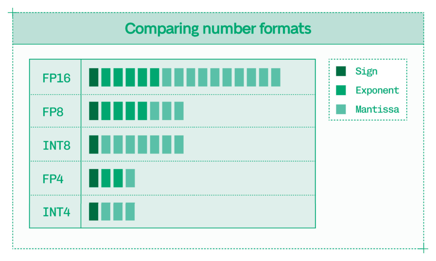
*Figure 5.1: 浮点数字格式同时具有 exponent 和 mantissa 位以及 sign 位。*

浮点数中的 exponent 赋予了它更高的 dynamic range，意味着它可以更好地表达非常大和非常小的数字。这一点很重要，因为异常值（outlier）在推理中非常重要，而浮点数字格式在 quantization 后能更好地表示异常值。

在浮点格式中，每种精度都有多种选择，如 FP4、MXFP4 和 NVFP4。这些格式在 granularity 上有所不同，即由单个 scale factor 量化的值的数量。

Quantization 可以在以下层级应用：

- **Tensor 级别**：为整个 QKV tensor 计算单个 scale factor。
- **Channel 级别**：为 tensor 中的每个特征向量计算不同的 scale factor。
- **Block 级别**：在每个特征向量内，将向量分成 N 个值的块，为每个块计算 scale factor。

更细粒度的 quantization 不太可能平滑掉异常值，从而保留质量。然而，更大的粒度会引入更多存储和应用 scale factor 的开销。

MXFP8 和 MXFP4 是 Blackwell 支持的新数字格式，它们是"microscaling"格式，在每 32 个参数上计算分块 scale factor，减少了这些数字格式较低 dynamic range 的影响。

NVFP4 是 NVIDIA 的 4 位格式，提供了比 MX 格式更高的粒度，block size 为 16，并带有辅助的 32 位全局 scale factor，以进一步对抗 4 位格式引入的质量损失。

Microscaling 格式的代价是小块 scale factor 也需要存储在内存中，略微减少了 quantization 带来的性能提升。此外，tensor 和 block 的 scale factor 都需要被应用，引入了一些计算开销。Blackwell GPU 通过 Tensor Core 中的 scale factor 应用机制来抵消这种开销。

虽然本书的重点是数据中心的推理工程，但 quantization 对于本地和边缘推理（尤其是大模型）也是一个核心话题。GGUF 是一种用于存储模型的二进制格式，是在 Hugging Face 上分发高度量化模型最流行的选择，个别研究人员和公司可以将 DeepSeek 等大型模型压缩到 Apple 电脑等消费级硬件上运行。

这些 quantization 策略通过 dynamic quantization（动态量化）来对抗质量损失，其中模型的某些层或其他组件保持原始精度，而其他组件被量化为精度低至 1 位的整数。动态格式以其平均精度表示，这就是为什么你可能会看到像微调实验室 Unsloth 广受欢迎的 1.58 位 quantization 这样的说法。

虽然这些动态量化是令人印象深刻的工程壮举，非常适合本地推理，但从事生产系统的推理工程师应该坚持使用浮点数字格式——整数格式由于其缺乏 dynamic range，不适合对质量敏感的工作负载。

相反，8 位浮点格式（FP8、MXFP8）通常是改善性能而不牺牲质量的理想选择。FP4 前景看好，特别是 NVFP4 格式引入了更高粒度以改善精度，但 FP8 和 MXFP8 提供了最大的灵活性，尤其是在量化 KV cache 时。

### 5.1.2 Quantization Approaches（量化方法）

模型参数越多，对 quantization 的敏感度就越低，因为每个单独参数的重要性更低。然而，即使对于非常大的模型，谨慎地进行 quantization 也是至关重要的。

Quantization 可以在训练期间或训练后进行：

- **Quantization-aware training（量化感知训练）**：将训练权重和计算 scale factor 同步进行，确保最终收敛的权重在给定精度下是准确的。
- **Post-training quantization（训练后量化）**：通过计算 scale factor 并通过 calibration（校准）保持准确度，将完成的模型权重转换为新精度。

虽然一些实验室发布了使用 quantization-aware training 创建的模型，如 MXFP4 格式的 GPT-OSS 和 INT4 格式的 Kimi K2 Thinking，但使用开源模型的推理工程师只能进行 post-training quantization，因为他们拿到的是已完成的权重。

Post-training quantization 的领先工具是 NVIDIA TensorRT Model Optimizer (ModelOpt)，这是一个开源库，还支持 pruning（剪枝）、distillation（蒸馏）和 sparsity（稀疏化）。ModelOpt 的输出与所有推理引擎（vLLM、SGLang、TensorRT-LLM）兼容。

在选择精度之后，进行 post-training quantization 之前，还有两个决定要做：

1. 模型的哪些部分（权重、activation、KV cache、attention）应该被量化？
2. 哪种数字格式提供适当的 dynamic range 和 granularity？

这些决定将 quantization 从一个二元选择变成了围绕性能和质量的连续权衡谱。

模型组件对 quantization 的敏感度各不相同。降低更敏感组件的精度会带来更高的质量退化风险。从最不敏感到最敏感排列：

1. **Weights（权重）**：特别是线性层对 quantization 最不敏感。
2. **Activations（激活值）**：activation 函数的中间输出对 quantization 只有轻微敏感。注意，activation 函数本身很少被量化，因为它们只占模型权重的极小部分。
3. **KV cache**：来自 attention 计算的缓存值对 quantization 中度敏感。
4. **Attention（注意力）**：模型的 attention 层对 quantization 高度敏感，尤其是 softmax 等公式。

在这些组件内部，你可以对 quantization 更加有选择性。

即使在线性层和 activation 中（它们由于规模较大通常对 quantization 最不敏感），早期和后期的层（如神经网络的输入和输出层）可能会保持原始精度，因为这些层更加敏感。

虽然量化权重和 activation 直接有助于性能，但 KV cache quantization 为 prefix caching 和 disaggregation 等技术提供了额外的加成。KV cache 是一种宝贵的资源。量化它允许推理引擎在内存中存储更多内容并更快地读取。

然而，每个 token 的 KV cache 都会被后续的每个 token 使用。这意味着 quantization 引入的精度误差可以在 token 之间累积。

误差累积正是 attention 层是量化风险最高的原因。Attention 不仅对 dynamic range 非常敏感，而且每个 attention 计算都依赖于之前每个 attention 计算的结果。在数千个 token 的序列中，这些误差会快速累积。

除了最激进的 quantization 方案外，所有方案都会以原始精度运行 softmax 等函数。

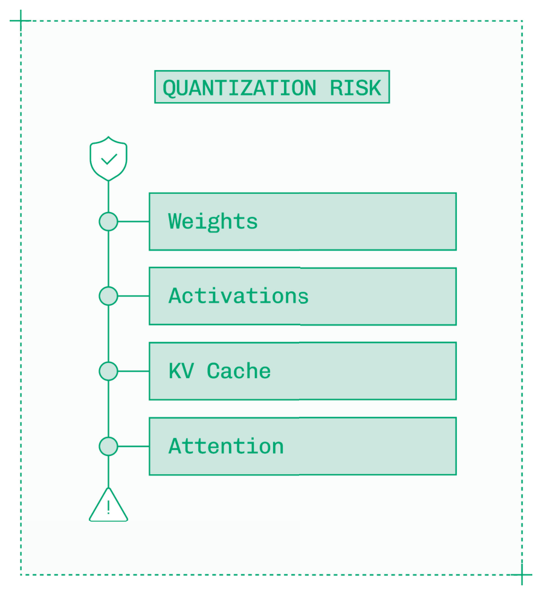
*Figure 5.2: Quantization 对权重和 activation 风险较低，对 KV cache 中等，对 attention 较高。*

一种适度的低精度推理方法是使用 FP8 等具有高 dynamic range 的格式——如果可能，使用 MXFP8 等 microscaling 格式——来谨慎地量化特定的线性层、activation，以及通常还包括 KV cache 值。即使使用这些高 dynamic range 格式，attention 层的组件也很少被量化。

### 5.1.3 Measuring Quality Impact（衡量质量影响）

生产就绪的 quantization 的标准是没有可感知的质量损失。在量化模型后，必须彻底测试其输出质量与原始精度的对比。

有三种方法可以检查 quantization 后的模型质量：

1. **Perplexity（困惑度）**：计算量化模型的 perplexity 分数并与原始模型比较。
2. **Intelligence benchmarks（智能基准测试）**：运行 MMLU 或 SWE-bench 等标准智能基准测试并与原始分数比较。
3. **Custom evals（自定义评估）**：在量化模型上运行产品特定的评估套件并与原始权重比较。

在每种情况下，你都在寻找与噪声无法区分的分数差异。LLM 是非确定性的，因此分数在每次运行之间会略有不同。

最简单的质量检查是 perplexity。Perplexity 不是让模型生成输出，而是给模型期望的输出序列，并计算模型预测这些 token 的可能性。

更高的 perplexity 意味着模型对序列更"惊讶"——这不是你期望从一个应该预测 token 的模型得到的。在 quantization 之后，你希望 perplexity 的增幅最小。

更全面的质量检查依赖于公开的智能基准测试，或者更好的是与预期实际使用场景匹配的领域特定 eval。在 eval 上，你希望质量分数的降低幅度最小。

获得 quantization 影响全貌的最佳方法是运行所有三种类型的检查，并与原始模型权重进行同口径比较。

记住，quantization 是一个连续范围，而不是二元决策。你仍然可以通过量化到 FP8 而不是 FP4，或者量化更少的模型组件（如仅量化权重）来获得一些性能提升，同时降低质量损失的风险。

如果你在对质量高度敏感的领域工作且不能冒险影响模型质量，不必担心：本章中的其他所有技术在质量方面都是无损的。

## 5.2 Speculative Decoding（推测解码）

LLM 推理的 decode 阶段是一个自回归过程，token 被逐个生成。Decode 的瓶颈是内存带宽，在中低 batch size 下计算资源处于空闲状态，因为权重正在从内存中读取。

Speculative decoding 利用这些空闲计算来尝试在目标模型的每次前向传播中生成多个 token。如果推理引擎能在权重每次往返内存时生成两个、三个甚至更多的 token，那么每秒生成的 token 数将大大增加。Speculative decoding 只改善 TPS/ITL，不改善 TTFT。

Speculative decoding 有多种算法。它们共享一个通用机制：

1. Speculator 生成一个或多个 draft token。
2. Target model（即你试图加速的底层模型）对这些 token 进行验证，检查它们是否与模型本应生成的结果一致。
3. Target model 接受任何有效的 draft token，并自行生成一个额外的 token，完成前向传播。

这会在每次前向传播（即一次 decode 循环迭代）中生成 N+1 个 token，其中 N 是被接受的 draft token 数量。

生成 draft token 并非免费，它需要消耗计算和内存。然而，target model 验证一个 draft token 比生成一个原始 token 快得多。如果你想象一个数独谜题，解它很难，但检查答案是否正确非常容易。对于 target model，生成一个 token 就像解数独，而验证一个 draft token 就像检查已完成的数独。

任何 speculative decoding 策略的性能提升取决于三个因素：

1. **Draft token cost（草稿 token 成本）**：生成一个 draft token 所需的时间。
2. **Draft sequence length（草稿序列长度）**：每次前向传播生成的 draft token 数量。
3. **Token acceptance rate（token 接受率）**：被 target model 接受的 draft token 百分比。

Token acceptance rate 在 draft 序列的早期较高，但 draft token 在序列越深处越不可靠。

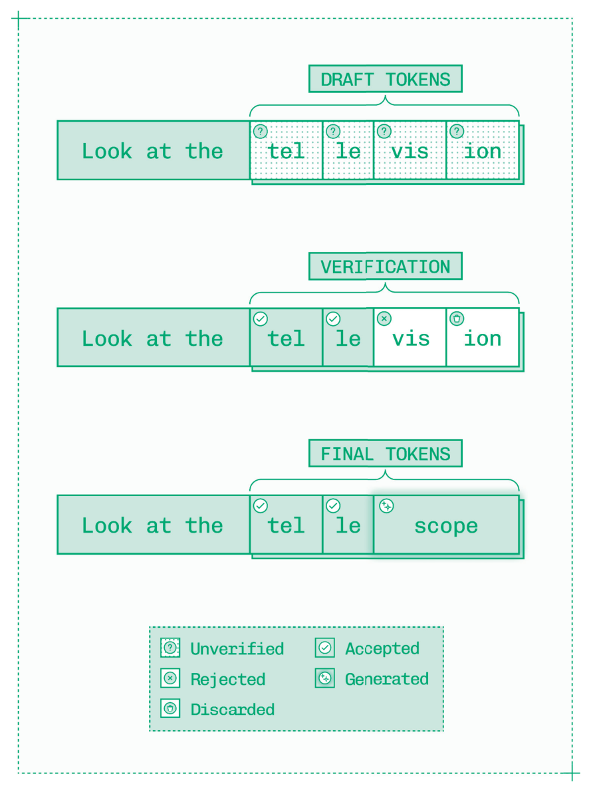
*Figure 5.3: Speculative decoding 从 draft token 生成和验证到 prefix 接受以及后续 token 生成。*

目标是追求短且高接受率的序列，因为生成和验证 token 虽然相对于在原始模型中生成 token 来说成本较低，但仍会带来显著的开销。此外，一旦一个 draft token 被拒绝为错误，序列中所有后续 token 也会被拒绝。

使用 speculation 很有趣，因为许多因素都会影响 token acceptance rate。最大的因素是 temperature——更高的 temperature 会产生更难预测的 token 分布，降低 speculative decoding 的有效性。但即使像主题内容这样简单的因素也会影响 acceptance rate，前提是 draft model 或用于 speculation 的额外 head 更擅长（比如）数学而非历史。

Speculative decoding 的另一个限制是它在低 batch size（有空闲计算周期）时最有用。在更高的 batch size 下，speculative decoding 必须被动态禁用，因为计算资源过于饱和，无法承担验证开销。

每种 speculation 算法以不同方式平衡这些权衡，针对具体情况仔细实现正确的算法可以带来 TPS 的重大改善。

### 5.2.1 Draft-Target Speculative Decoding（草稿-目标推测解码）

最初的 speculative decoding 方法使用两个模型：

- **Draft model（草稿模型）**：一个额外模型，用于生成推测性 draft token。
- **Target model（目标模型）**：原始模型，现在除了执行常规 decode 外还验证 draft token。

配置 draft-target speculative decoding 时最重要的决定是使用哪个 draft model。一个好的 draft model 具有高 token acceptance rate，同时运行所需资源最少。

Draft model 通常是目标模型同系列中的较小成员，因为它们共享 tokenizer 和行为。作为经验法则，draft model 在参数量上应该至少比 target model 小十倍。Fine-tuning 或 distillation 可以通过教导这些小模型更像 target model 的行为来提高 token acceptance rate。

Draft-target speculative decoding 是一个不错的选择，当你想要开箱即用快速设置而不进行任何训练或微调时。

然而，其他 speculation 算法通常提供更好的性能。Draft-target 在所有 speculative decoding 方法中引入的开销最大。虽然 draft model 很小，但推理引擎必须在内存中存储 draft model 的权重、activation 和 KV cache，并分配计算周期给 draft model 的 prefill。此外，draft 和 target model 必须协调运行以免争夺资源，不过 TensorRT-LLM 等推理引擎会处理这种模型编排。

### 5.2.2 Medusa

Medusa 是 draft-target speculation 的最早替代方案之一。Medusa 通过微调 target model 使其在每次前向传播中生成额外 token，来解决运行 draft model 进行 speculation 的复杂性和开销。

为 Medusa 微调模型意味着在模型上嫁接额外的 decoder head。LLM 的普通架构包含单个 decoder head，但 Medusa 添加了额外的两到四个 head 来生成连续的 draft token。

与 draft-target speculation 一样，draft token 在下一次前向传播中被验证。

Medusa 在 draft token 数量和 draft token acceptance rate 方面仍然受限，目前在生产环境中并不广泛使用。然而，Medusa 启发了更流行的技术如 EAGLE。

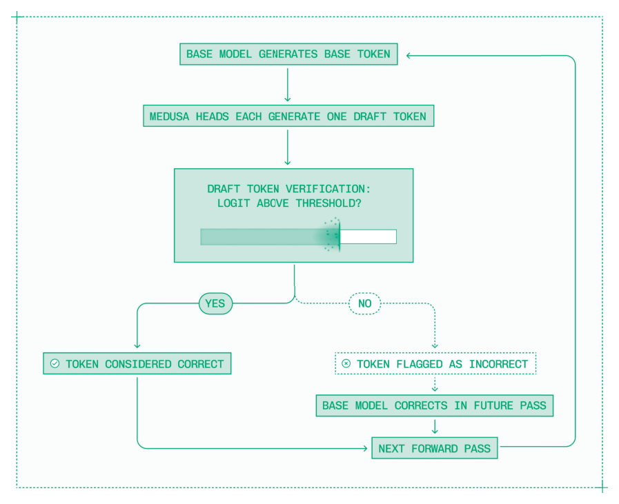
*Figure 5.4: Medusa head 各自在 target model 生成的 token 之上生成一个 draft token。*

### 5.2.3 EAGLE

使用现成的预训练模型作为 draft model 的主要问题是，像 Qwen 0.5B 这样的模型被设计为在廉价硬件上作为独立的 LLM 运行良好，而不是在 B200 上推测 draft token。这些 draft model 运行效率低且 acceptance rate 相对较低。

EAGLE 提供了一种替代方案：一个专门构建的 draft model，从头开始训练，用于生成最多八个 draft token 的序列（比 Medusa 多两倍），并具有非常高的 acceptance rate。

在推理过程中，LLM 以层间 hidden state（隐藏状态）的形式积累了大量关于预测 token 的上下文信息。传统的 draft model 无法获取这些信息。

EAGLE 是一个被训练为接受 hidden state 作为输入并生成 speculative token 作为输出的 draft model。具体来说，它在三个 hidden state 集合上进行训练：一个来自早期层，一个来自中间层，一个来自后期层。EAGLE 通常不到十亿参数，在获得额外训练数据时扩展良好。

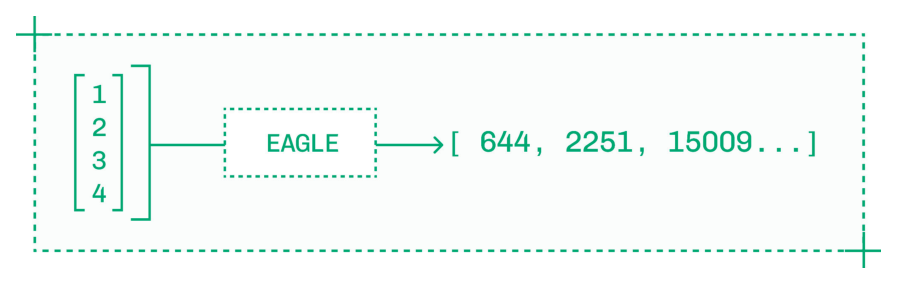
*Figure 5.5: EAGLE speculative model 以 hidden state 作为输入并产生 draft token 作为输出。*

在实践中，当使用 TensorRT-LLM 等推理引擎配合 EAGLE 时，实现通常很直接，包括训练后的 EAGLE 创建和单序列 speculation。

EAGLE 可以附加到与 target model 相同的模块（PyTorch class），因此每次前向传播同时对 target model 和 EAGLE speculator 运行推理。这种统一流水线解决了 draft-target decoding 的另一个问题，即需要多次 CPU 往返来编排 draft 和 target model。

EAGLE 是拥有训练 EAGLE head 知识和手段的推理工程师进行通用推理的首选 speculation 算法，并得到推理引擎的良好支持。与其他 speculation 技术一样，采用 EAGLE 来改善延迟需要降低 batch size，从而降低吞吐量并增加成本。

### 5.2.4 N-gram Speculation and Lookahead Decoding（N-gram 推测与前瞻解码）

N-gram speculation 使用与其他 speculation 类型不同的机制。没有 draft model。

取而代之的是，在与生成 KV cache 并行的过程中，推理引擎构建一个 n-gram 字典。N-gram 字典将单个起始 token 映射到观察到的 N 个 token 的序列（即 n-gram）。

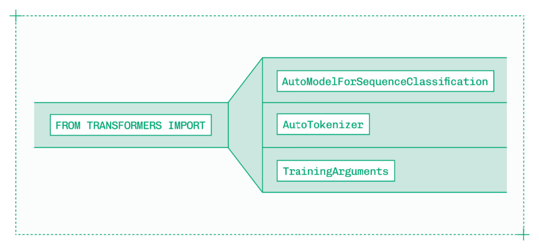
*Figure 5.6: N-gram 字典将 prefix 匹配到可能的 suffix，对于代码等受限语言特别有用。*

这个 n-gram 字典包含来自输入文本的常见序列，首次在 prefill 期间构建。在 decode 期间，生成的 token 被输入字典，任何可用的 suffix 被选为 draft token。在下一次前向传播中，target model 像往常一样验证这些 draft token。

N-gram speculation 相对于 EAGLE 的优势在于序列可以更长。虽然 EAGLE 可以以不错的 acceptance rate 生成八个左右的 draft token，但 n-gram 序列可以超过十个 token。

然而，n-gram 的 acceptance rate 只有在模型输出的内容与模型输入相似时才较高。N-gram speculation 主要用于代码补全和代码修订，这些场景中语法可预测且输出与输入紧密匹配。然而，在这个特定领域内，它轻松超越 EAGLE。

一种与 n-gram speculation 类似的方法是 Lookahead Decoding（前瞻解码），它在推理期间生成 n-gram 来填充字典。Lookahead Decoding 比 n-gram speculation 更通用，因为它不太依赖高度重复的上下文，但需要额外的计算来生成 n-gram。

每种 speculative decoding 算法都旨在减少生成完整输出序列所需的前向传播总数，改善整体延迟，特别是 decode 期间每用户每秒 token 数。N-gram speculation 在代码补全和类似任务中表现出色，而 Lookahead Decoding 在计算资源充裕的系统中提供了更好的通用性。

## 5.3 Caching（缓存）

在 prefill 期间，推理引擎在输入序列上构建 KV cache（每个 token 的键和值的存储）。然后在 decode 期间为每个 token 更新 KV cache。由于推理是自回归的，每个新 token 的值取决于序列中每个先前 token 的值。

每个推理引擎默认在每个请求的基础上使用 KV caching。如果没有 KV caching，LLM 推理将慢得令人难以忍受，因为整个序列中的每个先前值都需要为每个后续 token 重新计算。

然而，工程师可以通过在请求之间复用 KV cache（而不仅仅是在每个推理序列内部）来获得更多效用。

### 5.3.1 Prefix Caching and KV Cache Re-Use（前缀缓存与 KV Cache 复用）

考虑以下两个 prompt，在大多数 tokenizer 中各有四个 token，如 Figure 5.7 所示。

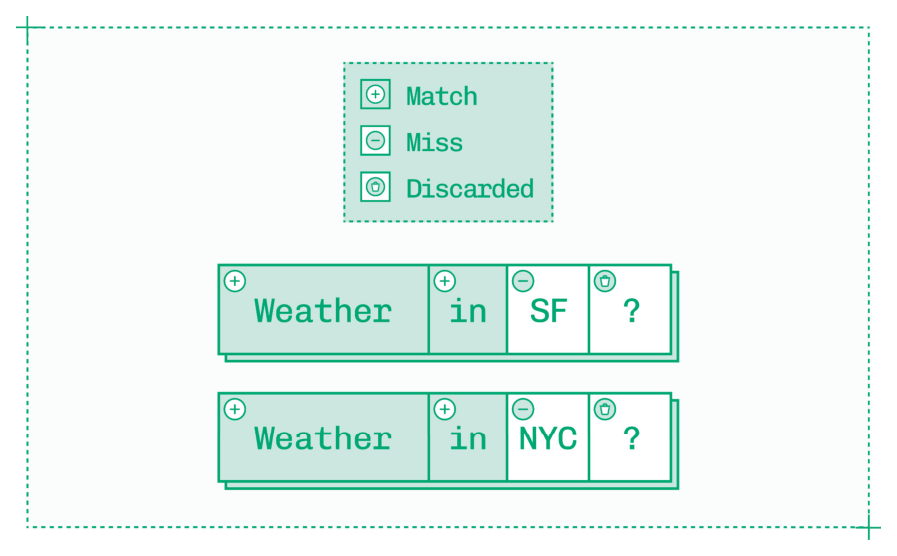
*Figure 5.7: 一对四 token 序列，具有两 token 的匹配 prefix。*

默认情况下，推理引擎必须对每个 prompt 的所有四个 token 运行 prefill。但每个 prompt 的前几个 token——"Weather in"——构成了这对请求之间的共享 prefix。

通过 prefix caching，你可以复用第一个请求的 KV cache 来改善第二个请求的 TTFT，方法是跳过前两个 token 的 prefill，改为读取已有的 KV cache。

当你看到按 token 计费的 API 对"cache hit"输入 token 的收费低于"cache miss" token 时，原因就在于此——复用缓存的 token 所需的计算能力和时间非常少。作为推理工程师，你可以应用相同的原则来减少延迟并提高吞吐量（从而节省成本）。

节省两个 token 不会对 TTFT 产生太大影响，但 prefix caching 可以在某些领域跳过数千个 token 的 prefill：

- **复杂的系统 prompt**：Agent、面向客户的聊天机器人、RAG 脚手架和工具调用通常在每次调用时都有冗长复杂的系统 prompt。
- **代码补全**：代码补全、代码生成和其他编码功能需要将相同的数千行代码作为共享上下文传入。
- **文档和检索**：文档摘要、问答和检索都会在用户 prompt 前添加重复的上下文。
- **多轮对话**：普通对话会回显聊天模板中的每条消息，随着轮次增加 prefix caching 的节省越来越多。

Prefix caching 从输入序列的开头工作到第一个非重复 token。天气示例中的第四个 token（问号）在两个输入序列之间是共享的。然而，prefix 在第一个非重复 token 处结束，因此第四个 token 不会从缓存中读取。

由于 prefix 在第一个唯一 token 处终止，你的 context engineering 决定了你的 TTFT 节省。考虑对同一 prompt 的不同方法：

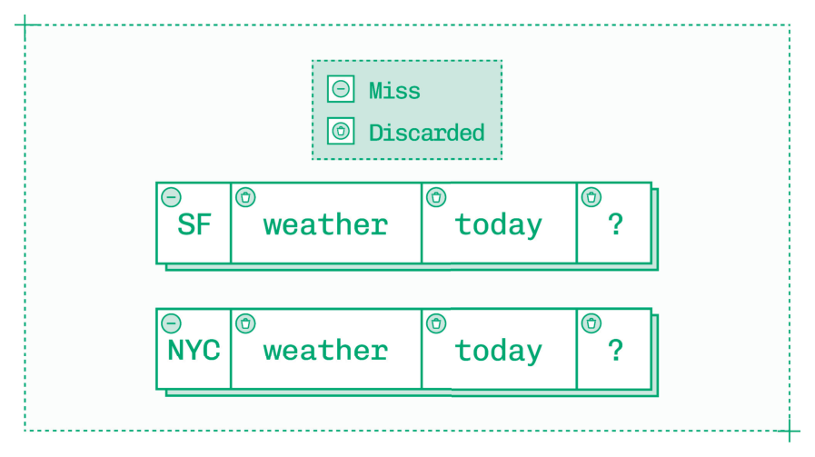
*Figure 5.8: 一对四 token 序列没有 prefix 匹配，第一个 token 不同，所以接下来的三个相同也不起作用。*

这里 prefix caching 没有任何节省，因为两个序列的第一个 token 就不同了，即使之后每个 token 都相同。

要利用 prefix caching，请确保新 token 尽可能出现在上下文的靠后位置。

Prefix caching 是 KV cache 复用的主要形式，因为 LLM 是自回归的。每个 token 影响每个后续 token，因此即使单个新 token 也会改变模型内部表示序列其余部分的方式，即使序列在人类读者看来是相同的。

然而，围绕其他类型的 KV cache 复用来克服这一限制的研究正在进行中。从 prompt 中间缓存任意序列需要同时修正位置嵌入和选择性地重新计算 KV 条目以保持输出质量。CacheBlend 和 LMCache 等工具支持非 prefix 序列，扩展了 KV cache 复用的可能性。

### 5.3.2 Where to Store the KV Cache（KV Cache 的存储位置）

KV cache 非常有价值。但 KV cache 占用大量内存，而 GPU 只有有限的 VRAM。

你可以配置推理引擎分配多少内存给 KV cache。例如，在 TensorRT-LLM 中，你可以设置：

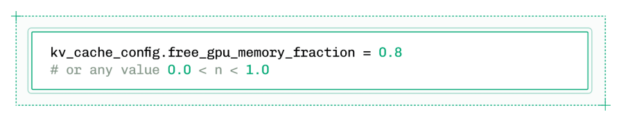
*Figure 5.9: 将空闲 GPU 内存分配给 KV cache 是运行推理引擎时的关键配置决策。*

如果你在具有 180 GB VRAM 的 B200 GPU 上工作，其中 100 GB 用于模型权重和缓冲区，这将把剩余 VRAM 的 80%（即 64 GB）分配给 KV cache。

一旦这个分配被填满——而且很快就会被填满——你就不得不开始删除已保存的 KV cache，增加了未来请求 cache miss 的可能性。

为了给 KV cache 腾出更多空间，可以从 VRAM 卸载到附近的其他存储。KV cache 可以存储在四个位置，按到 GPU 的带宽降序排列：

| 层级 | 内存类型 | 大致速度 | 大致容量 |
|------|---------|---------|---------|
| G1 | Device Memory (GPU VRAM) | 每秒 TB 级 | 数十到数百 GB |
| G2 | Host Memory (CPU RAM) | 每秒数十到数百 GB | 数百 GB 到 TB 级 |
| G3 | Local SSD | 每秒 5-10 GB | TB 级 |
| G4 | Networked SSD | 每秒 GB 级 | 数十 TB |

某些 SKU（如 GB200）配备了提供更快 G2 存储的 CPU 和互连，使其非常适合 KV cache 卸载。

NVIDIA Dynamo 通过 KVBM（KV Block Manager）提供 KV cache 卸载支持。KVBM 提供在不同内存层级之间移动 KV cache block 的 API。作为一般规则，你希望将最频繁使用的 block 保留在高带宽内存中，而不太常用的 block 可以被下放到较慢的存储中，直到需要时再调用。

### 5.3.3 Cache-Aware Routing（缓存感知路由）

在生产环境中，你的推理服务器会有多个副本，传入流量在这些副本之间分配。通常，流量路由基于每个副本的繁忙程度。

如果你的推理服务器大量使用 prefix caching，路由逻辑需要相应更新。一个与聊天机器人进行长时间对话或对代码库提出多个问题的用户，应该尽可能将请求路由到同一副本，这样他们就能获得 cache hit，从而实现更快、更省的请求。

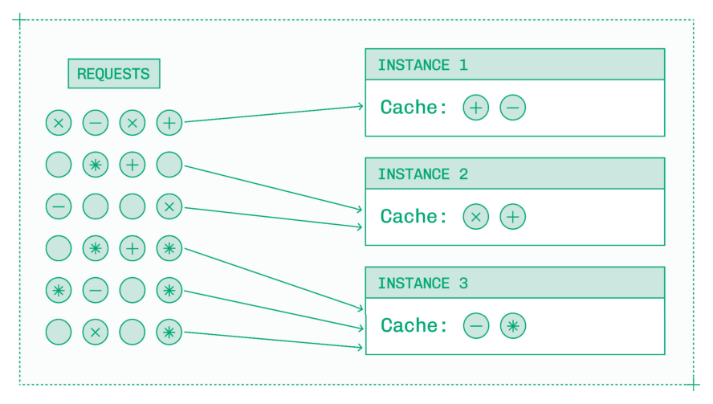
*Figure 5.10: Cache-aware routing 基于 KV cache 分配流量，而不是简单地在副本之间平均分配请求。*

另一个选择是使用 G4 网络存储在副本之间构建全局 KV cache。路由在这里仍然很重要——拥有热 G1 cache 的副本比从 G4 读取的副本更快地处理请求——但全局缓存确保所有副本最终都能访问任何预计算的序列，并且缓存序列不会在节点循环或自动缩放期间被关闭时丢失。

### 5.3.4 Long Context Handling（长上下文处理）

"长上下文"有点同义反复的定义：当一个序列生成的 KV cache 足够大以至于在推理过程中引起问题时，它就变成了"长上下文"。

根据模型、硬件、引擎和流量的不同，这些问题可能在超过 32K、64K 或 128K token 等常见截断点后开始出现。在你的性能基准测试中，务必发送非常大的输入序列来测试你的推理服务对长上下文请求的处理能力。

基础模型实验室一直在使用 RoPE 等 scaling 技术来解锁更长、更准确的上下文窗口。但支持这些升级后的上下文窗口在推理中引入了新的挑战。

考虑到 KV cache，attention 公式随序列长度线性扩展。对于长序列，attention 可能成为 VRAM 的主要消费者——而 VRAM 正是 decode 所受限的资源。

虽然 sliding window attention、compressed attention 和 sparse attention 等方法在逐模型的基础上提供了解决方案，但也有优化标准 attention 算法的通用方法：

- **FlashAttention**：一系列优化的 attention kernel，通过减少内存读写次数来计算 attention。
- **PagedAttention**：一种内存管理技术，将 KV cache 存储在固定大小的 page 中，减少碎片化和重复。
- **Chunked Prefill**：一种将大型输入序列分割成块的策略，可根据资源情况与 decode 并行运行，避免长序列压垮推理引擎。

但如果在应用这些优化后，你仍然需要比单个 GPU 提供的更多 VRAM 来存储 KV cache 呢？你需要跨多个 GPU 进行并行推理。

## 5.4 Model Parallelism（模型并行）

当今市场上的每个前沿 LLM 都太大而无法在单个 GPU 上进行 batch inference。虽然 GPU 变得越来越大，模型也变得越来越大，这一趋势没有逆转的迹象。

在 FP8 中，加载十亿参数的模型权重大约需要 1 GB 的 VRAM。对于 DeepSeek-V3.1 这样拥有 6710 亿参数的模型，仅模型权重就会使单个 B200 GPU 立即抛出 out-of-memory (OOM) 错误。

仅仅勉强将模型权重塞入 VRAM 是不够的。在 4 块 B200 GPU 上，拥有 720 GB 的 VRAM，理论上可以加载 DeepSeek 的权重。但没有剩余空间给 KV cache，而 KV cache 通常占权重之后剩余 VRAM 的 80% 或更多，四块 B200 GPU 无法以任何合理的序列长度或 batch size 来服务 DeepSeek。

相反，需要一个完整节点的八块 B200 GPU 才能在 DeepSeek 这样规模的模型上服务真实的生产流量。你可以通过将精度、参数量和预期 KV cache 分配相乘来估算模型所需的最小 GPU 数量。

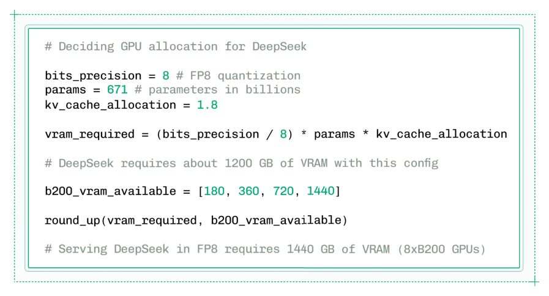
*Figure 5.11: 计算推理所需的 VRAM 后，向上取整到下一个可用的实例大小来确定最小 GPU 数量。*

在许多情况下，即使对于 GPT OSS 等中等规模模型，你也希望使用超过最小数量的 GPU，以启用更大的 KV cache 并解锁更好的每用户延迟。

然而，所有这一切都要求推理能高效地从单个 GPU 扩展到多个 GPU。扩展并行推理的限制是 GPU 之间的通信开销。

第 3 章详细介绍了 GPU 之间的不同互连方式：节点内的 NVLink 和 NVSwitch，节点间的 InfiniBand。

虽然 NVLink 和 InfiniBand 提供高带宽，但它们只是 VRAM 速度的一小部分。由于 decode 受限于内存带宽，多 GPU 推理需要精心设计以避免 GPU 间通信中的瓶颈。这个研究领域被称为 topology-aware parallelism（拓扑感知并行）。

推理中有三种主要的模型并行形式：

- **Pipeline Parallelism (PP)**：跨 GPU 分割模型的层。
- **Tensor Parallelism (TP)**：跨 GPU 分割每层内的 tensor。
- **Expert Parallelism (EP)**：将 MoE 模型的整个 expert 分片到不同的 GPU 上。

每种并行形式都有自己的权衡：

| 方法 | 机制 | 缺点 |
|------|------|------|
| PP | 每个 GPU 处理前向和反向传播的一个阶段。 | 由于逐步流水线导致延迟和利用率差，不推荐使用。 |
| TP | matmul 等计算密集型操作被分割到多个 GPU 上。 | 需要 GPU 间的同步，不适合多节点。 |
| EP | 每个 expert 驻留在单个 GPU 内，使 expert 内推理速度快。 | 需要在 GPU 间路由以到达多个 expert，更适合吞吐量。 |

Tensor Parallelism 通常是单节点内低延迟模型推理的最佳选择，而 Expert Parallelism 改善 MoE LLM 的吞吐量。Pipeline Parallelism 仅用于多节点推理。

此外，Context Parallelism 等数据并行策略可以跨设备分割计算。这些策略在 LLM 推理中较为罕见，但对于视频生成至关重要（6.6 节）。

### 5.4.1 Tensor Parallelism for Lower Latency（面向更低延迟的 Tensor Parallelism）

Tensor Parallelism 应该是你多 GPU 模型推理的默认策略。它同时支持像 Llama 405B 这样的 dense model 和当前主导开源模型领域的 MoE 模型。

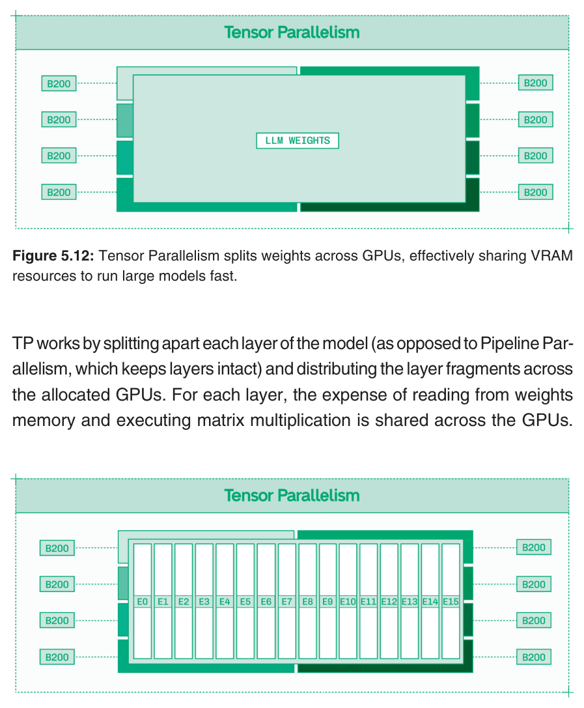
*Figure 5.12: Tensor Parallelism 跨 GPU 分割权重，有效共享 VRAM 资源以快速运行大模型。*

TP 的工作方式是将模型的每一层拆分（与保持层完整不变的 Pipeline Parallelism 不同），并将层片段分配给各 GPU。对于每一层，从权重内存读取和执行矩阵乘法的开销由各 GPU 共同分担。

*Figure 5.13: 对于 Mixture of Experts 模型，每个 expert 通过 Tensor Parallelism 跨多个 GPU 运行。*

然而，每一层的结果需要以 all-reduce 方式通信合并为单一输出，然后才能计算下一层。在具有高带宽节点内 NVLink 和 NVSwitch 的节点中，这种通信开销被最小化。

增加 Tensor Parallelism 可以改善每用户基础上的 TPS（假设模型足够大、序列足够长，使得通信开销不会超过更快的前向传播带来的收益——对于大多数前沿模型来说是这种情况）。

### 5.4.2 Expert Parallelism for Higher Throughput（面向更高吞吐量的 Expert Parallelism）

Expert Parallelism 将 expert 整齐地分配到各 GPU 上。在一个拥有 128 个 expert 的模型中以 EP8 跨八块 GPU 服务时，每块 GPU 将托管 16 个完整的 expert。

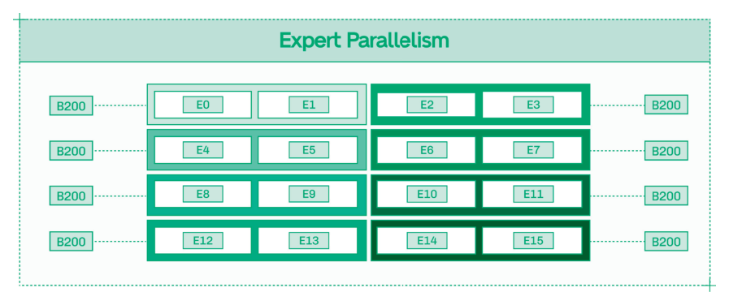
*Figure 5.14: Expert Parallelism 在单个 GPU 内运行每个 expert，每块 GPU 各托管多个 expert。*

EP 改善总系统吞吐量，使推理更具可扩展性和更经济。由于各 expert 分别处理 token，每个 token 的处理时间不变，但系统整体可以处理更多同时进行的 token。

许多部署混合使用 TP 和 EP 来同时获得两种好处。

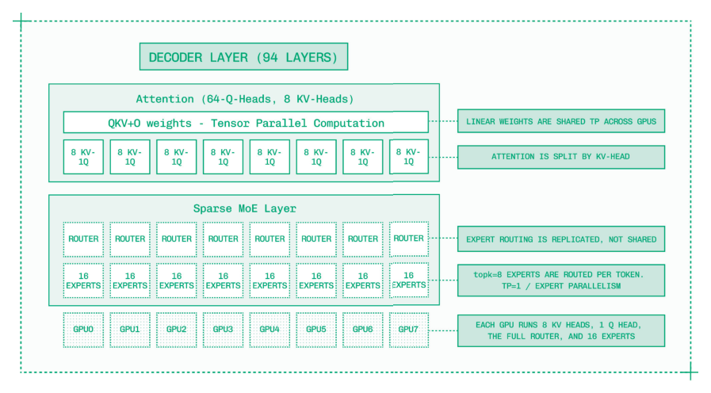
*Figure 5.15: 该部署对 attention 使用 TP，对稀疏 MoE 层使用 EP。*

Expert Parallelism 需要比 Tensor Parallelism 更少的 GPU 间通信。Expert Router（决定每个 token 激活哪些 expert 的组件）被复制到每个 GPU 上，因为它是模型中相对较小的组件。GPU 间通信用于在 expert 之间传递 token，但与 TP 不同，它不需要收集每层的结果。

得益于这种较低的通信开销，EP 能很好地扩展到多节点部署和互连带宽有限的系统。

### 5.4.3 Multi-Node Inference（多节点推理）

如果你在以高精度服务超大模型、支持数百万 token 的输入序列，或者只是想尽可能快地运行推理，你可能需要超过八块 GPU。

GPU 被设计为跨节点协同工作，多节点训练多年来一直是开发前沿模型的标准。但多节点推理引入了新的挑战：

- **基础设施**：如何可靠地配置两个或更多互连的 GPU 节点并跨云提供商构建抽象（第 7 章）？
- **并行**：如何通过比 NVLink 慢得多的 InfiniBand 有效通信？

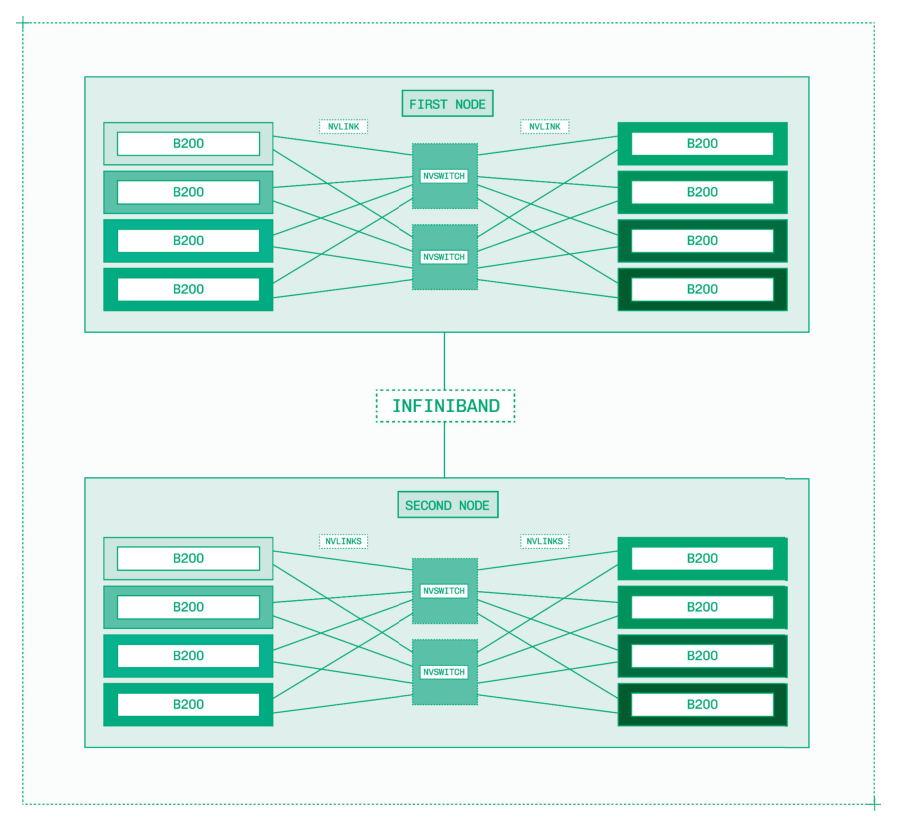
*Figure 5.16: InfiniBand 通过高带宽节点间互连实现超过八块 GPU 的多节点推理。*

InfiniBand 为 topology-aware parallelism 引入了新的复杂性。Tensor Parallelism 通常需要过多的 GPU 间通信，不适合多节点推理。相反，你有两个在 InfiniBand 上表现良好的选择：

1. 对于 dense model，在每个节点内使用 Tensor Parallelism，在节点之间使用 Pipeline Parallelism（例如 TP8PP2）。
2. 对于 MoE 模型，你还可以尝试 Expert Parallelism（例如 EP16），因为它的通信开销低于 Tensor Parallelism。

对于 MoE 模型，TP8PP2 通常提供更低的每用户延迟，而 EP16 产生更高的总系统吞吐量。

除非你的模型和 KV cache 大到必须使用多节点推理，否则多节点推理可能不是额外硬件的最佳用途。你通常更好地将这些额外节点用于跨副本的横向扩展，或用于 disaggregated serving。

## 5.5 Disaggregation（分离）

Disaggregation 结合了推理工程中的三个重要理念：

1. Prefill 是一个受计算限制的过程，决定了你的 TTFT，而 decode 是一个受内存限制的过程，决定了你的 TPS。
2. 特化能改善从 kernel 选择到推理引擎参数调优等各方面的性能。
3. 如果你能避免较低带宽互连带来的瓶颈，你就可以有效地在多个 GPU 甚至多个节点上并行化模型服务。

当 prefill 和 decode 在同一节点上高负载运行时，它们更有可能相互干扰。理想情况下，prefill 使用更多计算资源，而 decode 使用更多内存，两者可以高效共存。然而，随着更大的 batch size 和更多计算密集型优化，prefill 和 decode 开始争夺资源。

### 5.5.1 How Disaggregation Works（Disaggregation 的工作原理）

Disaggregation 或 disaggregated serving，是将 prefill 和 decode 分离到不同 GPU 或节点上的不同引擎上的理念。

Disaggregation 将 LLM 推理变成一个三步过程：

1. Prefill 引擎接收输入序列并生成 KV cache，同时计算第一个 token。
2. Prefill 引擎通过硬件互连将 KV cache 发送到 decode 引擎。
3. Decode 引擎计算所有后续 token。

在 conditional disaggregation（条件分离）中，请求首先被发送到 decode 引擎，该引擎检查输入序列是否已被缓存或是否足够短可以本地处理：

1. 如果是，decode 引擎在本地处理 prefill，跳过 disaggregation。
2. 如果不是，decode 引擎将请求转移到 prefill 引擎进行 disaggregated serving。

Conditional disaggregation 更适合真实世界的流量。

Disaggregation 的另一个好处是，有了独立的 prefill 和 decode 引擎，你可以分别优化每个引擎和系统整体。例如，受计算限制的 prefill 引擎需要比受内存限制的 decode 引擎更低的 TP。

### 5.5.2 When to Use Disaggregation（何时使用 Disaggregation）

Disaggregation 非常强大，但需要多个 GPU 和额外的工程工作。你应该在以下条件满足时才考虑使用 disaggregation：

1. 你正在服务大量流量，从每天一亿到十亿 token 不等，具体取决于模型大小。
2. 你正在服务更大的模型，至少一千亿参数。
3. 你的流量以 prefill 为主，输入序列较长。

如果第一点或第二点不成立，你可能是在浪费额外硬件的费用来换取极小的性能提升。如果第三点不成立，你可能最好将这些额外 GPU 用于横向扩展副本，因为对于短序列或 prefix cache hit，decode 引擎将更高效。

Disaggregation 的一个绝佳用例是在代码编辑器中服务前沿 LLM，许多开发者同时传入大量且多样的代码块作为上下文。海量 token、主要是 prefill、在万亿参数 LLM 上——这就是 disaggregation 的教科书式工作负载。

### 5.5.3 Dynamic Disaggregation with NVIDIA Dynamo（使用 NVIDIA Dynamo 的动态 Disaggregation）

Dynamo 为 disaggregation 提供了生产就绪的支持，具有处理异构真实世界流量的灵活性。

Dynamo 提供开发者工具和预构建优化来启用 disaggregation：

- 一个 prefill 队列，用于在所有 prefill 引擎饱和时暂存请求。
- 强大的 conditional disaggregation 支持，具有基于 prefix cache 后 ISL 和 prefill 队列大小可配置阈值的 prefill 路由。
- 基于 NIXL 的高效 KV 从 prefill 到 decode 引擎的传输，带有在引擎具有不同 TP 配置时在布局之间转置 KV block 的 kernel。

这些功能组合在一起实现了 dynamic disaggregation（动态分离），其中 prefill 和 decode 引擎的数量可在运行时配置，并可以随时间调整以匹配不断变化的传入流量特性。

Disaggregation 不需要是 prefill 和 decode 引擎之间的一对一比例。虽然用单个 prefill 引擎和单个 decode 引擎来解释 disaggregation 很简单，但真实系统各有多个。

Prefill 和 decode 引擎的数量写作 xPyD，例如 5P3D 意味着五个 prefill 引擎和三个 decode 引擎协同工作来服务单个模型部署。

随着系统变得更加复杂，更多潜在的瓶颈也会出现。在 disaggregation 中，新的瓶颈是 prefill 队列大小。重要的是不要让队列增长过大，既要在 decode 引擎上设置合理的本地 prefill 阈值，又要在运行时重新配置 xPyD 以在需要时将更多资源分配给 prefill。

Disaggregation 中的另一个潜在瓶颈是在高负载下 decode 引擎的 KV cache 耗尽。通过 quantization 和 KV cache 卸载来增加 KV cache 可用性。
