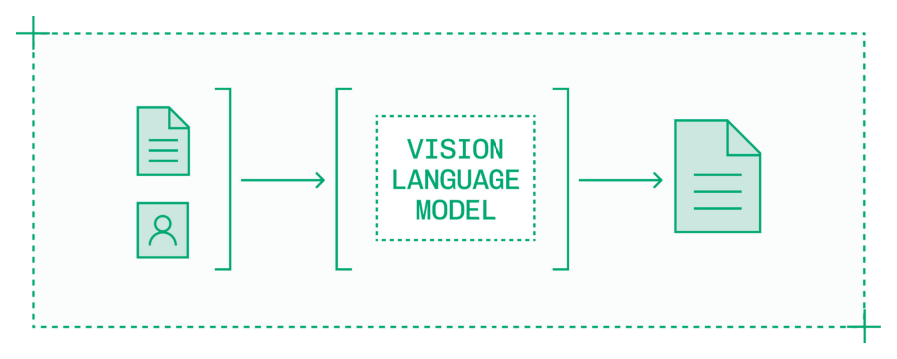
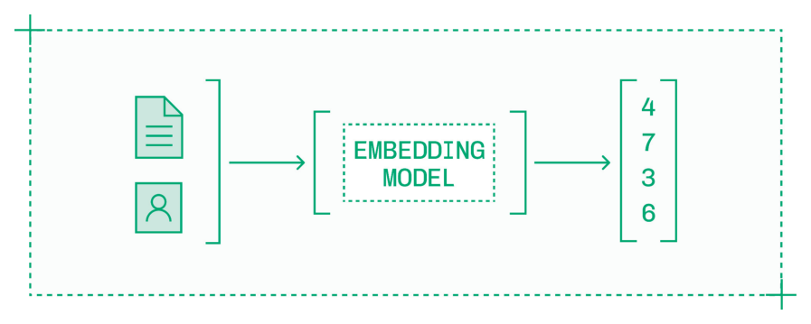
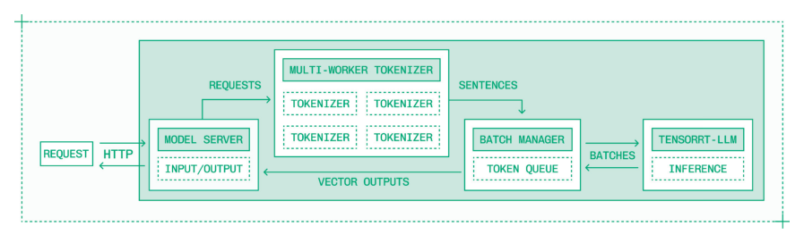
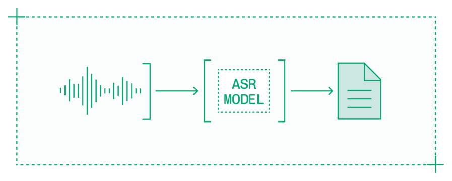
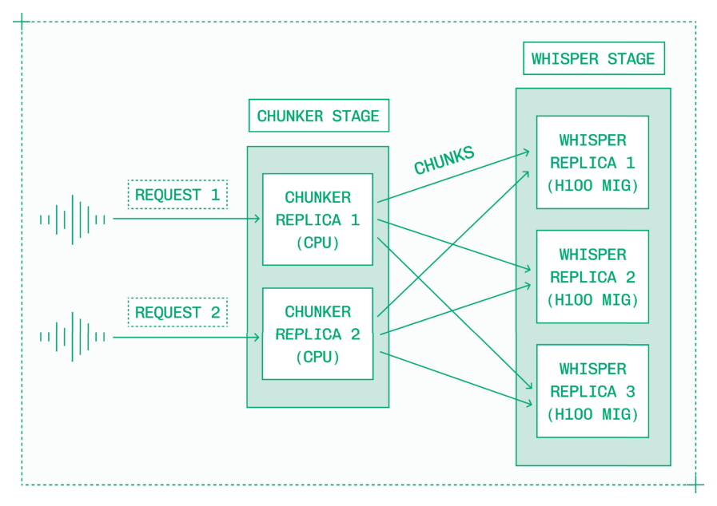
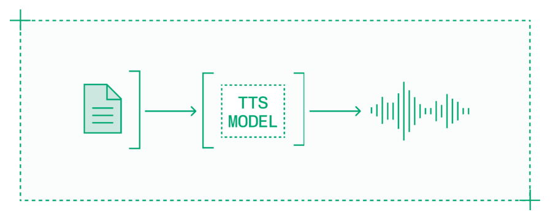
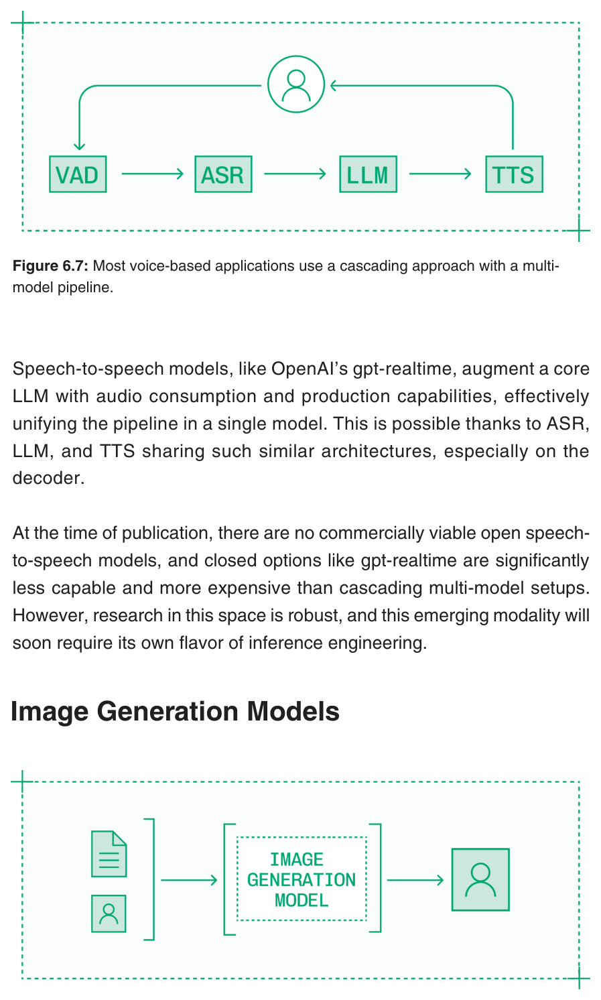
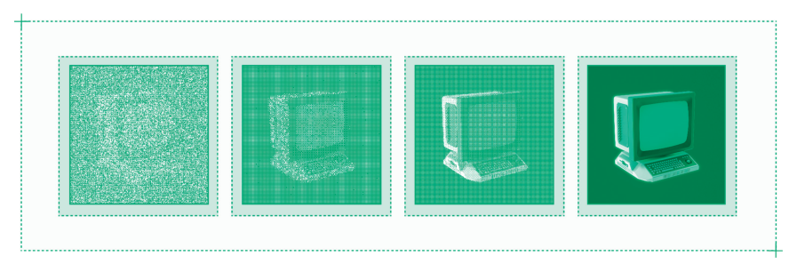
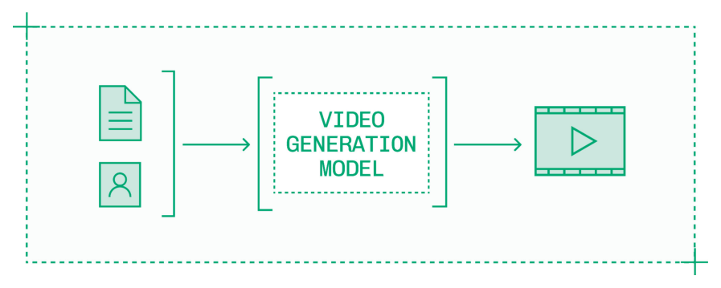
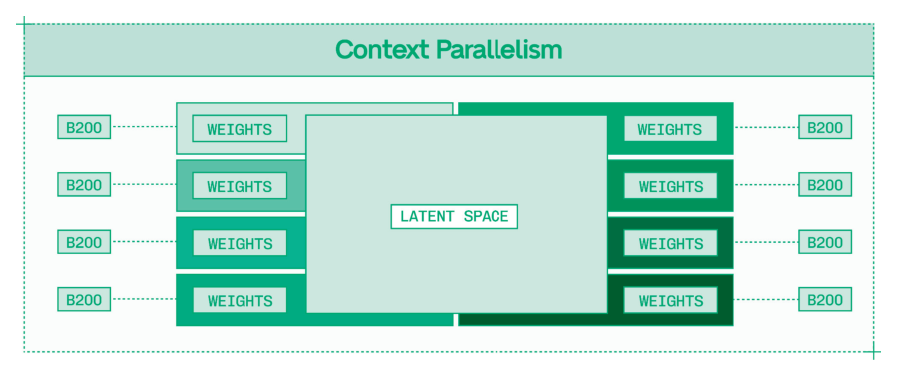

# Chapter 6: Modalities（模态）

## Modalities

模型的模态（modality）描述了它接受什么类型的输入以及产生什么类型的输出。第1章到第5章聚焦于 LLM 的推理工程，这类模型以文本作为输入并产生文本作为输出。本章将讨论扩展到更多模态。

生成式 AI 模型提供了丰富的模态种类，包括：

| 输入 | 输出 | 类别 |
|------|------|------|
| 文本和图像/视频 | 文本 | 视觉语言（Vision Language） |
| 文本或图像/视频 | 向量 | 嵌入（Embedding） |
| 音频（语音） | 文本 | 转录（Transcription） |
| 文本 | 音频（语音） | 语音合成（Speech Synthesis） |
| 文本 | 音频（音乐） | 音乐生成（Music Generation） |
| 音频（语音） | 音频（语音） | 语音到语音（Speech-to-Speech） |
| 文本和/或图像 | 3D 模型 | 生成式 CAD（Generative CAD） |
| 文本和/或图像 | 图像/视频 | 图像/视频生成（Image/Video Generation） |
| 图像/视频 | 文本 | 描述生成（Captioning） |
| 图像/视频 | 掩码 | 分割（Segmentation） |
| 文本和图像 | 图像 | 图像编辑（Image Editing） |

幸运的是，虽然模态种类繁多，但正如第2章所述，生成式 AI 模型只有两大原型（archetype）：

- **自回归 token 生成（Autoregressive token generation）**：从已 tokenized 的序列开始，预测最可能的下一个 token。
- **迭代去噪（Iterative denoising）**：从随机噪声开始，逐步精炼至最可能的输出。

LLM 是最著名的自回归 transformer token 生成模型，但远非唯一一种。视觉语言模型、文本和多模态嵌入模型、自动语音识别（ASR）模型、文本转语音（TTS）模型以及许多其他模型都依赖类似的架构。

LLM 使用的许多推理引擎和技术同样适用于这些相关模态。

图像和视频生成模型则依赖迭代去噪，不过越来越多的混合 diffusion transformer 模型正在品质前沿取得突破。虽然从 kernel 选择到参数调优的许多理念同样适用于图像模型优化，但具体细节却截然不同。

对于每种新模态，你还需要调整对延迟（latency）、吞吐量（throughput）和质量（quality）的思考方式和衡量方法。例如，TTS 模型输出的单个音频 token 并不是特别有用；与其衡量 TTFT（Time To First Token），不如衡量首词时间（time to first word）或首句时间（time to first sentence）。

本章讨论 LLM 之外六种常见模态的推理工程，并特别关注每种模态的不同考量。

## 6.1 视觉语言模型（Vision Language Models）

视觉语言模型（VLM）以一个或多个图像或视频作为输入，同时配合文本提示，生成文本响应。

> 
> *Figure 6.1: VLM 在 LLM 基础上增加了图像和视频理解能力。*

视觉语言模型通常由两个模块组成：

- **LLM**：标准的大语言模型。
- **视觉编码器（Vision encoder）**：一个小型模型，接收原始图像和视频作为输入，将它们转换为图像 token。

语言模型的参数量远大于视觉编码器。例如，在 Mistral Large 3 中，视觉编码器仅有 20 亿参数，而 LLM 有 673B 参数。

虽然从参数量来看视觉编码器很小，但它在推理中至关重要。VLM 使用了多种不同的视觉编码器架构和实现，因此视觉语言模型的运行时支持相对更加分散。这种分散性使得 vLLM 和 SGLang 在服务视觉语言模型方面变得更加重要。

作为经验法则，向 VLM 发送高分辨率输入图像会在输入序列中增加大约 1000 个视觉 token。虽然从宏观上看，图像 token 与常规 token 类似，但它们会快速累积。

在 VLM 中，推理优化的主要挑战在于处理更长的输入序列和更大的 KV cache。这给推理的两个阶段都增加了复杂性：

- **Prefill**：图像被分块（patched）、嵌入、tokenized，并作为输入序列的一部分送入 prefill。
- **Decode**：机制相同，但上下文更长，且一些模型为图像 token 添加了注意力变体。

前一章中的每一项技术都有助于应对这一挑战：

- **量化（Quantization）**：KV cache 量化减少了更长序列的内存带宽和存储开销。
- **推测解码（Speculation）**：VLM 的 decode 与 LLM 相同，可以通过推测解码加速，尤其是 EAGLE。
- **前缀缓存（Prefix caching）**：在多轮对话和重复查询中复用图像的 KV cache。
- **并行化（Parallelism）**：使用 Tensor Parallelism 实现快速推理，同时访问更多 VRAM 以支持大模型和长上下文。
- **拆分（Disaggregation）**：将 prefill 移至专用且可独立扩展的 worker 来处理长序列。

除了这些技术之外，VLM 还引入了一种新的质量-速度权衡：下采样（downsampling）。图像和视频可以以不同分辨率转换为视觉 token。高分辨率表示所需的 token 数量大约是低分辨率图像的四倍，但能提供更详细的信息。对于单图像输入，下采样通常不需要，但在传入多个图像或视频片段时可能需要使用。

### 6.1.1 视觉语言模型的视频处理

视频不仅仅是其各帧的总和。视频可能包含音频（虽然许多 VLM 无法处理音频，需要单独转录并添加到提示中），并且其帧表达了物体在空间中的运动，这些信息在查看静态图像时会丢失。

VLM 在视频片段上训练以理解时间维度。高质量推理需要在单次模型调用中处理整个视频片段。

一秒钟的电影视频包含 24 帧。每一帧都是一张图像。如果一张高清输入图像大约需要 1000 个 token 来表示，那么一个四秒的视频片段将产生近 100,000 个 token 的输入序列。

实际上，视频输入不会产生这么长的输入序列——下采样实际上是必须的。

降低分辨率和帧率使得在单次推理请求中评估整个片段成为可能，不过视频理解模型仍然只能处理非常短的片段。

在视频被 tokenized 和编码之后，推理过程与处理图像类似，只是上下文要长得多。前缀缓存、KV cache offloading 和优化的注意力实现对数万 token 的输入序列更加重要。

### 6.1.2 全模态模型（Omni-Modal Models）

视觉语言模型是向"全能"模型（omni models）发展趋势的重要组成部分，这类模型接受多种类型的输入并产生多种类型的输出。omni 模型各有利弊——其模态融合提供了独特的能力，但较小的专用模型在特定领域通常更快且更准确。

例如，许多 VLM 在图像输入处理中训练了文本识别能力。然而，这些能力落后于专用的光学字符识别（OCR）模型，后者通常只占 VLM 参数量的一小部分。

在生产环境中运行 VLM 推理通常涉及协调多个模型和预处理步骤的 pipeline。你可能需要独立的预处理器来从 PDF 中提取数据、通过 OCR 从图像中读取文本，或从视频中转录音频。

pipeline 中的每个组件都必须单独优化速度，并且应该独立扩展以避免瓶颈。

## 6.2 嵌入模型（Embedding Models）

嵌入模型将可变长度的文本块——或其他模态的输入如图像——转换为固定长度的向量表示，该表示捕捉输入的语义含义。

> 
> *Figure 6.2: 嵌入模型将非结构化输入数据转换为编码语义含义的向量。*

通过将内容编码到这个共享的语义向量空间中，你可以用简单的数学运算比较项目之间的距离。嵌入模型（连同向量数据库）用于构建 agent 记忆、RAG、搜索和推荐系统。

为了支持这些用例，嵌入模型推理工作负载有两种不同的流量特征：

1. **高吞吐量回填（High-throughput backfills）**：批量操作，如索引数百万文档、更新产品目录，甚至为 LLM 预训练准备数据。
2. **低延迟查询（Low-latency lookups）**：面向用户的单个查询，用于搜索、检索或推荐，其中每毫秒都影响用户体验。

嵌入模型的推理工程首先要明确你需要服务哪种流量特征。如果你两者都需要且流量足够大以证明成本合理，最好为每种用途构建独立的系统。

### 6.2.1 嵌入模型架构

Hugging Face 上有数以万计的嵌入模型，但它们都使用两种基于 transformer 的架构之一：

- **BERT 风格模型**：仅编码器神经网络，通常小于 1B 参数，最初为 masked token 预测而构建。
- **基于 LLM 的模型**：现代语言模型，通常 <=8B 参数，重新用于生成嵌入。

如今，基于 LLM 的嵌入模型提供了更强的能力，尽管 BERT 风格模型仍用于简单的延迟敏感任务如分类。

嵌入模型在嵌入维度（embedding dimensionality）方面引入了自身的速度/质量权衡，即输出向量的大小。嵌入向量包含几百到几千个值，更长的向量编码更多信息。

现代嵌入模型使用 Matryoshka 表示法来解锁嵌入维度和质量之间的动态权衡，同时在较短向量上保留更多信息。维度不会实质性地影响推理时间，但会影响系统内的存储、检索和相似度计算时间。

在大多数情况下，来自一个嵌入模型的向量无法与来自另一个嵌入模型的向量进行有意义的比较，即使它们长度相同，因为它们将输入编码到不同的语义空间中。

### 6.2.2 嵌入模型推理

对于具有 LLM 骨干的嵌入模型，如 Qwen 3 Embed 8B，推理优化与较小 LLM 的其他高吞吐量、低延迟部署共享通用工具和技术。

文本嵌入模型有多种运行时：vLLM、SGLang、Infinity、TEI（Hugging Face 的 Text Embedding Inference）。但最佳性能来自将 TensorRT-LLM 适配来运行这些模型。

> 
> *Figure 6.3: 高性能嵌入推理 pipeline 在优化推理引擎之前添加了并行 tokenization 和批量管理。*

TensorRT-LLM 为快速注意力带来了优化的 XQA kernel，并使用 kernel fusion 技术来减少内存访问开销。对于支持的模型，TensorRT-LLM 在延迟和吞吐量方面都是性能最高的推理引擎。

进一步的提升来自量化。虽然较小的模型更可能因量化而损失质量，但嵌入模型权重的 FP8 量化在最小质量损失的情况下提供了改进的性能。

检查量化后嵌入模型质量的最简单方法是将相同的输入分别通过原始模型和量化模型，然后检查输出向量的余弦相似度（cosine similarity）。100% 的余弦相似度意味着向量完全相同；你至少需要看到 99% 的相似度才能对量化有信心。

由于嵌入模型并行处理 token，前缀缓存和拆分不是相关的优化。而且鉴于这些模型体积小，跨多个 GPU 的并行化并不有效。相反，高流量部署应该横向扩展，每个 GPU 作为独立的副本。

在嵌入模型的高流量部署中，批处理（batching）和排队（queueing）在性能中扮演重要角色。嵌入模型提供比其他模型大得多的 batch size。单个请求可以将几十或几百个文本输入作为列表批量处理，多个请求可以在单个 GPU 上并行运行，因为即使是最苛刻的嵌入模型也相对较小且快速。

无论你是执行大批量回填还是处理使用高峰，流量都可能超过嵌入模型提供的大 batch size。在这些情况下，稳健的排队系统是支持嵌入模型推理的重要基础设施。

## 6.3 ASR 模型

自动语音识别（ASR）模型以音频作为输入，产生文本作为输出，驱动转录和听写应用。最受欢迎的开源 ASR 模型是 OpenAI 发布的 Whisper。Whisper 支持数十种语言的准确转录。

> 
> *Figure 6.4: ASR 模型将输入音频转录为文本。*

Whisper 有多种规模，但最大、最高质量的 Whisper 模型仅有 1.55B 参数。Whisper 通过 Multi-Instance GPU（MIG）可以在 H100 等大型 GPU 的小部分上极快地运行。虽然存在各种其他规模、变体、蒸馏和量化版本，但实际上可以用最高质量的模型——Whisper 3 Large 和 Whisper 3 Turbo——满足大多数延迟预算。

Whisper 是一个编码器-解码器（encoder-decoder）模型：

- **编码器（Encoder）**：接收处理后的音频波形（log-Mel spectrogram）作为输入，并将其编码为音频特征。
- **解码器（Decoder）**：接收这些编码后的音频特征，将它们转换为文本 token。

绝大部分推理时间花在解码器上，这是一个与 LLM 架构非常相似的自回归 transformer 模型。幸运的是，有出色的工具可以优化这个主要瓶颈。

解码器端性能优化的主要工具是 TensorRT-LLM。使用 TensorRT-LLM，你可以为解码器获得 in-flight batching 和带有高效 CUDA kernel 的优化 C++ 运行时。TensorRT-LLM 在 Hopper 和 Blackwell 等最新架构上表现尤其出色，使 MIG 成为 ASR 推理的更好选择。

### 6.3.1 单块延迟优化

Whisper 的一个用例是实时转录，例如在听写应用或语音 agent 中。

对于实时 Whisper，关注单个音频块被转录的往返时间。一个很好的目标是 200 毫秒，即人类的平均反应时间。

使用在优化后的 TensorRT-LLM 推理引擎上运行的 Whisper，在运行时层面没有太多工作可以改善性能。相反，实时 Whisper 的大部分提升来自编排和基础设施。

ASR 在产品体验上最大的升级是流式处理（streaming），它在 API 服务器层而非模型运行时层实现。通过建立 WebSocket 连接（第 7.5.3 节）并持续流式传入音频和传出文本，产品可以实时转录而非转录预录音频。

在 ASR 运行时层，没有任何变化。相反，转录的流式实现使用语音活动检测（Voice Activity Detection，VAD）模型来监控传入的流，并将其分割成离散的块供 ASR 模型处理。推理像往常一样在这些块上运行，文本结果通过 WebSocket 流式返回。

这种设置可以处理多个并发流，并且具有保持转录顺序的优势。当每个块在同一 GPU 上处理时，你可以将前一个块的输出序列用作下一个块的前缀，从而提高转录质量。

### 6.3.2 长文件延迟优化

Whisper 模型的一个限制是它只能支持 30 秒的块。转录长文件，如一小时的播客，需要一套不同的优化方案。

使用容易令人困惑的名称——实时因子（Real-Time Factor，RTF）——来衡量长文件转录的性能。如果世界上最快的打字员能在 30 分钟内手动转录一小时的音频，他们的 RTF 就是 2X。使用针对长文件优化的 Whisper 部署，你可以在不到四秒内转录一小时的音频，RTF 达到 1000X。

长文件的快速转录需要多步 pipeline。第一步同样是 VAD 模型，这次运行在专用硬件上。该模型用于去除静音并切分出有意义的音频片段，而不是按时间间隔分割，后者可能导致将词语从中间切断。

然后，这些块可以并行处理。理想情况下，使用多个 GPU（或多个 MIG）一次处理更多音频块。RTF 大致随使用的 GPU 数量线性提升。每个 GPU 使用 in-flight batching 同时处理多个块，以实现高利用率。

最后，分块的转录结果按时间戳拼接回去。

> 
> *Figure 6.5: 用于长音频文件转录的两阶段 pipeline 通过并行化块转录来改善端到端请求时间。*

并行化块转录消除了将前一个序列作为下一个序列前缀的能力。但还有其他质量改进技术可以弥补这一点。

对于 ASR 输出，你可以通过测量输出结果的压缩比和每分钟词数来自动检测重复词语和短语等幻觉（hallucination）。当某个块出现问题时，你可以：

1. 以更高的温度重新运行该块。这有些反直觉——更高的温度通常产生更多幻觉——但其目的是打破重复词语的循环，生成不同的输出。
2. 将整个音频或音频的某个片段重新切分成更小的块，然后重新运行转录。

在实践中，这些技术消除了传递前一个序列作为前缀的需要，从而实现了高效且准确的长文件并行转录。

### 6.3.3 说话人分离（Diarization）

说话人分离（Diarization），即在转录中标注谁在什么时候说话，是与转录相邻的问题。说话人分离模型根据语音特征对音频进行分类，然后在整个文件中进行分割和聚类，以标注说话人切换的时间戳。

说话人分离模型是完全不同类别的模型。Whisper 是编码器-解码器 transformer 模型，而像 pyannote audio 这样的说话人分离系统是经典 ML 模型的 pipeline。

说话人分离 pipeline 包含分割、嵌入和聚类模型。要优化说话人分离，你必须快速运行每个模型并高效编排整个 pipeline。

由于说话人分离是一个 ML pipeline，你可以使用 PyTorch 和 pyannote 等工具以及 Torch compilation 等优化来提升性能。在实践中，即使高度优化的说话人分离实现，处理音频文件所需的时间也至少是转录的两倍。

## 6.4 TTS 模型

文本转语音（TTS）模型，也称为语音合成（speech synthesis）模型，以文本作为输入，产生音频作为输出，具体来说是生成语音。在 2025 年，像 Orpheus TTS 这样的开源模型为开源模型生态系统引入了极其逼真的语音合成。许多公司对 Orpheus 进行了 fine-tune 以提高语音质量和创建产品特色声音，推动了开源模型在语音 AI 领域的高度采用。

> 
> *Figure 6.6: 文本转语音模型将输入文本合成为音频。*

现代 TTS 模型是基于 LLM fine-tune 的。例如，Orpheus TTS 源自 Llama 3.2 3B。这意味着许多为 LLM 开发的运行时和性能优化同样适用于语音合成模型。

TTS 模型参数量较小——Orpheus TTS 的 30 亿参数已属于较大的一端——这意味着与 ASR 模型一样，H100 上的 MIG 是高效且高性能的推理选择。

与通常以 FP16 运行的 ASR 模型不同，TTS 模型权重和 KV cache 可以量化到 FP8，以获得更好的性能，再加上 TensorRT-LLM 推理引擎引入的优化 kernel 和 in-flight batching。

具有 LLM 骨干的 TTS 模型通过扩展 LLM 的词汇表大小来训练，增加了数万个编码后的音频 token。然后，这些模型在文本输入与 tokenized 音频输出的配对上进行训练。这意味着要在实践中使用 TTS 模型，你还需要一个音频解码器，将音频输出 token 转换为波形。

这个音频解码过程给推理增加了潜在的瓶颈。音频解码器应使用 PyTorch 实现，并为目标 GPU 编译以实现高效运行，还应使用短超时（例如 15 毫秒）的动态批处理。音频解码器不能使用 in-flight batching。

TTS 模型的性能使用与 LLM 略有不同的指标来衡量。关键指标包括：

- **TTFB**：首字节时间（Time To First Byte，TTFB）是语音合成中等同于 TTFT 的指标。
- **首句时间（Time to first sentence）**：与 TTFB 相比，一个更面向用户的延迟指标是生成第一个有意义的短语或句子的时间。
- **TPS**：与 LLM 一样，TTS 模型生成 token，因此解码速度可以用每秒 token 数来衡量。

与 LLM 上的 TTFT 一样，目标是尽量减少语音合成的 TTFB。对于 Orpheus，在单个 H100 上可以低至 150 毫秒。

然而，对于语音合成模型上的 TPS 有不同的目标。模型生成的 token 被转换为音频波形。根据模型不同，可能需要每秒 80 到 100 个 token 才能实时生成音频。超过这个水平，每秒生成更多 token 并没有任何好处。

相反，性能增强用于以模型可以创建的并发实时输出数量来衡量吞吐量扩展。如果单个 GPU 可以支持多个并发用户，语音合成的每用户成本将大幅下降。

### 6.4.1 流式实时文本转语音

大多数 TTS 任务需要实时语音合成。与 ASR 模型一样，实时系统的性能提升较少来自运行时层——已通过 TensorRT-LLM、量化和编译的 SNAC 解码器进行了优化——而更多来自基础设施。

同样，通过 WebSocket 进行流式传输是相较于以离散块发送文本和接收音频最大的性能解锁。在测试推理引擎以确定可以生成多少并发实时流之后，设置相同的 batch size 和活跃 WebSocket 数量以保持高但稳定的使用率。

TTS 模型很少在实时应用之外使用。但是，如果你确实遇到批量用例，例如为大量文档回填音频以提高可访问性，请注意 TTS 模型不适合处理长输入，语音在大约 30 秒后开始退化。

### 6.4.2 语音到语音模型

一个令人兴奋的研究领域是语音到语音（speech-to-speech）模型，即以音频作为输入并生成音频作为输出的模型。

如今，大多数语音系统使用级联（cascading）方法，其中 ASR 模型、LLM 和 TTS 模型在 pipeline 中协作以倾听、思考和回应用户。这些 pipeline 还使用辅助组件如 VAD 和嵌入模型来促进自然对话和添加上下文。

> 
> *Figure 6.7: 大多数基于语音的应用使用带有多种模型 pipeline 的级联方法。*

语音到语音模型，如 OpenAI 的 gpt-realtime，在核心 LLM 基础上增加了音频消费和生产能力，有效地将 pipeline 统一在单一模型中。这之所以可能，是因为 ASR、LLM 和 TTS 共享如此相似的架构，特别是在解码器方面。

截至出版时，还没有商业可行的开源语音到语音模型，而像 gpt-realtime 这样的闭源方案在能力和成本上显著不如级联多模型方案。然而，该领域的研究非常活跃，这种新兴模态很快将需要自己的推理工程方法。

## 6.5 图像生成模型

> 
> *Figure 6.8: 图像生成模型可以接受文本和参考图像来创建新的输出图像。*

在多个维度上，使用图像和视频生成模型与使用大语言模型完全不同。

第一个区别是架构。虽然一些最近的模型如 HunyuanImage-3.0 更接近 LLM，但大多数图像和视频生成模型是迭代去噪器（iterative denoisers），而非自回归 token 生成器。图像生成模型是多个小型模型在 latent space 中协同工作的 pipeline，而非 LLM 那样的统一解码器架构。

因此，工具也不同。截至出版时，SGLang Diffusion 和 vLLM Omni 都是全新的。大多数图像和视频生成模型的推理在更底层的栈上实现，直接使用 PyTorch 或 TensorRT。

约束也不同。图像生成模型比前沿语言模型小 10 到 20 倍，推理受限于计算而非带宽。

但也许最显著的区别是，图像和视频生成模型提供了更直接的质量与速度权衡。

以程序化方式评估图像模型输出质量是很困难的。使用视觉语言模型的自动化 pipeline 最多只能提供方向性信号，可能与人类偏好产生偏差。人眼是神秘的，大多数图像质量评估通过让人类在数千张图像中进行选择来工作，将感受和偏好聚合为质量基准。

### 6.5.1 图像生成 Kernel 优化

当你从模型仓库阅读图像生成模型的模型卡时，推理示例通常使用 diffusers 库，几乎没有优化。

事实上，虽然图像生成理论上是计算密集型的，但你通常需要选择内存高效的 kernel 并使用 kernel fusion 才能真正触及那个瓶颈。

高性能图像模型推理使用以下三个库之一：

- **SGLang Diffusion**：为流行的图像和视频生成架构构建的高性能推理引擎。
- **TensorRT**：使用 NVIDIA 自研 kernel 的流行模型高质量黑盒实现。
- **PyTorch**：精心的 kernel 选择和融合提供了控制力、灵活性和高端性能提升。

如果你想要开箱即用且效果良好的方案，直接使用模型的 SGLang Diffusion 或 TensorRT 实现即可。但使用 PyTorch，高级推理工程师有机会进行深度定制。

最关键的 kernel 是注意力 kernel。许多图像生成模型开箱即用 FlashAttention 2，但 FlashAttention 3 和 4 分别在 Hopper 和 Blackwell GPU 上提供更好的性能。

还有一系列较小的 kernel，特别是像 RMSNorm 这样的归一化函数，是融合的良好候选，以确保高效的内存使用。

然后，GEMM kernel 对于计算密集型推理很重要。GEMM kernel 应用于线性层，通常可以安全地量化为 8 位浮点格式，以在 Tensor Core 上获得两倍的 FLOPS。来自 CuTe、CUTLASS 或 DeepGEMM 的 kernel 可能在不同模型上表现最佳。

Torch compilation 包含自动 kernel fusion 以及用于插入手动选择 kernel 的插件系统，生成的引擎可以被缓存以在节点启动时更快加载（这很重要，因为编译需要几分钟）。

像大多数高性能引擎一样，Torch compilation 针对执行编译的特定 GPU 模型和架构——如果你想在 B200 上运行模型，就在 B200 上进行编译。

### 6.5.2 加速图像生成的一个巧妙技巧

Kernel 选择和 Torch compilation 都是真正的推理优化技术。但推理优化的世界也有一些有趣的 hack，这里介绍其中之一。

> 
> *Figure 6.9: 回顾一下，diffusion 是一个逐步的过程，图像的基本轮廓在早期步骤中就已确立。*

图像生成时间与步数（step count）呈线性关系。这就是为什么少步模型（few-step model）和潜在一致性模型（latent consistency model）比完整的 50 步模型快得多。但减少步数可能会使图像质量降至可接受的阈值以下。

每次通过去噪模型的运行以 batch size 为二进行，因为每个步骤包括一次有提示引导和一次无提示引导的通过。

提醒一下，引导参数（guidance parameter）控制组合每步生成的两次迭代时，提示引导图像的权重。如果引导值为零，则不需要生成提示引导图像。

在前几步之后，图像的基本轮廓已经就位，其余步骤用于填充细节。因此，提示遵循度（prompt adherence）在影响图像大体轮廓的早期步骤中更为重要——模型不会在后面的步骤中改变主意，在正在生成猫的过程中去生成一只狗。

如果你在图像生成过程中间关闭引导（guidance），你可以在不减少步数的情况下节省通过去噪器的通过次数。如果在 50 步运行中最后 20 步跳过引导，模型只需通过 80 次而非 100 次，而质量通常保持很高。

## 6.6 视频生成模型

> 
> *Figure 6.10: 视频生成模型接受文本提示，并可接受关键帧或其他图像、音频和视频输入。*

视频生成是要求最高的模态。只要有可能，这些模型应该在 Blackwell GPU（或在 Rubin 可用后使用 Rubin）上运行。这些 GPU 提供用于 Context Parallelism 的高内存容量、用于注意力计算的快速 Tensor Core，以及用于更精确量化的微缩放（microscaling）数据格式。

在架构上，视频生成与图像生成类似，只是从 latent space 渲染完整视频而非单帧。遵循更大规模解锁更多技术的原则，视频生成使用与图像生成相同的所有技术加上额外的优化。

与图像生成一样，视频生成受限于计算，通过 latent space 上的迭代去噪工作。视频生成模型通常采用与图像生成模型大致相同数量的去噪步骤（约 50 步），但每步处理的数据量要大得多。

由于视频生成模型受限于计算，批处理不像文本生成中那样有用。视频生成模型通常在八个 GPU 的完整节点上以 batch size 为一运行：所有八个 GPU 协同工作一次创建一个视频。

与可以通过调整 batch size 来实现延迟-吞吐量权衡的批量工作负载不同，提高视频生成吞吐量和成本的唯一方法是让模型本身更快。

早期的视频生成模型是逐帧（framewise）的。它们一次生成一帧。这降低了视频输出的质量和一致性。如今，视频生成模型在 latent space 中对整个视频进行去噪步骤。图像生成的 latent space 表示两个维度（宽度、高度），而视频模型的 latent space 表示三个维度（宽度、高度、时间）。

这意味着每次注意力计算要传递大量数据。对于视频模型，注意力占计算时间的 70% 到 80%，使注意力成为最重要的优化目标。

### 6.6.1 注意力优化与量化

注意力优化从 kernel 选择开始。测试 FlashAttention、DeepGemm、CuTe 和 CUTLASS kernel，看哪些在你的模型上表现最好。

语言模型使用 KV cache 来加速注意力，而视频生成模型使用其他缓存模式来尝试复用模型输出。复用注意力计算的部分内容可以使视频生成在实践中快 30% 到 40%。

具体方法和算法随着新研究不断变化，但有两种基本的缓存方法：

- **基于时间步的缓存（Timestep-based caching）**：缓存和复用某些时间步的输出以跳过整个步骤。
- **基于 Transformer 的缓存（Transformer-based caching）**：缓存和复用隐藏状态（hidden state）以跳过 transformer 内部的层。

算法和实现从几乎无质量退化到完全不可用的输出不等——在生产中使用这些策略之前要仔细测试。

除了 kernel 和缓存之外，加速注意力的主要工具是量化。

对于带宽受限的语言模型推理，量化的好处意味着你要通过内存加载的数据更少。对于视频模型，它意味着通过切换到低精度 Tensor Core 来获得双倍 FLOPS。

然而，语言模型量化聚焦于权重——大型线性层，量化的影响微乎其微。对于视频模型，量化权重仍然有帮助，但虽然这些层占据了大部分内存带宽（制约语言模型），它们在视频模型中只占计算时间的一小部分。

相反，视频模型上的量化聚焦于注意力。注意力是任何模型中量化风险最大的部分，因为误差会在推理过程中累积。对于视频模型，只有约 50 步而非 token 生成中数千次自回归迭代，风险略低但仍然重要。

减少质量影响的第一种方法是使用分块量化（blockwise quantization）和微缩放数据格式（MXFP8），两者在 Hopper 和 Blackwell 上都可用。微缩放数据格式在保留离群值（outlier value）方面做得更好，这些值对注意力准确性有重大影响。

最精密的注意力量化方法是在模型内进行选择性量化：

- **按步骤（Step）**：早期步骤保持 FP16，量化后期步骤。
- **按层（Layer）**：保留首层和末层，量化隐藏层。

按步骤量化遵循与图像生成模型中无分类器引导技巧（classifier-free guidance trick）相同的洞察：早期步骤建立图像轮廓，后期步骤细化细节。这些早期步骤对提示遵循度和准确性更为重要。

对于层，首层和末层更为重要，因为它们接收输入并产生最终输出。隐藏层只执行中间计算，不会因近似而受到太大影响。

通过只量化视频生成过程中不太重要的部分，质量得以保留。这些策略可以在像 SageAttention 这样的 kernel 中找到——一个 8 位注意力 kernel，可用于视频生成模型的低精度高质量注意力。

### 6.6.2 Context Parallelism

虽然视频生成模型通常在八个 GPU 的完整节点上运行，但它们使用 Context Parallelism 而非 Tensor Parallelism。

Context Parallelism 将权重复制到每个 GPU 上。视频模型足够小，将权重复制八次占用可观的内存，但在 B200 上是可行的。

Context Parallelism 不是将模型拆分到多个 GPU 上，而是将注意力计算分配到各 GPU 上。这通过类似环形注意力（ring attention）的机制来协调，每个 GPU 持有上下文的一部分，并将中间结果传递给环中的下一个 GPU。

> 
> *Figure 6.11: Context Parallelism 在视频模型推理期间复制模型权重但共享 latent space 来计算注意力。*

Transformer 模型的注意力是多头的（multi-head），通常有八个或更多头。注意力头是独立的，因此可以分别运行，之后合并结果。

注意力不是唯一可以并行化的部分。例如，使用变分自编码器（variational autoencoder）的 latent decoding 步骤占推理总时间的 3% 到 5%，可以跨 GPU 运行。

这些并行化技术使 AI 视频成为可能。随着视频序列变长和视频模型变大，并行化将继续是视频生成模型推理中最关键的技术。
