# Chapter 7: Production（生产环境）

生产环境的目的是让生成式 AI 模型运行得更快、成本更低、更可靠，从而帮助你构建更好的产品。

这一承诺只有在推理工程的工作成功部署到生产环境，并且能够应对成功 AI 产品所带来的快速增长和病毒式流量峰值时，才算真正兑现。

当你扩展生产环境流量时，你的假设会受到严格的检验。从序列形状（sequence shape）到流量模式，再到用户决定聊什么话题，一切都会影响你在生产环境中观察到的性能。而维护安全、健壮的基础设施，与在 GPU 上优化模型推理是完全不同的技能领域。

无论单个实例服务模型的速度和效率有多高，在足够的流量下，服务终将被压垮。这不是 PyTorch 问题，也不是 CUDA 问题，而是基础设施问题，需要不同的思维方式和技术栈。

生产环境中的扩展引入了新的复杂性：在哪里以及如何获取 GPU、在它们之间均衡流量、防止停机等。此外，在从按百万 token 付费过渡到直接为基础设施付费的过程中，成本核算也变得复杂。

生产环境中的延迟不仅仅来自 prefill 和 decode。你需要对系统进行端到端评估，消除服务器、网络甚至客户端中的低效之处——尤其是在你可以控制或影响客户端代码的情况下。

本章介绍了在生产环境中扩展低延迟、高吞吐量推理的关键考量。最后，我将邀请你尝试使用 Baseten 来部署关键任务的推理工作负载。

## 7.1 Containerization（容器化）

容器化是将应用程序及其依赖项打包在一起，以标准化生产环境部署的实践。容器将程序变成一个可以在任何地方运行的打包产物——再也不用说"在我的机器上能跑"了。

容器是轻量级的，因为它们共享底层宿主机操作系统的 kernel（在此上下文中，kernel 指的是 Linux kernel，而非 CUDA kernel）。这使得容器非常适合打包推理服务。

对于大多数开发者来说，容器化就是 Docker 的代名词。使用容器涉及一些更具体的术语：

- **Container（容器）**：一个隔离应用程序及其依赖项的活动运行环境。
- **Image（镜像）**：一个包含运行某软件所需一切的可执行包。
- **Dockerfile**：一个人类可读的文件，包含用于创建镜像的明确定义、机器可解释的指令。
- **Registry（仓库）**：用于管理、存储、共享和分发镜像的中央仓库。

NVIDIA、多家云提供商以及 Docker 自身都运营着容器仓库。AI 领域一个流行的仓库是 Docker Hub——Docker Hub 之于镜像，就像 Hugging Face 之于模型权重，PyPI 之于 Python 包。

Docker 容器由层（layer）组成。你可以使用一个预配置的基础镜像（base image），并在其上添加包含额外文件系统变更的其他层。

有三种类型的层：

- **Base image（基础镜像）**：可以是像 Ubuntu 这样的操作系统发行版，也可以是从仓库获取的更复杂的镜像。基础镜像本身由多个层组成。
- **Additional layers（附加层）**：包括依赖项、应用程序代码和配置文件等文件系统变更，由 Dockerfile 指令指定。
- **Container layer（容器层）**：在运行时创建的一个薄且临时的层。对运行中容器的任何更改（如创建、更新或删除文件）都会写入此层，并在容器终止时丢失。

> 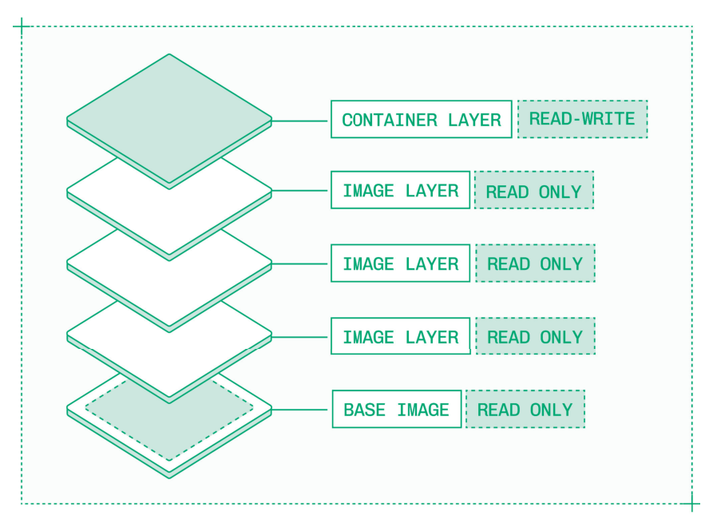
> *Figure 7.1: Docker 容器由层组成，从基础镜像一直到顶部的临时可写层。*

像 vLLM 和 SGLang 这样的推理引擎为活跃版本提供官方基础镜像。通常最好从这些经过验证的镜像开始，而不是从头构建自己的镜像。

### 7.1.1 Dependency Management（依赖管理）

推理的依赖链又长又脆弱。获得一个可用的构建很困难，这使得容器化在一个破坏性变更司空见惯的生态系统中保存已知的良好构建变得至关重要。

镜像是针对特定的 GPU 架构和模型构建的。一个容器包含许多运行时组件：

- **CUDA toolkit 版本**：与堆栈其余部分兼容的特定 CUDA、cuDNN 和驱动版本。
- **Python 包**：如 `torch`、`transformers` 和 `diffusers` 等依赖项。
- **推理引擎**：使用的 vLLM、SGLang、TensorRT-LLM 或其他推理引擎的版本。
- **系统包**：如 `ffmpeg` 等 Linux 包，在处理音频、图像或视频模型时尤为常见。

就像背包徒步旅行者一样，你希望轻装上阵。为推理构建的镜像通常有几个 GB。为了快速部署和高效运行，只包含严格必要的依赖项。

另一个最佳实践是锁定版本（pinning versions）。拥有锁定的依赖树可以保持系统运行时行为在不同环境中的一致性，并支持以相同结果重复构建镜像。精确指定每个依赖项应包含在镜像中的版本。

> 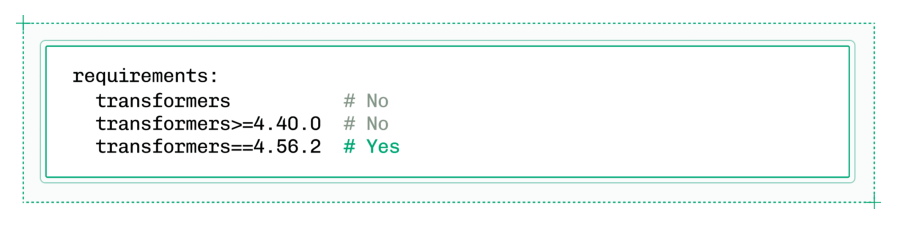
> *Figure 7.2: 依赖项应锁定到精确版本，以防止未来的变更破坏推理容器。*

像 `uv`、`poetry` 或 `pip` 这样的工具会在构建镜像时标记任何版本不兼容性并抛出错误。有了锁定的版本，一旦镜像成功构建一次，它将始终将依赖解析到相同的版本，保护你免受破坏性变更的影响。

在处理新发布的模型时，破坏性变更尤其常见。当像 DeepSeek 这样的新版本模型发布时，整个推理生态系统都在竞相提供零日支持（day zero support）。

在为新模型构建镜像时，推理工程师通常依赖依赖项的隔夜构建（overnight builds）或其他开发者预发布版本，而非稳定版本。这些早期版本更容易出现 bug，通常需要在模型发布后的几天和几周内在稳定版本上重新构建。

### 7.1.2 NIMs

NVIDIA Inference Microservices（NIMs）是为热门开放模型预构建的 Docker 容器。

容器使推理服务实现具有可移植性。NVIDIA 创建了两种类型的 NIM：

- **Multi-LLM NIM**：一个灵活的容器，用于在支持的 GPU 架构上运行一系列模型。
- **LLM-specific NIM**：一个针对特定 GPU 上特定模型优化的引擎，配置为最大性能。

NIM 可用于模型、GPU 架构、GPU 数量和配置的各种常见组合。

NIM 就像任何其他容器一样。你可以将 NIM 作为起点来构建，作为学习的参考架构，或作为开箱即用的推理服务。

然而，如果你追求的是最大控制权而非现成的配置，通常最好从较少预设的基础镜像构建自己的容器，而不是改编 NIM。

## 7.2 Autoscaling（自动扩缩容）

自动扩缩容的目标是确保你始终拥有足够的资源来服务所有传入请求，同时维持延迟 SLA（Service Level Agreement），而不在空闲 GPU 上浪费资金。

> 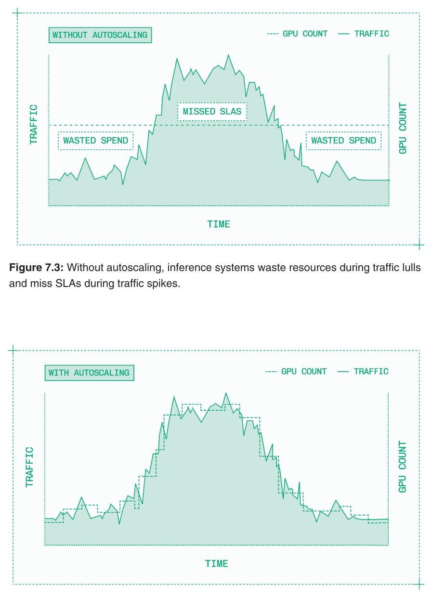
> *Figure 7.3: 没有自动扩缩容时，推理系统在流量低谷期浪费资源，在流量高峰期无法满足 SLA。*

> 
> *Figure 7.4: 一个强大的推理自动扩缩容系统能够将资源与需求相匹配。*

自动扩缩容系统使用 Kubernetes——一个开源容器编排系统——以及一个集群级别的系统来分配和释放计算资源。Kubernetes 可以运行一个或多个模型容器的副本（replica），每个副本在各自的实例（instance）上运行。一个实例包括容器所需的 GPU 和其他硬件资源。

Kubernetes 通过将一组硬件资源组合成一个集群（cluster）来工作。该集群有两种类型的组件：

- **Control plane（控制平面）**：做出路由和扩缩容决策。
- **Worker plane（工作平面）**：运行实际的容器化应用程序。

> 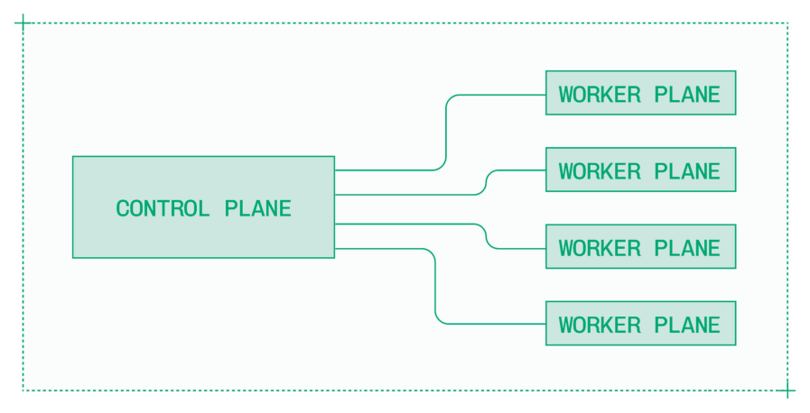
> *Figure 7.5: Kubernetes 集群有一个控制平面来编排多个工作节点。*

一个 Kubernetes 集群可以运行多个模型的多个副本。但你如何决定每个模型运行多少副本呢？除非你的流量异常稳定，否则可能没有一个完美的副本数量来匹配你的需求。

自动扩缩容是在集群内动态调整分配给特定模型的副本数量的实践。做出自动扩缩容决策有两种方式：

- **利用率（Utilization）**：基于 GPU 利用率信号（如内存使用或计算使用）进行扩缩容。
- **流量（Traffic）**：基于系统中正在处理的请求数量进行扩缩容。

利用率和流量并不总是匹配的。例如，在 LLM prefill 中，少量包含数十万未缓存 input token 的请求可能比许多具有高缓存命中率的小请求造成高得多的利用率。

基于流量的扩缩容决策可以主动做出，而利用率是一个滞后指标。将两者结合使用，以保持系统资源与需求匹配。

在设计基于流量的自动扩缩容系统时，你需要配置五个因素：

- **Min replicas（最小副本数）**：无论流量如何，始终保持运行的最小副本数是多少？
- **Max replicas（最大副本数）**：在高流量时可以分配的最大副本数是多少？
- **Autoscaling window（扩缩容窗口）**：用于衡量流量和做出扩缩容决策的滑动时间窗口是多长？
- **Scale down delay（缩容延迟）**：在建议缩容后等待多长时间，以防出现另一个流量峰值？
- **Concurrency target（并发目标）**：每个副本一次可以处理多少个请求？

具体的配置决定了自动扩缩容系统在维持延迟 SLA 的同时不浪费资源方面的效果。例如，增加缩容延迟可以防止锯齿形流量的过早缩容，但可能在流量真正回落后导致不必要的支出。

### 7.2.1 Concurrency and Batch Sizing（并发与批处理大小）

要正确操作基于流量的自动扩缩容系统，你需要充分了解每个实例可以处理多少并发流量。

大多数模型推理服务可以通过批处理（batching）同时处理多个请求。有几种批处理方法：

- **Static batching（静态批处理）**：服务器等待批次填满后才开始推理。
- **Dynamic batching（动态批处理）**：服务器等待批次填满或经过配置的时间后才开始推理。
- **Continuous batching（连续批处理）**：服务器持续运行推理，在有空位时换入新请求。

像 vLLM、SGLang 和 TensorRT-LLM 这样的推理引擎实现了健壮的 continuous batching（TensorRT-LLM 称之为 in-flight batching），其中请求在 token 级别进行批处理。这相对于 static batching 最小化了延迟。

> 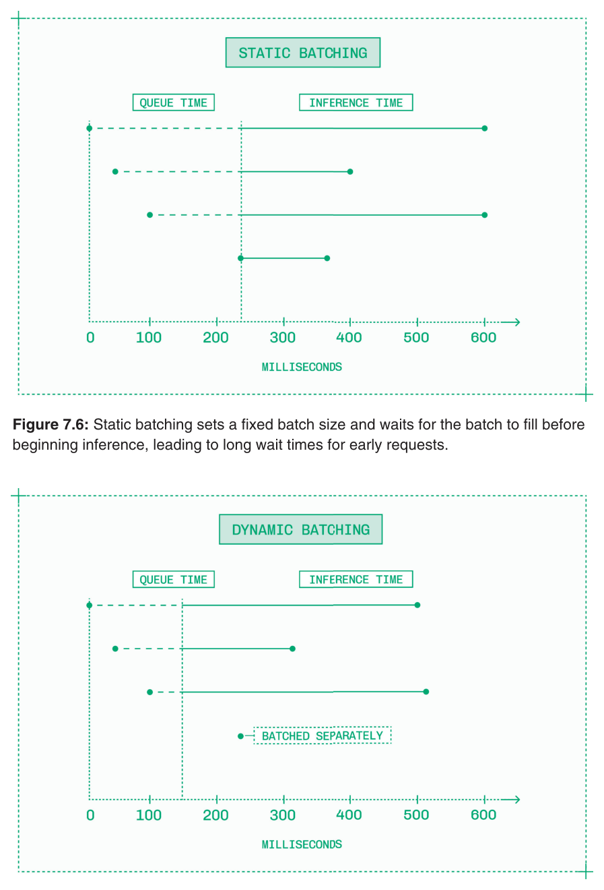
> *Figure 7.6: Static batching 设置固定的 batch size 并等待批次填满后才开始推理，导致早期请求等待时间过长。*

> 
> *Figure 7.7: Dynamic batching 添加了一个截止时间，无论批次是否填满，超过截止时间就会运行。*

> 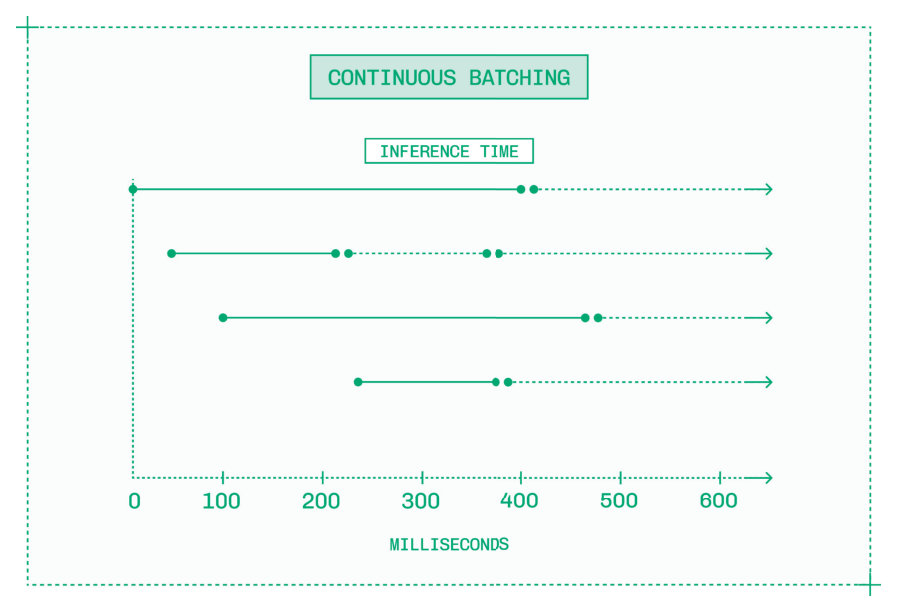
> *Figure 7.8: Continuous batching 在 token 级别操作，在旧请求完成时切换入新请求。*

批处理大小在延迟和吞吐量之间进行权衡。增加批处理大小将产生更高的总体吞吐量，但每个用户的延迟会变差。在多个批处理大小下测试性能，以找到适合你的模型、实例、延迟目标和预算的正确配置。

这通过并发目标在自动扩缩容配置级别进行控制，并通过批处理大小在副本级别进行控制——两者应该匹配。

一旦每个活跃副本达到其最大并发数，自动扩缩容系统就知道需要启动更多副本。如果足够多的副本都在运行半满的批次，就是时候缩减了。

### 7.2.2 Cold Starts（冷启动）

冷启动是指启动一个模型的新副本所需的时间。

自动扩缩容系统的整体性能取决于其冷启动速度。如果你不能快速启动副本，就很难有信心地缩容，从而导致过度配置。

有几个因素影响冷启动时间：

- **GPU 采购**：多快能将所需的 GPU 添加到集群中并分配给模型？
- **镜像加载**：多快能将容器镜像加载到新采购的实例上？
- **模型加载**：多快能将模型权重加载到容器中？
- **引擎启动**：多快能启动推理引擎，包括任何编译时间？

这些因素每一个都需要单独优化。

> 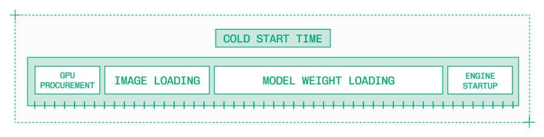
> *Figure 7.9: 冷启动过程中的每一步都会增加总时间线。*

除非你有一个在模型之间灵活调配的温热节点池，否则 GPU 采购速度主要取决于你的云提供商。7.3.1 节涵盖了 GPU 采购，节点启动时间是合同中可协商的因素之一。

然而，工程师在加载镜像和权重以及启动容器和引擎方面可以做很多事情。

加载镜像和模型权重取决于你能多快将千兆字节（通常是数百 GB）的数据写入你的实例。有两种方法可以更快地加载镜像和权重：让它们更小，或获得更多带宽。

只包含必要的步骤和依赖项使镜像更小、更快构建成容器，而量化模型权重还有一个额外好处，即在冷启动期间加载更快。

对于小模型，过去的策略是将权重烘焙到镜像中以简化缓存和加载。然而，现在大多数模型有数百亿或数千亿参数，权重远大于镜像，最好单独加载。

从哪里加载权重对带宽有巨大影响。如果你从 Hugging Face 等第三方加载，你会受到其出口速度的限制。而将权重存储在 S3 bucket 中会引入网络延迟和数据传输成本。

对于加载数千亿参数的模型，你需要每秒千兆字节级别的带宽。最好的方法是在同一数据中心内，从物理上靠近 GPU 实例的缓存源通过节点内网络加载。

像 vLLM 和 SGLang 这样的推理引擎启动很快。但像 TensorRT-LLM 这样的引擎以及用 PyTorch 优化的模型有一个编译步骤，需要针对特定的硬件资源构建模型推理引擎。这些编译通常需要几分钟。

在这些情况下，缓存已构建的引擎可以大幅改善冷启动时间。TensorRT-LLM 和 PyTorch 都有镜像缓存机制使之成为可能，但你始终需要将缓存的引擎加载到与引擎构建环境具有完全相同 GPU 类型、CUDA 版本和软件依赖的实例中，才能正确运行。

### 7.2.3 Routing, Load Balancing, and Queueing（路由、负载均衡和队列）

一旦有多个副本在线，系统就需要决定将哪些请求发送到哪些副本。有两种类型的组件做出这些决策：

- **Router（路由器）**：路由器在请求级别工作，确定发送给定请求的理想位置。路由器回答"这个请求应该去哪里？"
- **Load balancer（负载均衡器）**：负载均衡器在系统级别工作，在多个选项之间均匀分配请求。负载均衡器回答"这个请求可以去哪里？"

在复杂的系统中，不只是一个路由器和一个负载均衡器。路由在整个堆栈中进行，负载均衡器被注入到关键节点以保持系统级性能的稳定。

总体而言，你希望在副本之间均等分配负载。然而，路由和负载均衡并不像说"好吧，我有 3 个副本和 12 个请求，所以每个副本放 4 个请求"那么简单。

每个请求可能有不同数量的 input token。如果大多数请求有 100 个 input token，一个有 10,000 个 token 的请求将使一个简单系统失衡。某些请求也更适合由特定的副本处理。示例包括：

- **KV cache-aware routing（KV 缓存感知路由）**：将请求定向到其 KV cache 中已有匹配前缀的副本。
- **LoRA-aware routing（LoRA 感知路由）**：将请求定向到内存中已有所需 LoRA 微调权重的副本。

智能请求路由利用来自推理引擎和任何编排器（如 NVIDIA Dynamo）的信息，根据序列长度、前缀和 LoRA 需求来路由请求。

负载均衡和路由还不够。当自动扩缩容系统接收到的流量超过其处理能力时，它需要一种方式在扩展更多资源或等待现有资源变得可用时保持请求。

队列（queue）是处理这种情况的基础设施原语。标准队列是一个先进先出（first-in, first-out）的系统，用于处理超额请求，不过你也可以实现更复杂的方案，例如优先级队列，以便在高流量场景中将付费用户的优先级置于免费用户之上。

当新副本上线时，确保队列能看到它们，请求不会继续在现有副本上等待。每个新副本一旦激活，应立即被分配直到其并发上限的排队流量。

### 7.2.4 Scale to Zero（缩容至零）

高级自动扩缩容系统实现了缩容至零的机制，即系统在没有流量时可以缩减到零个活跃副本，然后在收到流量时自动扩展。

缩容至零依赖两个前提条件：

- **快速冷启动**：由于用户可能在实时等待，冷启动必须尽可能快。
- **健壮的队列**：系统需要能够在副本上线之前保持传入请求。

即使具备这些能力，缩容至零并不适合所有工作负载。

缩容至零非常适合开发阶段，此时测试是突发性的，第一个请求的延迟不重要。在生产环境中，缩容至零适用于只在特定时间段接收流量的应用程序，比如只在一个国家工作时间被访问的 agent，或设计用于每日批处理任务的离线系统。

然而，如果你依赖缩容至零来在接收轻微、不定期流量的延迟敏感型应用中保持低成本，这可能是一个信号，表明你的 AI 应用尚未准备好使用专用基础设施，应该使用按 token 付费的 API 直到达到更大规模。

### 7.2.5 Independent Component Scaling（独立组件扩缩容）

AI 应用越来越多地构建在多模型、多阶段的复合 AI 工作负载之上，推理工程师需要协调多个步骤来完成单个请求。

这些步骤可能有不同的硬件需求。语音活动检测（voice activity detector）模型所需的 GPU 远弱于它为其分块数据的转录模型，而处理该转录的 LLM 可能需要一个配备多 GPU 的完整节点。流水线中每个步骤的扩缩容参数也不同。

> 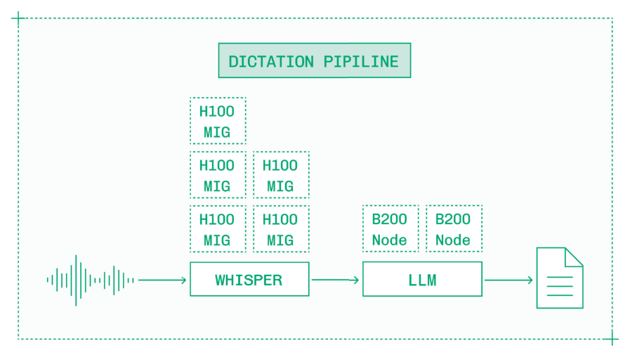
> *Figure 7.10: 独立组件扩缩容为每个模型提供适当的资源和独立的扩缩容能力。*

对于这些流水线，你需要分解自动扩缩容决策，单独扩缩容每个步骤，以正确调整每个步骤的资源，并避免瓶颈和过度配置。

然而，流水线中的每个模型应该在同一集群中运行。如果在集群内发送消息需要 10 毫秒，而在集群之间发送消息需要 50 毫秒，那么在 5 步流水线中这 40 毫秒的差异将占一秒延迟 SLA 的 20%。

## 7.3 Multi-Cloud Capacity Management（多云容量管理）

单个集群内的自动扩缩容在一定程度上是有效的。但服务于全球用户群的大规模部署需要分布在世界各地的数千个 GPU。

将多云推理构建为不同云提供商之间隔离的计算集合是很直接的。但在这些设置中，无法流畅地使用跨云计算，在云之间迁移工作负载是一个繁琐且容易出错的过程。

真正的多云推理需要构建一个多区域、多提供商的装箱工具（bin packing tool），将不同的计算池视为彼此可互换的。与单个集群内的 Kubernetes 类似，多云容量管理必须采取全局视角，实现自愈和全局调度。

> 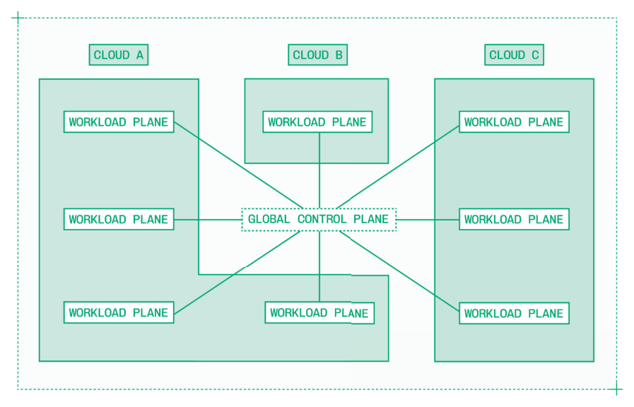
> *Figure 7.11: 多云方法将控制平面和工作负载平面的概念扩展到多集群、多区域系统。*

运行真正的多云推理可以带来：

- **容量**：汇集多个提供商的容量，以获得更多、更灵活的 GPU 访问。
- **冗余**：在提供商之间分散推理，提高对中断的恢复能力。
- **延迟**：在靠近终端用户的地方运行推理，以减少网络延迟开销。
- **合规性**：按照数据主权和其他法规要求运行推理。

从一个云中的一个集群扩展到多个云中的多个集群需要一个新的协调层。多云架构包含：

- **控制平面（Control plane）**：处理模型部署和全局扩缩容决策，接收实时事件流。
- **工作负载平面（Workload plane）**：处理直接推理流量和集群内扩缩容决策，报告利用率和需求。

这种职责分离确保各个工作负载平面可以独立服务流量。如果控制平面或任何给定工作负载平面出现问题，其他工作负载不应受到影响。

### 7.3.1 GPU Procurement（GPU 采购）

有不少公司从事提供 GPU 访问的业务。三大类型是：

- **Hyperscaler（超大规模云提供商）**：像 AWS 或 GCP 这样的大型云提供商。
- **Neocloud（新型云）**：专注于 GPU 的云提供商，如 CoreWeave 或 Nebius。
- **Reseller（经销商）**：二级市场，如 SF Compute Company。

这个领域的参与者在容量、可用性和可靠性方面各不相同。你通常为 hyperscaler 支付溢价，在所有提供商中，成本与正常运行时间 SLA、支持、区域可用性、实例配置和集群大小等因素之间存在权衡。

第一个挑战是确保容量。获取你所需的 GPU 通常很困难，尤其是最新硬件。大型集群也很难获得，提供数百节点块的参与者相对较少。

许多云提供商将大部分热门 GPU 分配给最大客户的长期预留。你可能需要跨多个云提供商来获取你所需区域内的 GPU。

云 GPU 可以通过三种不同的机制采购：

- **Reserved（预留）**：以折扣价预留数百或数千个 GPU 数月或数年。
- **On-demand（按需）**：按需提供单个实例，达到给定配额为止，按较高的小时费率计费。
- **Spot（竞价）**：折扣的按需实例，可以在约定的通知期（通常为几分钟）内被抢占。

大规模推理通常混合使用 GPU 来源，以低成本预留实例为基线，混合使用按需和竞价实例来应对流量高峰。这些 GPU 分布在全球多个集群中，以靠近终端用户。

### 7.3.2 Geo-Aware Load Balancing（地理位置感知的负载均衡）

成功的 AI 应用拥有世界各地的用户。就像单个集群有负载均衡器来确保集群中的每个 GPU 接收适量的流量一样，多集群系统需要一个全局负载均衡器。

你不希望用户请求在某个队列中空等，而其他地方有空闲容量，但你也不希望养成从新加坡向旧金山服务器发送请求的习惯。

作为经验法则，请求通过一个时区需要 5 毫秒。因此，从纽约向旧金山发送数据单程需要 15 毫秒。鉴于延迟预算如此紧张，在尽可能靠近终端用户的地方运行工作负载非常重要。

### 7.3.3 Building for Reliability（构建可靠性）

GPU 在生产环境中以高故障率著称。每个做过大规模训练运行的工程师都知道需要为硬件故障做好预案。

例如，在他们的 Llama 3 论文中，Grattafiori 及同事透露，在 54 天内运行 16,000 个 GPU 期间，Llama 团队经历了 419 次意外中断，主要原因是硬件故障。这大约相当于每 50,000 GPU 小时一次故障。

50,000 小时听起来可能很长，但运行一个配备 8 个 GPU 的单节点进行一整年的推理就超过 70,000 GPU 小时。推理工程师应该预期硬件故障。

> 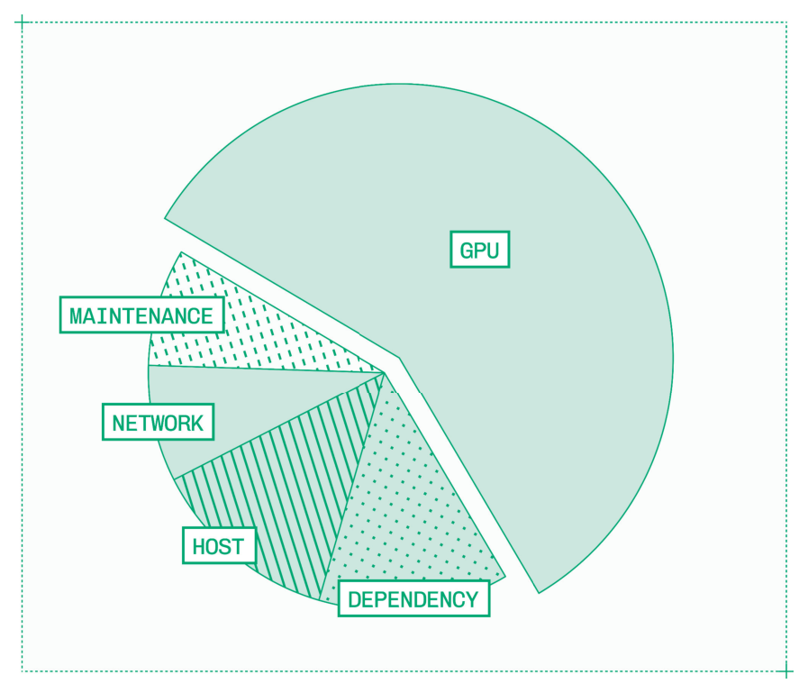
> *Figure 7.12: 训练 Llama 3 时的故障根因，改编自 "The Llama 3 Herd of Models"（Grattafiori et al., 2024）。*

GPU 健康是节点级别的问题。当单个 GPU 故障时，节点上的其他 GPU 通常接下来也会故障，或需要下线维护。主动记录故障、隔离节点和轮换 pod 可以保持各个集群的健康。

GPU 故障不是导致推理中断的唯一原因。云提供商有计划内维护和自身的计划外停机。基础设施的每一层都必须加固以提供高可靠性。

多云推理为高可靠性带来两种新方法：

- **Active-active（双活）**：一种高可用性架构，其中多个区域或集群同时活跃地服务实时流量。如果任何一个平面故障，流量在其他平面上无缝继续。
- **Active-passive（主备）**：一种故障转移架构，其中"热备"集群或区域保持就绪但空闲。如果活跃平面故障，流量切换到备用平面。

当单个集群、区域或云提供商宕机时，无缝故障转移到另一个工作负载平面可以保持高可靠性和低延迟。

### 7.3.4 Security and Compliance（安全与合规）

云基础设施二十多年来一直是安全和合规部门关注的热点话题。要让 AI 模型驱动关键任务应用，推理必须既安全又合规。

安全和合规讨论通常围绕三个领域：

- **用户数据**：安全和合规部门希望确保所有数据（包括用户输入和模型输出）都受到保护。
- **模型权重**：对于拥有微调或专有模型的公司来说，权重是无价的商业秘密。
- **基础设施**：GPU 本身和对智能的访问都是被滥用的目标。

你能做的最简单的安全决策之一就是简单地不存储用户输入或模型输出。这可能不可行——你可能出于日志要求或用户协议需要保留使用数据以用于未来模型训练——但如果你不需要保留用户数据，就可以减少攻击面。

保护 AI 推理工作负载和相关数据与保护任何其他容器化工作负载类似。数据加密、容器安全、网络和访问控制以及工作负载隔离——全部经过广泛的第三方渗透测试验证——仍然是黄金标准。

越来越多地，推理工程师需要支持在受监管行业和合规要求严格的区域运行的应用。多云基础设施的一个帮助是，为了让你的应用符合 SOC 2 Type II 等认证或 HIPAA 等法规，你的提供商通常也必须合规。在这种情况下，能够将工作负载迁移到合规提供商是有用的。

多集群基础设施的另一个好处是跨多个区域运行一个模型。某些行业和国家有数据驻留要求，即来自其国家的用户数据不能在不同国家的服务器上处理。

例如，在一个靠近多伦多的提供商处设置一个集群，在另一个靠近纽约的提供商处设置另一个集群，可以让你将加拿大数据保留在加拿大，将美国数据保留在美国，同时为整个地理区域的用户提供最小的延迟开销。

## 7.4 Testing and Deployment（测试与部署）

除了在配置推理引擎时进行的任何副本级别测试和基准测试外，在部署之前对系统进行端到端测试也很重要。

有几种推理测试策略：

- **Manual testing（手动测试）**：编写脚本（或点击按钮）向推理服务发送合成流量。
- **Load testing（负载测试）**：自动发送大量流量以测试系统的扩展和性能维持能力。
- **Shadow traffic（影子流量）**：将实时流量复制到测试部署，以在真实世界条件下衡量性能。

测试推理服务是昂贵的。配置测试和衡量结果需要工程时间，运行测试流量的推理需要 GPU。在某种程度上，这就是做生意的成本，但要仔细考虑如何最小化测试费用。例如，影子流量测试可以从复制随机抽样的一部分生产流量开始，然后进行短时负载测试。

测试时请注意，AI 产品使用量通常在日周期和周周期内波动。

一旦你对更新后推理系统的性能和稳定性有信心，就该部署到生产环境了。

### 7.4.1 Zero-Downtime Deployment（零停机部署）

推理工程师使用高可用性部署策略来避免停机。

传统的高可用性设计是蓝绿部署（blue-green deployment）。在此设置中，有两个相同的环境：原始的蓝色部署和运行更新服务的新绿色部署。一旦绿色环境准备就绪，全部流量负载从蓝色环境切换到绿色环境，蓝色环境保持就绪以备在出现问题时回滚。

然而，由于与大规模测试困难相同的 GPU 容量和成本问题，蓝绿部署不适合大规模推理工作负载。如果蓝色部署使用了 100 个 GPU，绿色部署在流量切换之前还需要另外 100 个 GPU。

相反，推理工程师可以使用金丝雀部署（canary deployment）以较低的 GPU 开销获得类似的好处。灵感来自煤矿中用于检测瓦斯的金丝雀，金丝雀部署在错误影响大量用户之前捕获它们。

> 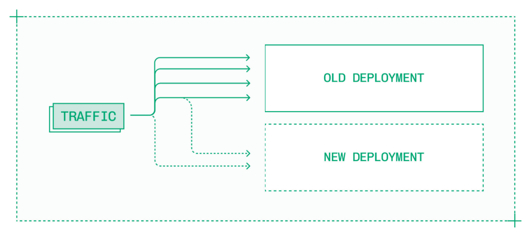
> *Figure 7.13: 迭代地将流量转移到新部署可以防止推理服务更新期间的多个问题。*

金丝雀部署是一个 4 步过程：

1. 构建推理服务的新部署，并准备好处理传入请求。
2. 将一小部分传入的实时流量导向新服务。
3. 监控新服务，确保它正确处理流量。如果出现任何问题则回滚。
4. 逐步增加流量，同时监控问题，直到新部署处理 100% 的流量。

这些金丝雀部署可以快速推出，只需几分钟的流量爬坡，也可以缓慢爬坡以确保每个阶段的稳定性。有了自动扩缩容，金丝雀部署在大规模时不会增加太多成本，因为减少对生产系统的流量会使其缩减一些副本。

有了自动扩缩容，新部署在没有流量时将默认为最小副本数。在整个金丝雀部署过程中，确保新部署有足够的活跃副本来正确处理请求。否则，用户将看到延迟峰值，因为他们的请求在自动扩缩容完成之前一直排队。

### 7.4.2 Cost Estimation（成本估算）

从使用公共 API 的 token 消费转变为在专用 GPU 上进行自己的推理，需要改变你对成本的思考方式。

公共 API 上的成本很简单：每百万 token 的价格乘以你使用的 token 数量。有几个变量——input token 的缓存命中与缓存未中、大用户量的折扣——但成本仍然是使用量的线性函数。

投入时间和精力进行推理工程的一个动机是掌控你的单位经济效益并摆脱按 token 定价。但这是一个困难的思维转变。

专用推理的福与祸在于成本现在是许多变量的函数。这是好事，因为它给了你控制权，但也使估算变得困难。影响成本的因素包括：

- **批处理大小**：部署是针对低批处理大小的延迟优化，还是高批处理大小的吞吐量优化？
- **流量模式**：流量是否持续饱和活跃 GPU，还是容量闲置？
- **序列长度**：请求平均有多少 input 和 output token，异常情况又是多少？

鉴于这种复杂性以及 input 和 output token 之间的成本差异，将你的 token 价格换算为总成本并与专用部署进行比较，通常比试图从你为 GPU 支付的费用中反推每 token 价格更有效率。

> 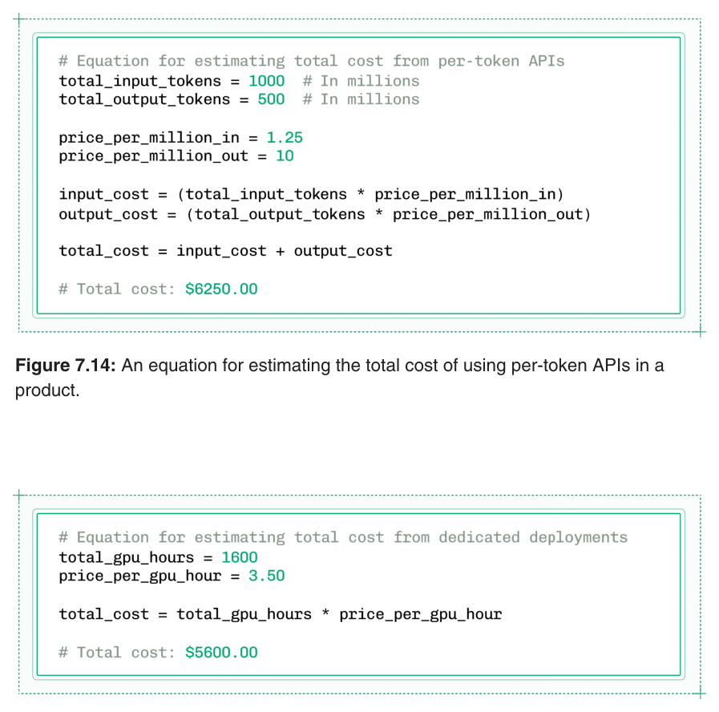
> *Figure 7.14: 估算在产品中使用按 token 计费 API 总成本的公式。*

> 
> *Figure 7.15: 估算在产品中使用专用部署总成本的公式。*

成本估算应使用较长的时间范围，最好至少一周，以平滑使用量的波动。

在专用部署中需要考虑的另一个因素是构建和维护推理系统所花费的工程时间成本。这项投资虽然在提高可靠性、安全性和控制力方面是合理的，但应该加到 GPU 成本中，以形成推理总拥有成本（Total Cost of Ownership, TCO）的完整图景。

### 7.4.3 Observability（可观测性）

推理是关键任务的，因此必须像应用程序的任何其他关键任务组件一样进行监控，配备适当抽象级别的告警、日志和可观测性。

第一个问题是什么需要监控。推理可观测性包括衡量：

- **总流量**：模型部署接收到的请求数量。
- **请求和响应大小**：正在处理的请求的 input 和 output 序列长度。
- **响应码**：模型服务器发出的 2XX、4XX 和 5XX 响应码计数。
- **延迟**：如 time to first token、每秒 token 数和端到端延迟等指标，以 P50、P90 和 P99 为基准。
- **副本数**：活跃服务流量的实例数，以及正在启动的实例数（如果有）。
- **利用率**：CPU、主机内存、GPU 和 GPU 内存的使用率。
- **队列深度**：对于异步流量系统，排队等待处理的请求数量。

这些指标是相互依赖的。延迟飙升可能来自请求量，但也可能来自长 input 序列。将这些指标放在一起看，让推理工程师不仅能了解正在发生什么，还能了解为什么。

当出现问题时，推理工程师需要信息来修复问题。日志——包括服务器日志和显示推理服务变更的审计日志——实时传递该信息。

可观测性不能被孤立。当你为推理构建可观测性时，要将其与现有可观测性和告警工具——Grafana、Datadog、PagerDuty、Sentry——深度集成，将推理信息置于应用程序其余部分的上下文中。

## 7.5 Client Code（客户端代码）

推理工程涉及许多技术，从 CUDA 到 Kubernetes。但在优化延迟和构建可扩展系统时，有一个关键领域经常被忽视：客户端代码。

调用推理服务有两个方面：

- **客户端（Client）**：向推理引擎发出请求的浏览器、agent 或应用程序。
- **服务器（Server）**：处理客户端请求并返回模型结果的推理服务。

客户端代码的行业标准是 OpenAI SDK，它除了支持 OpenAI 自己的模型外，还支持多种兼容提供商。流行的 AI 工程框架和库，如 LangChain、Vercel AI SDK、LiteLLM、LlamaIndex 等数十种，也可以作为客户端。

无论你是使用现有库还是自己的代码，都存在延迟开销或吞吐量瓶颈的可能。对于实时应用，你可能需要 HTTP 以外的协议，如 WebSockets，来提供持续连接。

> 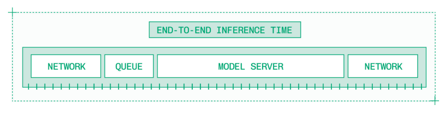
> *Figure 7.16: 服务器上的推理时间只是给定请求端到端延迟的一小部分。*

### 7.5.1 Client Latency Overhead（客户端延迟开销）

根据客户端的网络连接和使用的协议，建立客户端和服务器之间的会话需要几十毫秒。

在一个 P95 端到端延迟 SLA 为 300 毫秒的高性能系统中，TLS 握手在推理开始之前就消耗了至少 10% 的延迟预算。来自同一客户端的未来请求应通过复用现有会话来节省时间。

会话复用不是什么新概念，OpenAI SDK 等工具已经在底层默默提供了此功能。然而，在为非标准模态构建自己的客户端时，请遵循会话复用等最佳实践。

### 7.5.2 Asynchronous Inference（异步推理）

有些系统是为吞吐量而非延迟构建的。批量文档处理和语料库嵌入等用例对延迟不敏感，因此切换到异步作业是合理的。

异步请求是一种"发射后不管"（fire and forget）的推理执行方式。

普通的同步推理请求有一个超时时间（通常为几分钟），超时后请求将失败。异步作业通过立即确认请求，稍后将异步作业的结果返回到原始请求中提供的 webhook 来解决这个问题。

异步作业仍有时间限制，但这些请求通常以小时而非分钟衡量。加上强大的服务端队列，异步请求使高吞吐量、延迟不敏感的系统更加健壮和高效。

### 7.5.3 Streaming and Protocol Support（流式传输与协议支持）

流式传输让应用感觉即时响应。对于语言模型，通过 HTTP 流式传输文本输出就足够了。但对于其他模态，尤其是实时语音和视频，输入和输出流都需要能够承载更多数据。

> 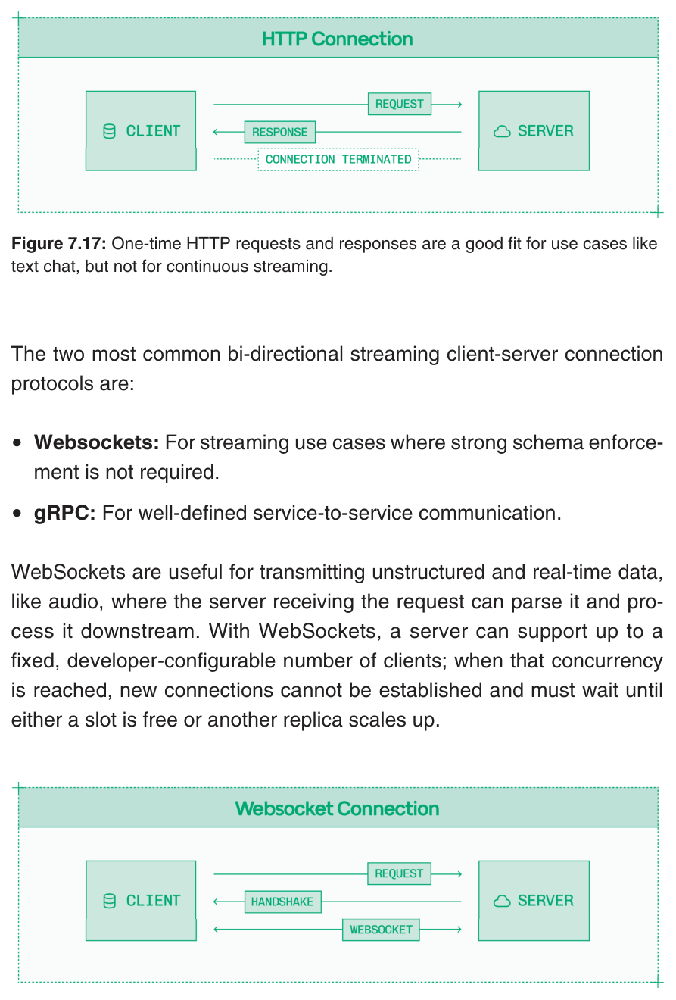
> *Figure 7.17: 一次性 HTTP 请求和响应适合文本聊天等用例，但不适合持续流式传输。*

两种最常见的双向流式客户端-服务器连接协议是：

- **WebSockets**：用于不需要强 schema 约束的流式用例。
- **gRPC**：用于定义良好的服务间通信。

WebSockets 适用于传输非结构化和实时数据（如音频），接收请求的服务器可以解析并将其在下游处理。使用 WebSockets，服务器最多可以支持固定数量的、由开发者配置的客户端；当达到该并发数时，新连接无法建立，必须等待直到有空闲槽位或其他副本扩展上线。

> 
> *Figure 7.18: WebSockets 为音频流等非结构化数据建立持续连接。*

与 WebSockets 类似，gRPC 支持双向流式传输，但用于结构化数据。通过 gRPC 传输的请求必须遵循预定义的 schema，这省去了解析输入的负担。这个额外的验证层使 gRPC 略慢于 WebSockets。

> 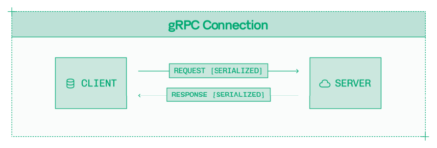
> *Figure 7.19: gRPC 为定义良好的服务间通信建立持续连接。*

## 7.6 Production Inference with Baseten（使用 Baseten 进行生产环境推理）

这本书包含了我在 Baseten 工作四年中学到的关于推理的一切。

Baseten 是一家成立于 2019 年的 AI 基础设施公司。在 Baseten，我们专注于为开放模型和自定义模型提供高性能、高可用的推理。我们还提供用于预训练（pre-training）、后训练（post-training）和强化学习（reinforcement learning）的平台。

我们为世界上增长最快的初创公司和最具创新力的企业运行推理，包括 Cursor、World Labs、Notion、OpenEvidence、Clay、Abridge、Gamma、Ambience、Writer 以及数百多家。

在 Baseten，我们专注于四大核心支柱来提供最快的关键任务推理：

- **性能**：由 Baseten Inference Stack 驱动的规模化一致低延迟。
- **基础设施**：可靠的多云部署、快速且精细的自动扩缩容，以及健壮的安全性。
- **工具**：直观高效的开发者体验，包括日志记录、可观测性和编程式访问。
- **实战专业知识**：来自前沿部署工程师的实践实现和协助。

我们将荣幸地为你的 AI 驱动产品提供快速、可靠的推理。

此外，我们持续在工程、销售、市场和运营的所有职位招聘。了解更多信息，请访问 https://baseten.com/careers。
